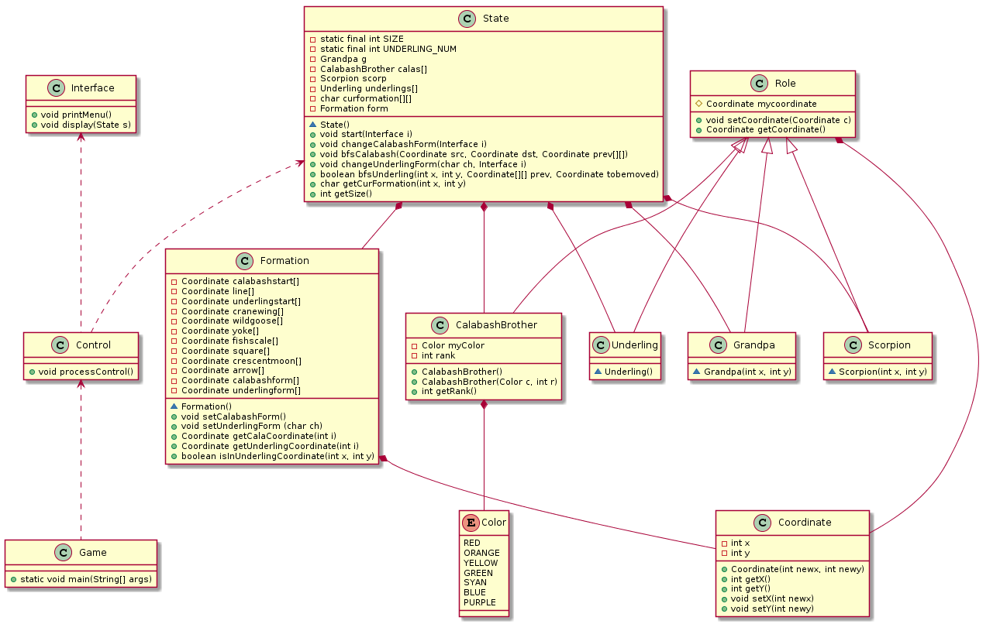

面向葫芦娃编程
===

类的设计
---

**（一）程序入口：**

Game类：包含main函数。

**（二）控制模块：**

Coctrol类：完成游戏主体的流程控制。

    public void processControl()

**（三）Enum类型：**

Color类：存放葫芦娃的七种颜色。

    public enum Color { RED, ORANGE, YELLOW, GREEN, SYAN, BLUE, PURPLE }

**（四）游戏状态相关：**

（1）Coordinate类

字段：两个整形数，分别代表横坐标和纵坐标。

方法：获取及设置横纵坐标值。

    private int x;
    private int y;
    public Coordinate(int newx, int newy);
    public int getX();
    public int getY();
    public void setX(int newx);
    public void setY(int newy);

（2）Formation类

字段：存放全部阵型。

方法：更改当前阵型类型，获取某个葫芦娃或者小喽啰在当前所选阵法中的坐标，判断某个坐标是否在阵法中等等。

    private Coordinate calabashstart[];
    private Coordinate line[];
    private Coordinate underlingstart[];
    private Coordinate cranewing[];
    private Coordinate wildgoose[];
    private Coordinate yoke[];
    private Coordinate fishscale[];
    private Coordinate square[];
    private Coordinate crescentmoon[];
    private Coordinate arrow[];
    private Coordinate calabashform[];
    private Coordinate underlingform[];
    public void setCalabashForm();
    public void setUnderlingForm();
    public Coordinate getCalaCoordinate(int i);
    public Coordinate getUnderlingCoordinate(int i);
    public boolean isInUnderlingCoordinate(int x, int y);

（3）Role类及其派生类

1)基类：Role类（所有角色的公共特性）

字段：坐标。

方法：设置坐标、获取坐标。

    protected Coordinate mycoordinate;
    void setCoordinate(Coordinate c);
    public Coordinate getCoordinate();

2)派生类：

CalabashBrother类：

    private Color myColor;
    private int rank;
    public CalabashBrother();
    public CalabashBrother(Color c, int r);
    public int getRank();
    
Grandpa类：

    Grandpa(int x, int y);

Scorpion类：

    Scorpion(int x, int y);

Underling类：

    Underling();

(4)State类：

字段：所有角色、阵法信息等。

方法：初始化游戏状态、指挥葫芦娃或小喽啰更换阵型等。

    private static final int SIZE = 11;
    private static final int UNDERLING_NUM = 8;
    private Grandpa g;
    private CalabashBrother calas[];
    private Scorpion scorp;
    private Underling underlings[];
    private char curformation[][];
    private Formation form;
    State();
    public void start(Interface i);
    public void changeCalabashForm(Interface i);
    public void bfsCalabash(Coordinate src, Coordinate dst, Coordinate prev[][]);
    public void changeUnderlingForm(char ch, Interface i);
    public boolean bfsUnderling(int x, int y, Coordinate[][] prev, Coordinate tobemoved);
    public char getCurFormation(int x, int y);
    public int getSize();
    
*类图*

算法
---
在更换阵型时，通过广度优先搜索找到移动到目标位置的最短路径。
