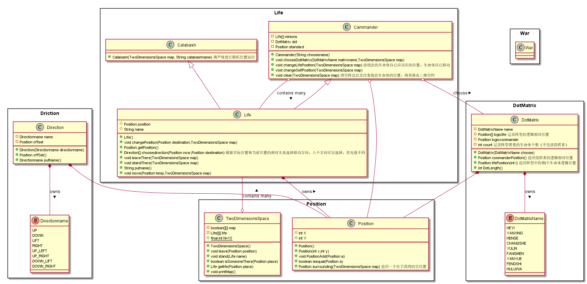

# **面向葫芦娃编程** 
## **一、面向对象的概念与机制** 
### **1．使用了组合语法与继承语法** 
#### *比如TwoDimensionPlace中组合使用了Life类，这样可以清晰的在二维空间中展示出来某个位置是哪个位置在占用。Cammander与Calabash均是通过继承Life类，将生命体的相同的方法放在基类中，而导出类则拥有具有特性的函数，并且通过构造器的重载，对不同类别的生命体进行不同方式的初始化。* 
### **2．使用了final与static数据** 
#### *由于二维空间的长宽是确定的数值，因此使用static令长宽不与包含它的类TwoDimensionPlace的任何对象实例关联在一起。并且由于长宽是我们提前确定的，因此这是一个永不改变的编译时常量，所以使用final数据，这样可以减轻运行时的负担。* 
### **3．多态** 
#### *不同的生命体均在二维空间进行移动，由于二维空间需要对空间的状态进行更新，因此需要知道哪个位置的哪个生命体的即时位置，而这并不依赖于生命体的类型，无论创建了多少个不同种类的生命体，均将其当作其基类的对像对待，这样在进行二维空间的维护时更方便。生命体离开位置和到达一个位置的状态也不依赖于生命体的类型。* 
### **4．包** 
#### *通过将同一种类型的类放在一个包内，更便于代码的维护* 
### **5．enum类型** 
#### *通过使用枚举类型，将方向和矩阵的类型设为枚举类型，这样更方便使用* 
