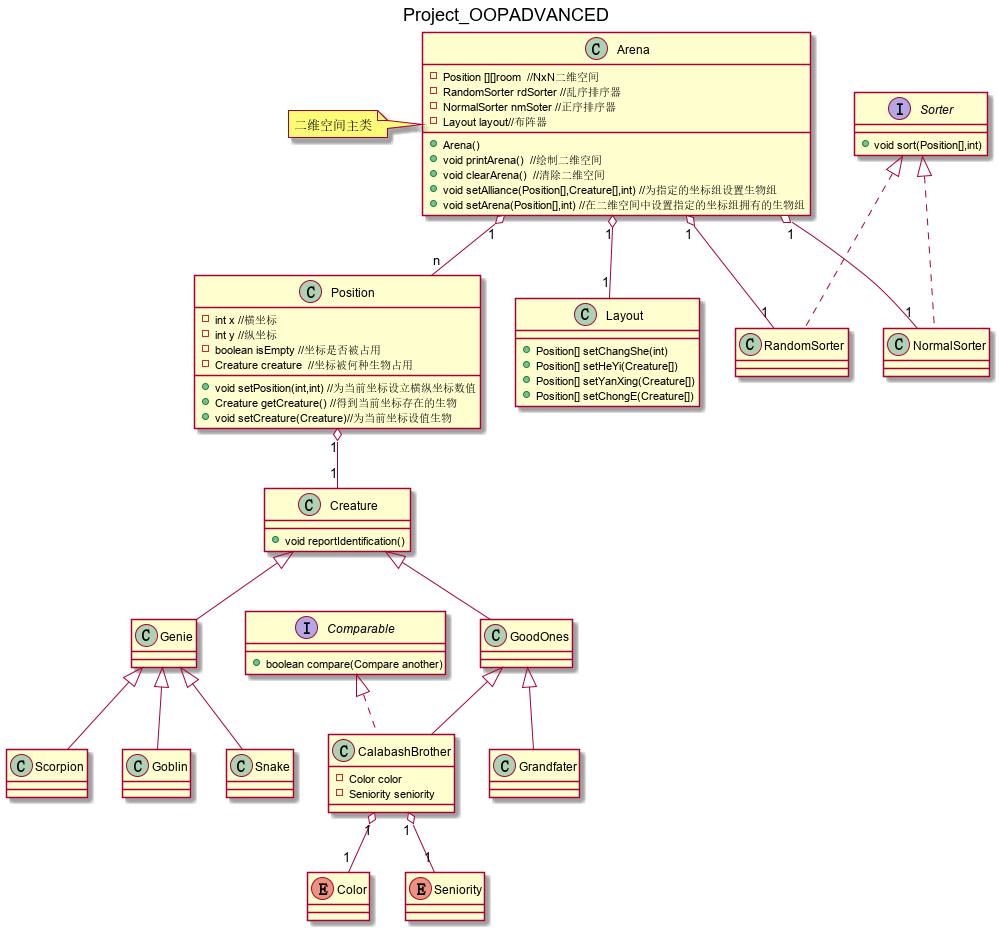

# 葫芦兄弟面向对象编程——阵型排列
## 类图设计框架

## 抽象层次设计
### 1.空间位置——Position类
    将NxN的二维空间中每一个位置坐标抽象成一个对象,此问题的所有处理转化为对当前位置坐标对象的处理,坐标抽象为Position类,负责定位和在此位置上生成生物和判断是否被占用.

### 2.具体角色——Grandfather类,CalabashBrother类,Goblin类,Snake类,Scorpion类
    Grandfather: 老爷爷  
    CalabashBrother: 葫芦娃  
    Goblin：小喽啰
    Snake：蛇精   
    Scorpion：蝎子精

### 3.好坏阵营——GoodOnes类、Genie类
    可以将所有角色分类为好人阵营，坏人阵营
    将老爷爷和葫芦娃向上抽象为GoodOnes类
    将小喽啰，蛇精和蝎子精向上抽象为Genie类

### 4.生物——Creature
    将项目要求中的所有角色向上抽象成Creature类

### 5.布阵器——Layout类
    根据提供的Creature集合设置此角色集合在二维空间的相对位置，返回相对位置集合

### 5.排序器接口，随机排序器和正序排序器——Sorter，RandomSorter和NormalSorter
    对坐标对象Position排序,根据其属性（横纵坐标或者角色属性值）进行排序
### 6.主类空间-Arena类
    聚合其他类，为此项目的主类。

    设立NxN个Position对象来抽象二维空间
    设立一个Layout对象来抽象布阵器，接受其返回的相对位置坐标对象集
    设立两个Sorter对象来抽象随机排序器和正序排序器
    在Arena来进行二维空间的绘制和刷新

## 设计原则
### 1.DIP依赖倒置原则
    在Creature，Sorter，Layout的设计中，子类型都是通过基类提供的接口进行实现。
### 2.LSP LISKOV替换法则
    由于角色均从Creature派生而来，因此在处理时也是直接对Creature进行处理。