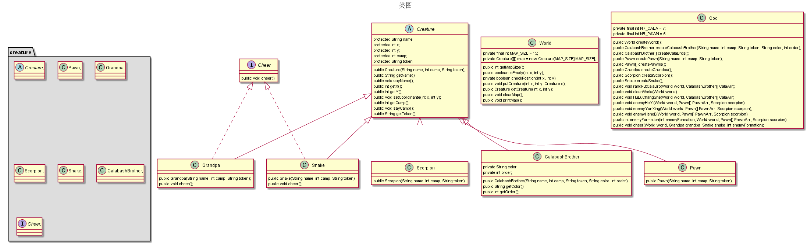

## 设计思路简述
本次实验设计的类有: **生物**, **葫芦娃**, **爷爷**, **蛇妖**, **蝎怪**，**小卒**, **世界**, **上帝**.
其中**世界**中提供了地图和一些地图相关的基本操作; **上帝**视作多元宇宙造物主, 本身并不具有属性, 只具有方法, 可理解为一组方法的集合, 对**世界**的操作均由其完成.
在世界上出现的生物体有一定的共同特征, 同时也有各自独有的特征, 故这里采用面向对象里的继承机制实现.

## 面向对象相关
### 封装

1. 在**世界**类里封装了地图`map`, 其上可以放置生物体, 其声明如下:
   `private final int MAP_SIZE = 15;`
   `private Creature[][] map = new Creature[MAP_SIZE][MAP_SIZE];`

   对于地图`map`的所有操作均由**世界**类中的接口提供, 即`map`不能被**上帝**直接访问, 提供的API有:
   * `int getMapSize()`: 获得`map`大小.
   * `boolean isEmpty(int x, int y)`: 判断`(x, y)`处有无生物体.
   * `boolean checkPosition(int x, int y)`: 判断`(x, y)`是否超出范围.
   * `void putCreature(int x, int y, Creature c)`: 在`(x, y)`处放置生物`c`.
   * `Creature getCreature(int x, int y)`: 获得`(x, y)`处的生物.
   * `void clearMap()`: 清空地图上的所有生物.
   * `void printMap()`: 打印地图信息.

2. 将生物体的共性特征(名字, 坐标, 阵营, 在地图上的表示, getter, setter等)封装在**生物**类中, 并通过继承方式构造其派生类. 考虑到实际情况中只会生成具体的生物, 故这里将**生物**类声明抽象类.

3. 在**上帝**类中封装了所有操纵**生物**和**世界**的方法, 包括创建世界, 创建生物, 排兵布阵等. 即**生物**和**地图**是对于任务中所出现对象的封装, 而**上帝**是对于任务中所要求实现的操作的封装.

封装机制使得每个类的属性和方法聚合在一起, 使得程序模块化, 更易于管理. 同时, 对于每个类的操作均只能通过类提供的接口进行, 避免了外部类直接操作某类的内部成员, 使得程序更为安全.

### 继承

1. 对于本次任务中出现的**葫芦娃**, **爷爷**, **蛇妖**, **蝎怪**，**小卒**这些对象, 他们都具有一些生物体共有的属性和方法, 如`名字`, `坐标`, `阵营`, `在地图上的代表`等. 所以我们自然而然地会想到实现一个**生物**类作为他们共同的父类. 这里考虑到我们永远不会生成单个抽象生物体的实例, 只是将一些生物体的共同特征打包以提高代码复用性, 于是我们将**生物**类声明为抽象类. 其声明如下:

~~~java
public abstract class Creature
{
    protected String name;
    // coordinate in 2-d map
    protected int x;
    protected int y;
    protected int camp; // -1:bad 0:neutral 1:good else:???
    protected String token; // what to show on map
    ...
    // common methods
}
~~~

**葫芦娃**, **爷爷**, **蛇妖**, **蝎怪**，**小卒**都是`Creature`类的派生类.

借助继承机制, 我们可以将多个同类对象的共同特征抽象成一个单独的类, 并使其成为这些类的父类. 这样我们可以在提高代码的复用性的同时, 也保证了代码的可拓展性. 

### 多态

多态指不同的对象的同一操作, 可以有不同的解释, 产生不同的执行结果. 在这里子类的实现里没有重写父类的方法, 但考虑到**爷爷**和**蛇精**两个类都需要有一个助威的方法, 但他们的助威方式不一样, 且助威这个操作是他们所独有的, 所以这里采用了`interface`方法, 让**爷爷**和**蛇精**两个类各自实现了对应的接口. 接口声明如下:

~~~java
public interface Cheer
{
    public void cheer();
}
~~~

多态机制使得我们可以把不同的子类对象都当作父类来看, 可以屏蔽不同子类对象之间的差异, 写出通用的代码, 做出通用的编程, 以适应需求的不断变化.

---

### UML类图

