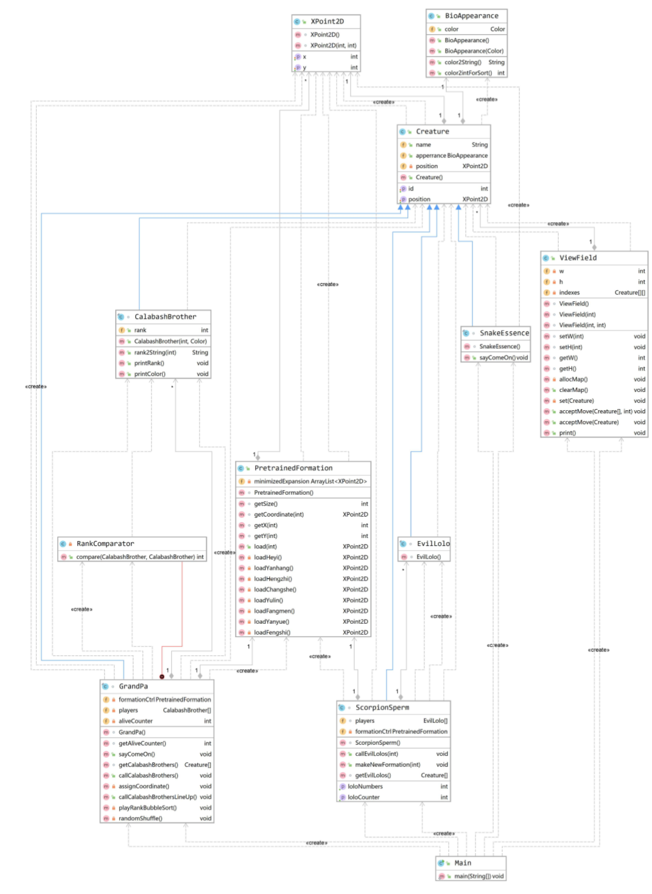

# Java-2019 作业三

## 171860633 徐国栋

## 任务简述

* 1、在 N × N 空间内构造 8 种阵型

* 2、控制阵型位置，形成对峙效果

* 3、用面向对象的设计思想完成任务1和任务2

## 设计思路

* 0、作业三基于作业二，复用作业二除SortShow类和主类以外的所有类

* 1、设置阵型类(class PretrainedFormation)，生成8种阵型的归一化坐标

* 2、封装出老爷爷类、蝎子精类，继承生物类，包含阵型类的实例，(class GrandPa)(class ScorpionSperm)和(class PretrainedFormation)是聚合关系；老爷爷类包含7个葫芦娃类实例，蝎子精类包含可动态调整数量的小喽啰类实例，老爷爷和蝎子精通过阵型类生成的坐标，告诉手下应该待在什么位置

* 3、设置视场类(class ViewField)，维护一个 N × N 场景，因为控制台打印的特殊性，即必须从左往右、从上到下打印，视场类需要知道生物体的精确位置（不像GUI那样支持随机绘制），视场类通过acceptMove(Creature[] input, int n)函数获得生物体位置信息和名称，通过 N × N 遍历进行打印。acceptMove函数的调用涉及转型，传入的是继承生物类的派生类，体现面向对象的多态特性

* 4、故事描述和场景绘制的分离：利用(class Creature)中的成员(XPoint2D position)连接故事描述（阵型改变等）和场景绘制（赋予网格点以人物含义）

* 5、class Homework3是主类，生成老爷爷、蛇精、蝎子精三个具有主观能动性的实例，调度葫芦娃和小喽啰，描述出8个场景

## 类图

* 1、继承关系

* 2、依赖关系

## 结果展示

（场景 0）：蛇精、老爷爷进场，葫芦娃乱序排队  
（画外音）Gp: 我是老爷爷，我在给我的葫芦娃加油  
---------------------------------------  
         Gp          Ss  
  
      H5  
      H3  
      H7  
      H2  
      H6  
      H4  
      H1                                 
  
  
  
  
---------------------------------------  
（场景 1）: 蛇精、老爷爷在场，葫芦娃保持长蛇阵，蝎子精和小喽啰变换阵型  
（画外音）Gp: 我是老爷爷，我在给我的葫芦娃加油  
（画外音）Ss: 我是蛇精，我在给我的蝎子精加油  
---------------------------------------  
         Gp          Ss  
  
      H1                Xz  
      H2             *.    *.  
      H3          *.          *.         
      H4             *.    *.  
      H5                *.  
      H6  
      H7  
  
  
  
  
---------------------------------------  
（场景 2）: 蛇精、老爷爷在场，葫芦娃保持长蛇阵，蝎子精和小喽啰变换阵型  
（画外音）Gp: 我是老爷爷，我在给我的葫芦娃加油  
（画外音）Ss: 我是蛇精，我在给我的蝎子精加油  
---------------------------------------  
         Gp          Ss  
  
      H1                *.  
      H2             *. *. *.  
      H3          Xz    *.    *.         
      H4          *.    *.    *.  
      H5                *.  
      H6                *.  
      H7  
  
  
  
  
---------------------------------------  
（场景 3）: 蛇精、老爷爷在场，葫芦娃保持长蛇阵，蝎子精和小喽啰变换阵型  
（画外音）Gp: 我是老爷爷，我在给我的葫芦娃加油  
（画外音）Ss: 我是蛇精，我在给我的蝎子精加油  
---------------------------------------  
         Gp          Ss  
  
      H1             Xz                  
      H2          *.  
      H3             *.  
      H4          *.  
      H5             *.  
      H6          *.  
      H7  
  
  
  
  
---------------------------------------  
（场景 4）: 蛇精、老爷爷在场，葫芦娃保持长蛇阵，蝎子精和小喽啰变换阵型  
（画外音）Gp: 我是老爷爷，我在给我的葫芦娃加油  
（画外音）Ss: 我是蛇精，我在给我的蝎子精加油  
---------------------------------------  
         Gp          Ss  
  
      H1          Xz                *.   
      H2             *.          *.      
      H3                *.    *.  
      H4                   *.  
      H5  
      H6  
      H7  
  
  
  
  
---------------------------------------  
（场景 5）: 蛇精、老爷爷在场，葫芦娃保持长蛇阵，蝎子精和小喽啰变换阵型  
（画外音）Gp: 我是老爷爷，我在给我的葫芦娃加油  
（画外音）Ss: 我是蛇精，我在给我的蝎子精加油  
---------------------------------------  
         Gp          Ss  
  
      H1                      Xz         
      H2                   *.  
      H3                *.  
      H4             *.  
      H5          *.  
      H6  
      H7  
  
                                         
  
  
---------------------------------------  
（场景 6）: 蛇精、老爷爷在场，葫芦娃保持长蛇阵，蝎子精和小喽啰变换阵型  
（画外音）Gp: 我是老爷爷，我在给我的葫芦娃加油  
（画外音）Ss: 我是蛇精，我在给我的蝎子精加油  
---------------------------------------  
         Gp          Ss                  
  
      H1                      *.  
      H2                *. *.  
      H3             *. *.  
      H4          Xz *. *.  
      H5          *. *. *.  
      H6          *. *. *.  
      H7             *. *.  
                        *. *.  
                              *.         
  
  
---------------------------------------  
（场景 7）: 蛇精、老爷爷在场，葫芦娃保持长蛇阵，蝎子精和小喽啰变换阵型  
（画外音）Gp: 我是老爷爷，我在给我的葫芦娃加油  
（画外音）Ss: 我是蛇精，我在给我的蝎子精加油  
---------------------------------------  
         Gp          Ss  
  
      H1             Xz  
      H2                *.  
      H3             *. *. *.  
      H4          *. *. *. *.  
      H5             *.  
      H6  
      H7  
  
  
  
  
---------------------------------------  
