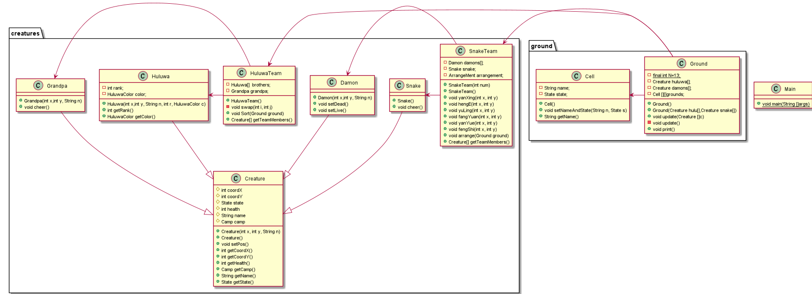

# homework 3

## 需求分析

1. 假设存在一个`NxN`的二维空间（`N>10`)，该空间中的任意一个位置坐标上可站立一个生物体（葫芦娃、老爷爷、蛇精、蝎子精、小喽啰均属于生物体）；
2. 请让初始乱序的七个兄弟按下图所示阵型中的长蛇形依序（老大至老七）站队；
3. 请在图中选择一个阵型（长蛇除外）让蝎子精领若干小喽啰站队；
4. 将葫芦兄弟的长蛇阵营和蝎子精小喽啰阵营放置于二位空间中，形成对峙局面；
5. 请选择合适位置将老爷爷和蛇精放置于空间中，为各自一方加油助威；
6. 将上述对峙局面打印输出；
7. 请让蝎子精小喽啰阵营变换一个阵法（长蛇除外），重复4-6步。

## 假设和依赖

​	1.蛇精阵营的妖精变化阵型时，妖精数目会改变，具体数目参照作业说明中的图；

​	2.若后期某个妖精死亡，不会因该位置的缺失而移动其他妖精以保持阵型；

​	3.由于阵型变化时妖精的数目会改变，故不模拟阵型变化过程中每个妖精的移动过程，只表现阵型变化后的结果；

## 设计介绍

### Creature

生物类，游戏中所有生物的子类，具有的成员变量是自己在地上的坐标、姓名、生命值、状态（活/死），阵营（葫芦娃/蛇精）。成员函数为：设置自身坐标、获得当前坐标、获得生物所属阵营、状态、姓名。

### Huluwa

继承Creature，增加了rank、color属性，增加了getRank(), getColor()函数。

### Grandpa/Snake

增加了cheer()函数，为自己阵营的队友加油。

### Damon

增加setDead(), setLive()成员函数（由于有的阵型变化时人数会减少，人数减少时将该妖精设置为“DEAD”状态，即可在最终打印输出时不显示）。

### 枚举类型

为了代码的易读性，添加Camp, HuluwaColor, Arrangement(阵营), State(LIVE/DEAD)的枚举类型。

### HuluwaTeam

由葫芦娃兄弟和爷爷组成，可以完成作业要求中的排序操作。

### SnakeTeam

由蛇精、蝎子精、小喽啰组成，可以完成阵列的变换操作。

### Cell

将大地划分为一个个小方块，每个方块上有其上站立的生物体的姓名和状态。

### Ground

成员变量时葫芦娃阵营和蛇精阵营生物体的引用，以及13$\times$13的Cell，具有update(),print()成员函数，用于更新当前状态以及打印输出。

## UML类图

## 面向对象理念

### 封装

将每个实体封装为一个类，类与类之间互不干扰，通过接口函数传递消息。

### 继承

Creature抽象了所有生物体的特征，作为游戏角色的子类，其他Huluwa, Snake,  Damon, Grandpa均继承自Creature。

### 多态

此次设计并未涉及多态，在后期不同生物体的攻击方式不同时可以考虑添加多态。