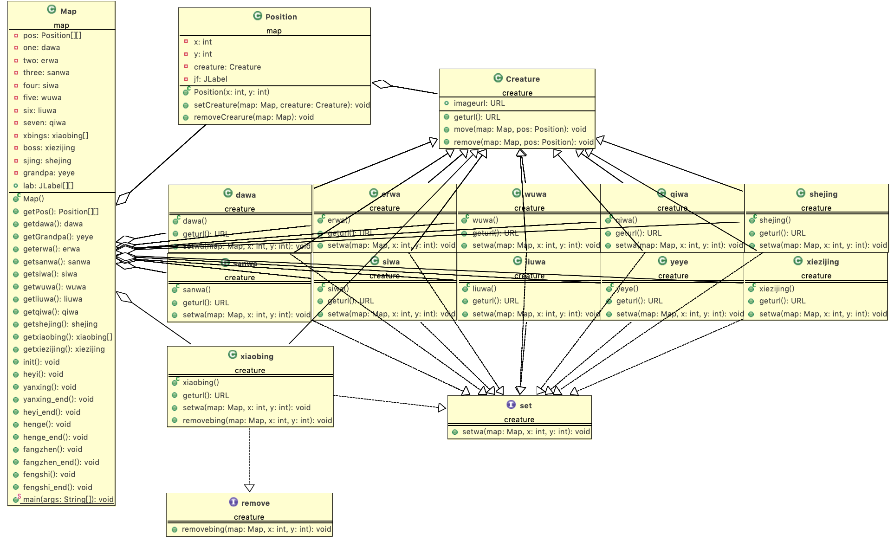

#161220028 戴佳宸
#设计思路：
##根据问题需求：假设存在一个NxN的二维空间（N>10)，该空间中的任意一个位置坐标上可站立一个生物体（葫芦娃、老爷爷、蛇精、蝎子精、小喽啰均属于生物体）；
##我创建了三个类Creature类（生物体类）和Map类（二维空间类）和Position类（坐标位置类）
###Creature类
```
public class Creature {
    public URL imageurl;
    public URL geturl(){
        return this.imageurl;
    }

    public void move(Map map,Position pos){
    	pos.setCreature(map,this);
    }

    public void remove(Map map,Position pos){
    	pos.removeCrearure(map);
    }

}
```
####葫芦娃、老爷爷、蛇精、蝎子精、小喽啰都属于生物体，他们都继承Creature类，都有Creature类共有的属性imageurl表示该生物体的头像图片的地址（因为我使用了swing图形化用户界面，用头像图片在屏幕上表示生物体），还有geturl（）让外界类获取它的图片url地址使其在坐标格上显示对应生物体的图像。move(Map map,Position pos)---生物体走到（显示在）某个坐标点上（为了形成阵型），remove(Map map,Position pos)---生物体离开某个坐标点（为了换位置变阵型）。葫芦娃、老爷爷、蛇精、蝎子精、小喽啰都实现了一个interface接口set
```
public interface set {

    public void setwa(Map map, int x, int y);

}
```
####实现方法是在子类里调用Creature类中的move方法，将当前生物体对象显示在坐标点（x，y）上。
```
    public void setwa(Map map, int x, int y){
    	move(map,map.getPos()[x][y]);
    }
```
####根据题目需求，葫芦娃、老爷爷、蛇精、蝎子精是开局固定在一定位置后就不动了，而小喽啰需要变换阵型，每次变换阵型需要把原来的阵型撤销，所以我由建立了一个interface接口remove抽象出一个类里面有removebing方法，然后在小喽啰类里面实现这个接口
```
    public void removebing(Map map, int x, int y){
    	remove(map,map.getPos()[x][y]);
    }
```
####让坐标点（x，y）上的小喽啰撤兵。
***
###Position类
```
public class Position extends JFrame{
    private int x;
    private int y;
    private Creature creature;
    private JLabel jf;
    
    public Position(int x, int y){
		this.x = x;
		this.y =y;
		this.creature = null; 
		this.jf=null;
    }

    public void setCreature(Map map,Creature creature){
		if (this.creature != null) {
			this.creature = null;
		}
		this.creature = creature;
		this.jf=map.lab[x][y];
		ImageIcon image = new ImageIcon(this.creature.geturl());
		image.setImage(image.getImage().getScaledInstance(this.jf.getWidth(), this.jf.getHeight(),Image.SCALE_DEFAULT ));
		this.jf.setIcon(image);
		this.jf.setHorizontalAlignment(0);
    }

    public void removeCrearure(Map map){
    	this.jf=map.lab[x][y];
    	this.jf.setIcon(null);
    	this.creature = null; 
    }

}
```
####坐标位置类Position中，每个Position对象有其横纵坐标x和y表示具体位置，每个位置上站着一个生物体Creature和一个显示生物体头像的标签jf。

####这里用到了多态

#####多态是指不同的子类对于相同的消息可能会有不同的行为，根据对象的实际类型决定调用的具体目标，多态形成的条件包括：继承、重写以及父类引用指向子类对象。在本次任务中，葫芦娃、爷爷、蝎子精，小喽啰都是Creature类的子类

```
    public void setCreature(Map map,Creature creature){
		if (this.creature != null) {
			this.creature = null;
		}
		this.creature = creature;
		this.jf=map.lab[x][y];
		ImageIcon image = new ImageIcon(this.creature.geturl());
		image.setImage(image.getImage().getScaledInstance(this.jf.getWidth(), this.jf.getHeight(),Image.SCALE_DEFAULT ));
		this.jf.setIcon(image);
		this.jf.setHorizontalAlignment(0);
    }
```
输入参数中存在一个有Creature对象creature，因此无论传入的是葫芦娃，还是小喽啰，都满足要求。已经满足了继承以及父类引用指向子类对象两个条件，如果葫芦娃类或者小喽啰类中重载了Creature中的方法，那么就会调用重载之后的方法,在本程序中的主要目的是，不同的Creature设置不同的图片在屏幕上显示（比如大娃的imageurl是“1.jpg”）
***
###Map类
```
public class Map extends JFrame {
    private Position[][] pos;
    private dawa one;
    private erwa two;
    private sanwa three;
    private siwa four;
    private wuwa five;
    private liuwa six;
    private qiwa seven;
    private xiaobing[] xbings;
    private xiezijing boss;
    private shejing sjing;
    private yeye grandpa;
    public JLabel[][] lab;
```
####Map类是我们建立图形界面和提供生物体行为的信息支持的关键类。它不能直接操控生物体，他在生物体和坐标空间之间提供了联系通道，map类继承了JFrame类，JFrame类是一个窗体，其实它是一个容器承载很多swing组件。我们在窗体中创建一个大小为11*11的Position数组表示战斗的地图，再new出各个对象，调用get方法得到这些对象的内部方法来让生物体对象在地图上发生动作。要变阵的时候只需调用变阵函数，变阵函数的实现即各个对象自己运动到合适的位置，比如变换到鹤翼阵
```
    public void heyi(){
    	this.getxiaobing()[0].setwa(this, 3, 6);
    	this.getxiaobing()[1].setwa(this, 4, 6);
    	this.getxiaobing()[2].setwa(this, 5, 7);
    	this.getxiaobing()[3].setwa(this, 6, 8);
    	this.getxiaobing()[4].setwa(this, 5, 9);
    	this.getxiaobing()[5].setwa(this, 4, 10);
    	this.getxiaobing()[6].setwa(this, 3, 10);
    }
```


***
#UML类图


#运行效果gif图


