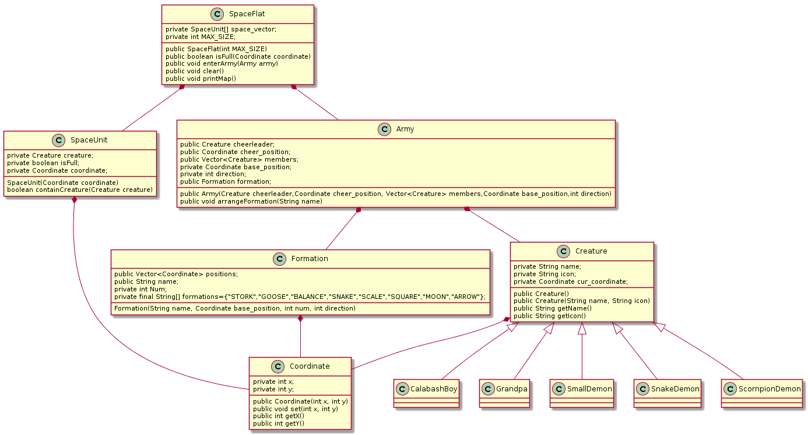

# 第三次作业说明

## 1.UML图

## 2.生物类

- Creature是生物基类
- 5种其他生物类从基类Creature继承而来

## 3.空间类

- 空间单元SpaceUnit
  - 每个SpaceUnit可以容纳指定内容，在本次作业中仅可容纳一个生物，在之后可以方便地进行拓展
- 空间平面SpaceFlat
  - 由N*N个空间单元构成
  - 提供进入和清楚的接口

## 4.组织类

- 阵型类Formation
  - 由一个装有坐标类Coordinate的容器和构造方法构成
- 军队类Army，包含以下内容
  - 拉拉队
  - 成员容器
  - 阵型信息Formation

## 5.其他简单类

- Sort类
  - 仅对葫芦娃的长蛇阵排序
- Main类
  - 假象为概念宇宙
  - 战场和两支军队在此构建
  - 两支军队进入战场
  - 开始战斗
