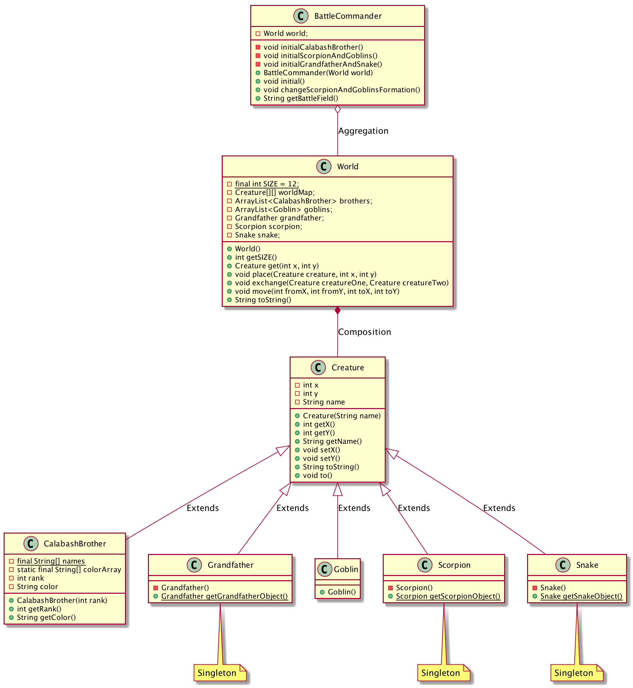
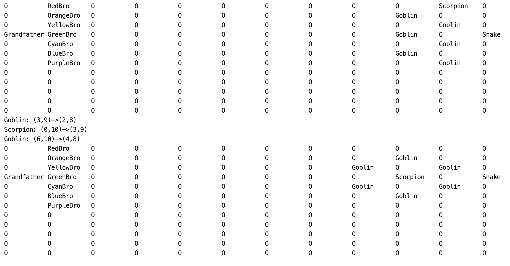

# 第三次作业：面向葫芦娃编程（三）
## UML图

## 设计思路
上面的UML很清晰的展现了我本次作业的设计思路：利用继承实现多态，定制不同的行为、再利用聚合进行协作，控制完成总体的任务
### BattleCommander类
该类负责完成最终的任务，即放置葫芦娃和爷爷、妖怪、蝎子精和蛇精，并控制它们变换阵型。在使用时，需要传入一个World类来进行初始化其成员变量，但由于World同时也可以脱离其存在，因此其与World类是**聚合关系**，这样做的好处是**十分灵活，不会影响World类的复用**。该类的主要方法用于控制战场上双方的阵型和位置。其中值得一提的是，为了便于展示战场对峙情况，以及为了后面的作业在控制台进行调试方便，注意其最后一个方法
```java
public String getBattleField() {
    return world.toString();
}
```
该方法直接通过调用world类的toString方法获取战场情况。我在World类中重写了该方法，用于将战场情况作为一个String返回，其实不止是在World类中，在所有的类中我们都重写了该方法，用于进行展示和调试，程序最终的运行结果在后面有展示
### World类
该类复用了上次作业的代码，只不过在本次作业中，由于新加入了爷爷、妖怪、蝎子精和蛇精，我们将葫芦娃的世界抽象为了Creature类型的二维数组：
```java
private Creature[][] worldMap;
```
由于Creature不可独立于当前世界而存在，因此其属于**组合关系**。除了这里的改变而外，我们还新添加了几个成员变量：
```java
private Creature[][] worldMap;
private ArrayList<CalabashBrother> brothers;
private ArrayList<Goblin> goblins;
private Grandfather grandfather;
private Scorpion scorpion;
private Snake snake;
```
其分别用于追踪和获取当前处于世界中的各个生物的情况。该类主要提供对当前世界中存在的生物进行位移操作的方法，除了上次作业中便有的place和exchange方法外，还新加入了move方法，用于将某个位置的生物移到新的位置：
```java
public void move(int fromX, int fromY, int toX, int toY) {
    if (worldMap[fromX][fromY] == null || worldMap[toX][toY] != null)
        throw new IllegalArgumentException();
    else {
        Creature creature = worldMap[fromX][fromY];
        worldMap[fromX][fromY] = null;
        creature.to(toX, toY);
        worldMap[toX][toY] = creature;
    }
}
```
### Creature及其子类
为了能够方便地表示整个葫芦娃世界，我们将所有生物抽象为Creature，然后将世界抽象为类型为Creature的二维数组。Creature类用于刻画最基本的一些共有特征，例如姓名和位置：
```java
private int x;
private int y;
private String name;
```
以及一些共有的行为（例如移动）：
```java
public void to(int newX, int newY) {
    System.out.println(name + ": " + "(" + x + "," + y + ")" + "->" + "(" + newX + "," + newY + ")");
    x = newX;
    y = newY;
}
```
同时，为了支持不同生物的不同行为和特征（例如葫芦娃有颜色），我们利用**继承**的方式实现多态，这样做**有利于代码的复用，同时提供了高度的可定制性，未来进行迭代开发也很方便添加新的生物**。这里值得一提的是，不同于葫芦娃和妖怪类，爷爷、蝎子精和蛇精在动画中是只有一个的，因此为了刻画这种特征，我采用了**单例模式**这一设计模式，**防止程序运行过程中同时出现两个爷爷**，保证逻辑正确：
```java
public class Grandfather extends Creature {
    private static Grandfather grandfather = new Grandfather();

    private Grandfather() {
        super("Grandfather");
    }

    public static Grandfather getGrandfatherObject() {
        return grandfather;
    }
}
```
## 编译运行
```shell
cd ./src
javac *.java
java Main
```
## 运行结果

其中我们用大写字母O代表地图上空闲的位置，可以看到，妖精阵营一开始是衡轭阵，后面变阵为了方圆阵
