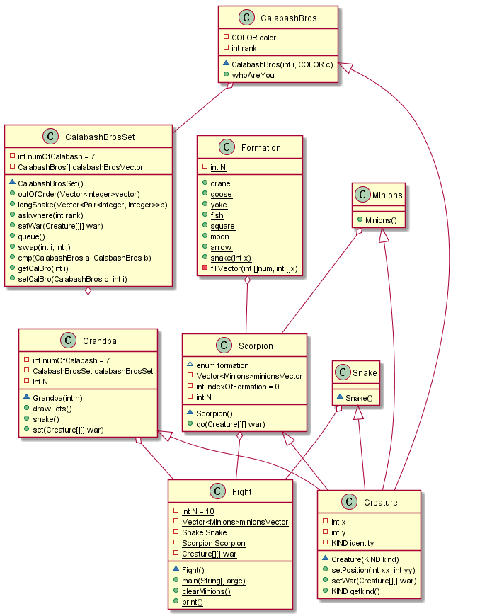

# 第三次作业

## 类的设计
+ class Creature  
在基类中定义生物体的坐标信息及共同方法(构造函数，设置坐标，站位).  
由基类派生出其他生物体
  + class Grandpa(爷爷)
  + class CalabashBros(葫芦娃)
  + class Snake(蛇精)
  + class Scorpion(蝎子精)
  + class Minions(小喽啰)

+ class Fight   
故事的发生地，主要维护主要人物和一个二维平面。

+ class CalabashBrosSet  
葫芦兄弟，七个葫芦娃组成的队伍。定义了葫芦娃间的排队，交换，比较等操作，因为这些操作应该是葫芦娃这个集体内部的自己的操作。

## 执行过程
+ 先设置好爷爷和蛇精的站位  
+ 爷爷抽签，决定葫芦娃的初始乱序站位
+ 葫芦娃先按照顺序排好队，再站成长蛇形
+ 蝎子精带领若干小喽啰按照不同阵型的要求站好位(小喽啰没有话语权，只能听从蝎子精的安排，因此和蝎子精是聚集关系)
+ 在下一个阵型之前，把右半边(反派)在平面上的痕迹清除，再重新摆放。

## UML图
