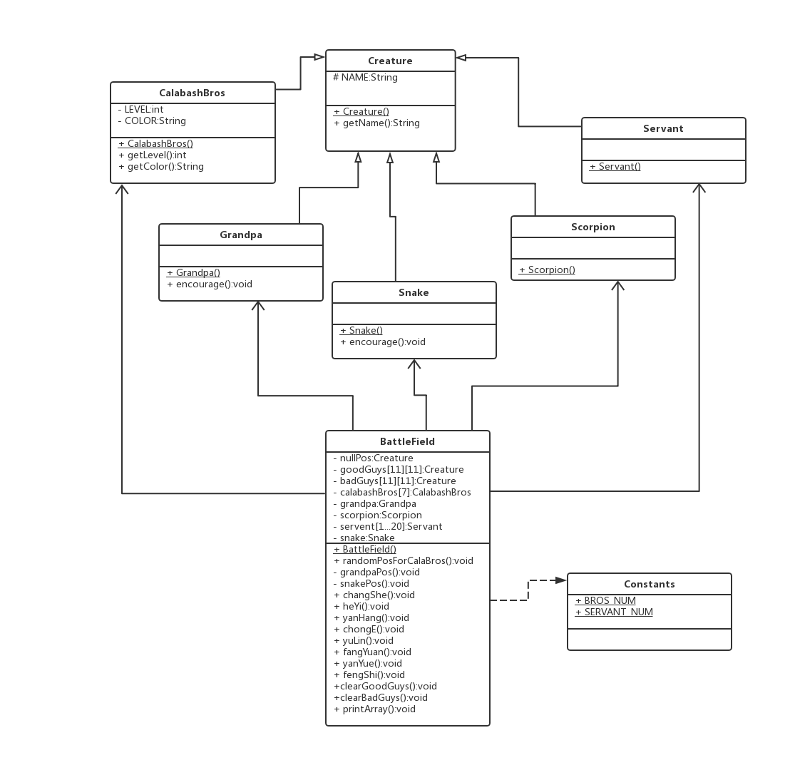

實現思路
==
首先閱讀需求，了解到有葫蘆兄弟、爺爺、蝎子精、蛇精、嘍囉五個角色，因這五個角色都有名字等私人屬性，故可以抽出一個Creature類作為這五個角色的父類，然後這五個角色再繼承這父類和加上自己獨有的屬性和方法。
```
class Creature{
    protected final String NAME;
    ...
}

class CalabashBros extends Creature{
    private final String COLOR;
    private final int LEVLE;
    ...
}

class Grandpa extends Creature{
    ...
}

class Scorpion extends Creature{
    ...
}

class Snake extends Creature{
    ...
}

class Servant extends Creature{
    ...
}

```

然後就創建地圖的類(BattleField)來操作五種角色的各種陣營，我這裡是用BattleField去擁有(has a)五種角色來直接操作他們來排出各個陣形並用goodGuys(11X11)和badGuys(11X11)來保存兩個勢力的位置，最後就直接用goodGuys和badGuys去輸出兩勢力的陣形(22X11)。

```
public class BattleField{
    private Creature nullPos;
    private Creature[][] goodGuys;
    private Creature[][] badGuys;
    private CalabashBros[] calabashBros;
    private Grandpa grandpa;
    private Scorpion scorpion;
    private Servant[] servants;
    private Snake snake;

    public void randomPosCalaBros(){...}
    public void changShe(){...}
    public void heYi(){...}
    public void yanHang(){...}
    public void chongE(){...}
    public void yuLin(){...}
    public void fangYuan(){...}
    public void yanYue(){...}
    public void fengShi(){...}
    public void printArray(){...}
}


```

最後就根據以上的代碼來進一步完善代碼。

---

UML圖的設計
