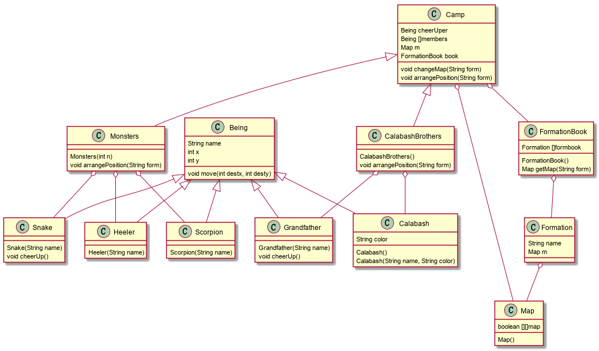
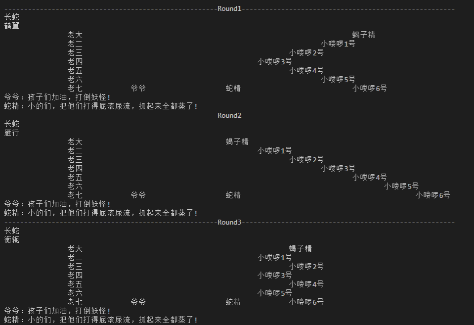

### 一、使用的面向对象机制

#### 1.Inheritance

#### 2.Aggregation

### 二、设计思路

#### 1.对象的选择

从题目中可以提炼出以下几个类：
(1)class Being：即生物类，无论是葫芦娃、爷爷、蝎子精、蛇精还是小喽啰，其都是生物。

​							具有姓名，拥有自己在二维空间中的坐标，也能从一个位置移动到另一个位置。

​							因此拥有String name、int x、int y和move方法。

(2)class Calabash：即葫芦娃类，继承自Being类，额外具有颜色属性和自己构造函数

​								  配套的有class CalabshName和class CalabashColor分别包含一个静态字符串数								  组，用来存储所有	葫芦娃的名字和颜色，类似字典或词典，从中取出一个作为自								  己的名字或颜色。

(3)class Grandfather：即爷爷类，继承自Being类，有自己的构造函数，并能为孩子们加油打气，因										此另外添加了cheerUp方法。

(4)class Snake：即蛇精类，继承自Being类，有自己的构造函数，并另外添加了cheerUp方法。

(5)class Scorpion：即蝎子类，继承自Being类，有自己的构造函数。

(6)class Heeler：即小喽啰类，继承自Being类，有自己的构造函数。

(7)class Formation：即阵型图谱类，包含阵型的名称以及阵型的点阵图。

​									 配套有class FormationName、class FormationMembers和									class FormationMap类，分别包含一个静态字符串数组、整型数组、布尔数组存									放阵型的所有名字、每种阵型需要的成员数量、每种阵型的点阵。

(8)class FormationBook：即阵型图谱书类，包含所有的阵型，通过一个阵型数组实现。通过构造函数											  对书中的每个阵型初始化，并通过getMap方法返回每个阵型的点阵图。

(9)class Map：即坐标点阵类，显示二维空间每个点的成员情况。

(10)class Camp：即阵营类，有一堆Being对象构成，每个阵营有一本阵型图谱书用来换阵时调整成员							   的位置，还有一个Map对象存放当前阵营的成员所占位置情况。

(11)class Commander：即指挥类，指挥阵营变换阵型。也是程序的入口。

#### 2.整体思路：

利用**继承**的思想让葫芦娃、爷爷、蛇精等继承Being生物类。利用**聚合**的思想由葫芦娃们和爷爷组成葫芦娃阵营，蛇精、蝎子精和小喽啰组成妖怪阵营。每个阵营有阵型图谱书用来换阵时确定每个成员的位置。两个阵营进行对峙，葫芦娃摆长蛇阵，妖怪不断换阵型，每次换阵型之后，爷爷和蛇精分别为自己所在的阵营加油。

### 三、类图



其中，Snake、Heeler、Scorpion、Grandfather、Calabash继承Being

​			Monsters由Snake、Heeler、Scorpion聚合构成

​			CalabashBrothers由Grandfather和Calabash聚合构成

​			Monsters和CalabashBrothers继承Camp

​			Camp由Being、FormationBook和Map聚合构成

​			Formation包含Map

​			FormationBook由Formation构成						

### 四、目录结构和执行过程

#### 1.目录结构：


其中，classGraph文件下存放一张类图图片以及生成类图的class.wsd文件

​			code文件夹下存放代码

​			pic文件夹下存放相关图片

#### 2.执行指令：

```
cd code
javac -encoding utf-8 Commander.java
java Commander
```

#### 3.程序执行结果部分效果图如下：



