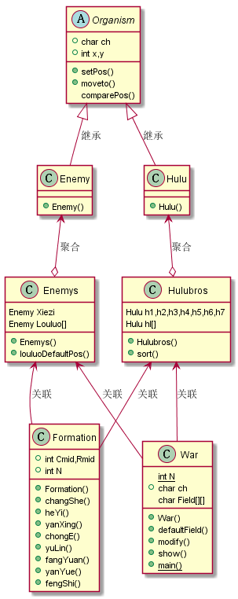

# 第三次作业

UML类图：

## 面向对象机制：

抽象类：Organism(表示所有生物体)

继承：敌人Enemy类和葫芦类Hulu继承自Organism

成员内部类：Enemy作为Enemys的成员内部类，Hulu作为Hulubros的成员内部类

## 设计说明

通过调用阵型类的相应方法，将葫芦娃和敌人的坐标依照阵型修改，再根据修改后的坐标，将表示战场的二位数组所对应的他们的位置坐标上的值修改为表示他们的字符，这样直接打印出二维数组就可以显示出阵型。

### War类：

要将葫芦兄弟和蝎子精等按照阵型排在二维空间上：可用一个二位数组模拟这个二维空间，用一个字符表示空间上的一个方块，不同的生物体用不同字符表示，所以在War类中用二维字符数组field表示战场；

成员变量ch(char)用来定义字符数组field的默认值(默认为'*')；

静态成员常量N规定field的大小，表示战场大小；

方法defaultField: 将二维数组field设置为默认值；

方法modify：根据葫芦兄弟的坐标以及敌人所在坐标将他们所在位置的字符值修改为表示他们的字符

方法show：打印field的值，即显示战场

### Organism类：

成员ch(char)：生物体的字符表示

int x,y：生物体的二维坐标

### Hulubros类：

葫芦兄弟作为一个整体出现，可以暂时忽略他们的个体差异，于是定义该类对他们整体进行操作。并以Hulu类作为该类的成员内部类，这样可以减少文件数量，增强代码封装性。

该类有7个Hulu成员作为七个葫芦娃，用字符'A'-'G'依次表示，同时定义了一个Hulu数组，长度为7，用来储存七个葫芦娃以方便对他们整体的修改，避免对他们逐个修改造成代码冗余。

### Enemys类：

该类整合了蝎子精以及小喽啰，将Enemy作为它的成员内部类，定义了成员Xiezi作为蝎子精，用Enemy类型数组Louluo表示小喽啰。

成员方法louluoDefaultPos()：将Louluo数组所有喽啰的位置坐标设置为无意义的(-1,-1)，表示一个喽啰都没有;（这是为了方便切换阵型，因为不同阵型喽啰数量不同，为了避免切换阵型Louluo数组中旧值对新阵型干扰）

### Formation类

成员int Cmid,Rmid :战场的中心位置坐标
成员int N :War类中的N

方法changShe(Hulubros h)；修改传入参数h中所有葫芦娃的坐标，使其排成长蛇阵型；

方法heYi(Enemys e)：修改传入参数e中所有敌人的坐标，使其排成鹤翼阵型。

## 运行效果：

Y表示爷爷，S表示蛇精，'#'表示小喽啰，X表示蝎子精

