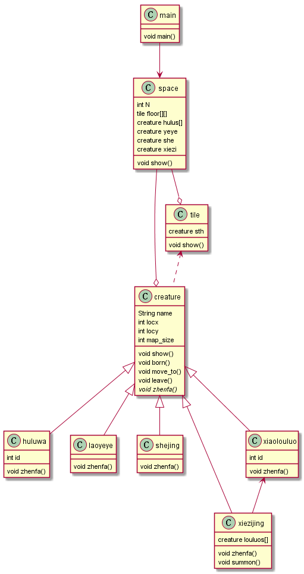

# 171870604 袁满杰 java课程 第三次作业

首先，我定义了Creature生物类，而葫芦娃、爷爷、蝎子精、蛇精都为其子类继承了Creature，如此便可将通用性的属性和方法放在其中增加代码的复用性，如show()输出自己、move_to()移动自己；同时其中还定义了抽象函数zhenfa(),对应于布阵时每个不同个体的策略（这里假设每个个体都懂阵法，根据自己是谁和当前要摆的阵法是什么就可以自动移动到指定位置中去）；

其次对于不同阵法中小喽啰数量的处理，我采用蝎子精可召唤小喽啰的设定（毕竟一般反派boss基本上可以无限召唤大众脸的小兵），因此将小喽啰数组设为蝎子精的一个属性（蝎子精拥有的"手下"）,从而在每次布阵时先执行召唤方法summon召唤出小喽啰，再命令每个小喽啰自己摆好阵法；对于阵法，我假设所有人都像是经过军训排练的新生一样，根据自己名字（id和类名）以及对场地的认知（长地大小map_size）就可以找到应该去的位置；

之后，我定义地板类和空间类，地板类负责承载生物（或虚无null）,而空间类定义了整个地板方阵，并实例化了所有出场人物散布在地板上；main控制类直接实例化空间类操作其中人物的动作发生（也即剧本操作整个故事中角色要做的事情）

最后程序赋予了每个生物生命与灵魂，他们可以自己通过move_to方法交换在地板上的位置而不需被上帝之手搬运，此时输入了整个地板的tile数组作为参数，意在模拟他们观察时局，掌握了此时地图上的全部信息并据此作出行动。

总UML类图如下：

最后阵法朝向的参考资料：http://www.360doc.com/content/12/0430/10/865028_207636798.shtml