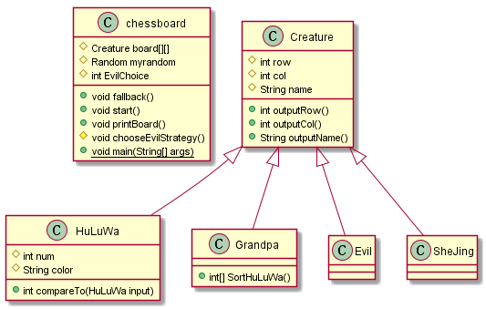

# 1.应用类的继承机制

	基类：Creature
		属性: int row //行
		      int col //列
		      int name //生物的名字
	子类：HuLuWa implements Comparable<HuLuWa>
		属性: int num //排行
		      int color //颜色
	子类: Grandpa
		方法: SortHuLuWa() //用于产生一个供葫芦娃排序的序列
	子类: Evil,Shejing
将妖精，葫芦娃和老爷爷都设置为Creature类的子类，从而使整个对峙场地可以定义为Creature类型；在子类构造函数中调用超类的构造函数设置行列和姓名。

# 2.应用Comparable机制实现两个类之间的交流

由于葫芦娃在进行排序时需要互相交流来得知是否需要换位置，因此将HuLuWa类定义为Comparable便于葫芦娃之间的交流与换位。

# 3.定义棋盘类控制对峙进程
	
chessboard中控制整个对峙的过程：

属性：

定义Creature board[15][15]作为棋盘

流程：

1.在对峙开始时首先设置蛇精和老爷爷的位置，并调用Grandpa类中的SortHuLuWa()方法产生一个初始葫芦娃序列

2.葫芦娃通过compareTo函数互相比较换位，进行冒泡排序。

3.调用chooseEvilStrategy()方法为妖精布置阵型

4.调用printBoard()方法输出棋盘

5.调用fallback()函数清空棋盘

