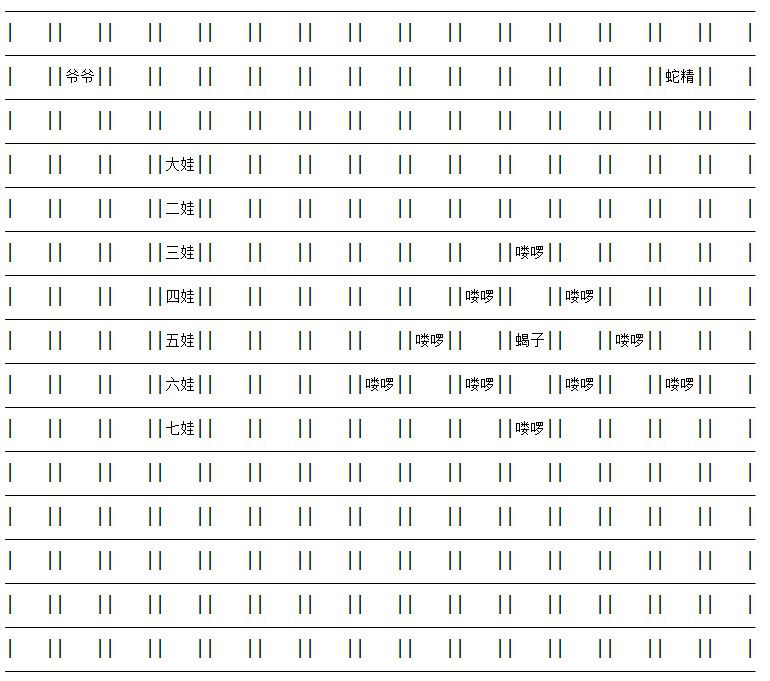
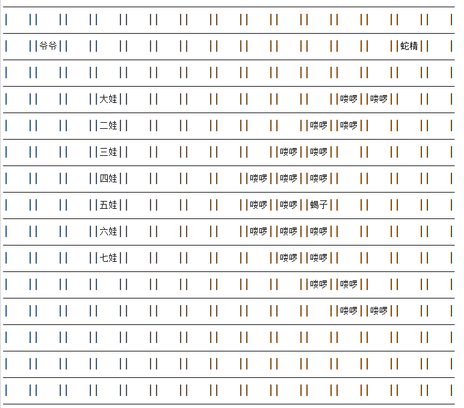
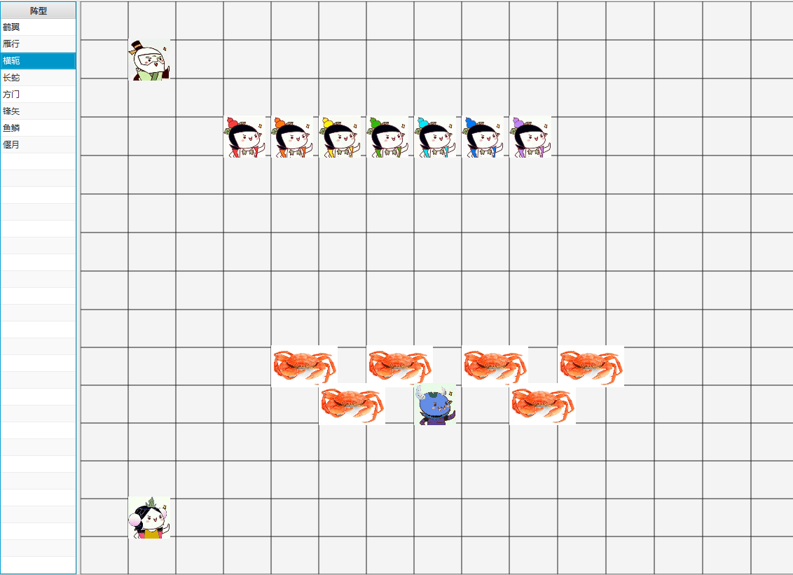
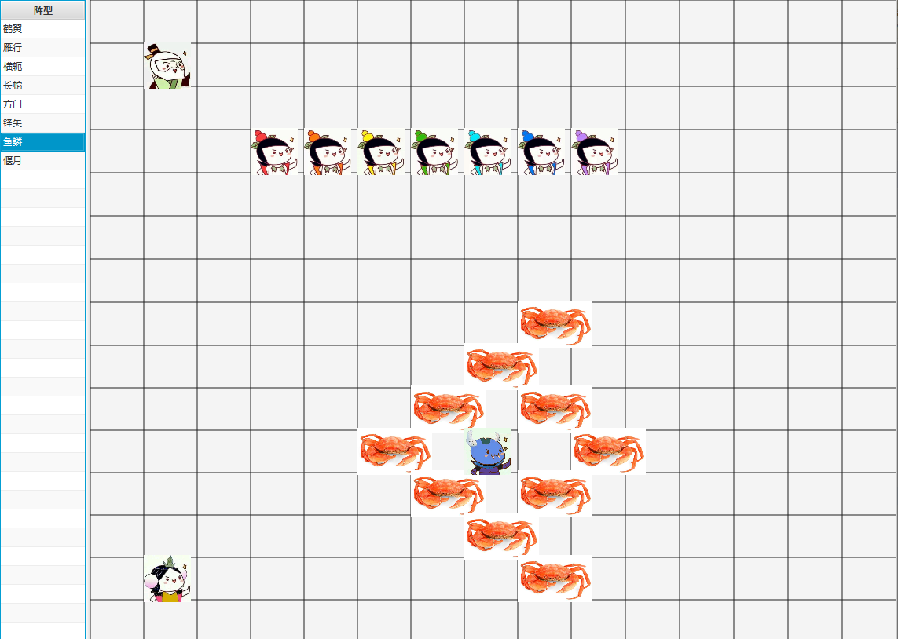

# 葫芦娃摆阵型


----------
## 最初版本使用控制台输出，详见withCmd目录

**运行截图**



		
		每隔2s输出一次战场情况，自动输出八个阵型

``` java
//				抽象类Unit为场上单位的基础类，有Calabash，Monster，GroundUnit三个子类，分别代表葫芦娃阵营单位，妖精阵营单位
//		和空场地。
//				Formation为枚举类，内部存储了8个不同阵型的单位之间相对坐标关系的信息
//				Army类代表一个方阵，为多个Unit和指定的Formation的聚合，代表场上的一个方阵，既可表示单个单位（比如爷爷）也可
//		表示一组单位（比如蝎子精带的虾兵蟹将）
//				Battleground类为战场的模拟，内用Unit类二维数组存储战场的实际情况，依赖于addArmy和delArmy对战场情况进行操作
//		并且直接通过setUnit方法对某个坐标Unit进行修改。重写了toString方法用于直接在控制台输出战场情况
//				
```


		实际上类的设计比较奇怪，不符合问题的自然理解


## 之后添加了javafx实现，详见withJavafx目录

**运行截图**




		在左边的列表中选择阵型，相当于更新了列表的选择项，这个选择项有一个指向更新右侧显示的函数的listener，每次选择
	不同的阵型都会更新右侧的显示
	
``` java
//
//		再次设计时尽量保持了MVC原则
//
//				抽象类Unit为场上单位的基础类，有Calabash，Monster 2个子类，分别代表葫芦娃阵营单位，妖精阵营单位，内部存储
//		对应的头像图片资源链接
//				Formation为枚举类，内部存储了8个不同阵型的单位之间相对坐标关系的信息
//				Army类代表一个方阵，为多个Unit和指定的Formation的聚合，代表场上的一个部队，既可表示单个单位（比如爷爷）也可
//		表示一组单位（比如蝎子精带的虾兵蟹将），并且存储有在战场上的坐标
//				Battleground类为战场的模拟，为多个Army的聚合，存储了当前场上的所有部队情况，只能操作Army，无法再直接更改
//		指定位置的单个Unit。
//				以上六个类为Model部分，共同实现战场模型的表达

//				BattlegroundOverviewController类为图形界面的控制器，当用户选择某个阵型时，显示该阵型的对峙情况
//				MainCalabash类为程序入口，也充当控制器的部分作用
//				以上两个类为Controller部分，实现Model到View之间的逻辑关系和同步监听

//				View部分使用Javafx的fxml进行布局，全部View部分只有一个fxml文件，由Controller在运行时进行加载。
//				
```


		这一版不仅用Javafx实现了GUI，同时对逻辑进行了重写，使得模型表现行为更自然更易于理解
		
		TODO:现在的程序仍然缺少交互性，下次更新将尝试写一些交互逻辑