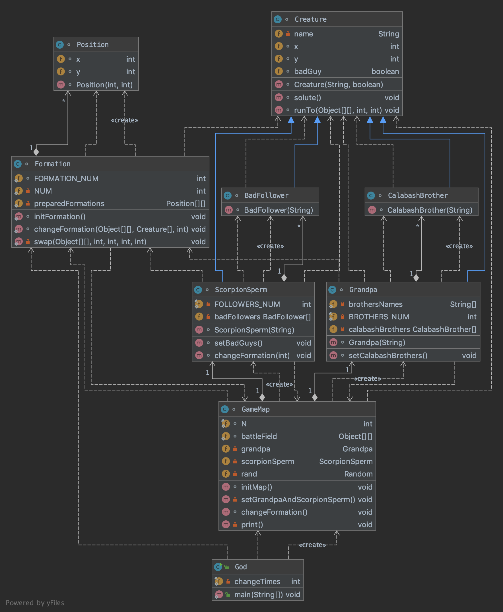

# 作业：面向葫芦娃编程

## 任务描述

葫芦娃有七兄弟（没看过的请参考[豆瓣](https://movie.douban.com/subject/1428576/)）。红娃排行老大、橙娃排行老二、黄娃排行老三、绿娃排行老四、青娃排行老五、蓝娃排行老六、紫娃排行老七，七兄弟各有一身独特的本领。故事中还有其他主配角，包括老爷爷、蛇精、蝎子精、小喽啰等。

请用**面向对象编程方法**，以Java语言编写程序，实现以下过程:

1. 假设存在一个`NxN`的二维空间（`N>10`)，该空间中的任意一个位置坐标上可站立一个生物体（葫芦娃、老爷爷、蛇精、蝎子精、小喽啰均属于生物体）；
2. 请让初始乱序的七个兄弟按下图所示阵型中的长蛇形依序（老大至老七）站队；
3. 请在图中选择一个阵型（长蛇除外）让蝎子精领若干小喽啰站队；
4. 将葫芦兄弟的长蛇阵营和蝎子精小喽啰阵营放置于二位空间中，形成对峙局面；
5. 请选择合适位置将老爷爷和蛇精放置于空间中，为各自一方加油助威；
6. 将上述对峙局面打印输出；
7. 请让蝎子精小喽啰阵营变换一个阵法（长蛇除外），重复4-6步。

---

## 面向对象的概念、机制与设计理念

### 抽象与封装

本次任务中设计到的对象有**葫芦娃**、**生命体**、**爷爷**、**蝎子精**、**小喽啰**、**地图**、**地砖**、**阵型**、**位置**以及**上帝**。接下来从不同的角度阐释任务中设计到的封装概念：

1. 在代表**地图**类的`GameMap`中，封装了二维数组`battleField`，其声明如下所示：

   `static Tile[][] battleField=new Tile[N][N];`

   **上帝（God类）**不能直接操纵该二维数组，只能调用`GameMap`类提供的函数，包括：

   * `void initMap()`：**上帝**调用该函数，初始化双方阵型。
   * `private void setGrandpaAndScorpionSperm()`：由`initMap`函数调用，在地图中防止**蝎子精**以及**爷爷**。
   * `void changeFormation()`：调整阵型，由**上帝**调用。
   * `private void print()`：在控制台打印地图，该功能不能有**上帝**直接调用，因为这是**地图**类自身的动作，故每次执行`initMap`函数以及`changeFormation`函数之后都会自动调用该函数进行打印输出。

2. 在进行阵型的改变时，**地图**类不能直接操作**葫芦娃**以及**小喽啰**进行移动，而是将消息发送给**爷爷**以及**蝎子精**，在代表**爷爷**类的`Grandpa`中，封装了一维数组`calabashBrothers`；在代表**蝎子精**类的`ScorpionSperm`中，封装了一维数组`badFollowers`。**地图**类只能使用`Grandpa`以及`ScorpionSperm`中提供的函数接口进行阵型初始化以及阵型变换，接口如下所示：

   * `void setCalabashBrothers()`：在地图中初始化**葫芦娃**，由`GameMap`类调用。
   * `void setBadGuys()`：在地图中初始化**小喽啰**，由`GameMap`类调用。
   * `void changeFormation(int formation)`：`ScorpionSperm`中的方法，用于变换**小喽啰**的阵型，由`GameMap`类调用。

### 继承

1. 由于**葫芦娃**、**爷爷**、**蝎子精**，**小喽啰**都是场景中出现的生命体，因此他们具有一些共同的、生命体都具有的行为，例如：拥有自己的**名字**，在地图上拥有自己的**位置**，是不是**好人**，**报出自己的名字**以及从地图中的某一点**移动**到另一点这些**属性**以及**行为**。因此本次任务中定义了一个`Creature`类，用来定义生命体都有的属性（**Field**）以及行为（**Method**）。如下所示：

~~~java
class Creature{
    private String name;
    int x;
    int y;
    boolean badGuy;
    Creature(String name,boolean badGuy){...}
  	//生命体报数
    void solute(){
        System.out.print(name);
    }
  	//生命体判断是否可以移动到某个位置
  	boolean canMove(Tile[][] battleField,int a,int b){
        ...
    }
  	//生命体移动到某个位置
    void runTo(Object[][] battleField,int x,int y){
        ...
    }
}
~~~

**葫芦娃**、**爷爷**、**蝎子精**以及**小喽啰**都继承了`Creature`类。

### 聚合

1. `GameMap`类中合成了`Grandpa`类实例化的对象`grandpa`以及`ScorpionSperm`类实例化的对象`scorpionSperm`。

   ~~~java
   class GameMap {
       private Grandpa grandpa;
       private ScorpionSperm scorpionSperm;
     	...
   }
   ~~~

2. `Grandpa`类中合成了`CalabashBrother`类实例化对象`calabashBrothers`；`ScorpionSperm`类中合成了`BadFollowers`实例化对象`badFollowers`。

   ~~~java
   class ScorpionSperm extends Creature{
       private BadFollower[] badFollowers;
     	...
   }
   class Grandpa extends Creature{
       private CalabashBrother[] calabashBrothers;
     	...
   }
   ~~~

考虑到：如果`GameMap`对象消亡之后，其中的成员对象`grandpa`本质上不应该消亡，所以此处不应该采用**强合成**方法，应该使用**聚合**方式：所有的生命体都由上帝`God`创建，`GameMap`中的成员对象只是对象的引用，这样`GameMap`对象消亡之后，其中的生命体仍能继续存在。

### 多态

多态是指不同的子类对于相同的消息可能会有不同的行为，根据对象的实际类型决定调用的具体目标，多态形成的条件包括：<u>继承</u>、<u>重写</u>以及<u>父类引用指向子类对象</u>。在本次任务中，**葫芦娃**、**爷爷**、**蝎子精**，**小喽啰**都是`Creature`类的子类，对于`Formation`类中的`changeFormation`函数，其定义如下所示：

~~~java
static void changeFormation(Object[][] battleField,Creature[] creatures,int formation){...}
~~~

输入参数中存在一个有`Creature`对象组成的数组`creatures`，因此无论传入的是**葫芦娃**队列，还是**小喽啰**队列，都满足输入参数的要求。已经满足了<u>继承</u>以及<u>父类引用指向子类对</u>象两个条件，，如果**葫芦娃**类或者**小喽啰**类中重载了`Creature`中的方法，那么就会调用重载之后的方法。本次任务中还没有重载`Creature`类中的方法，故无法进行实例验证。

---

### UML类图

