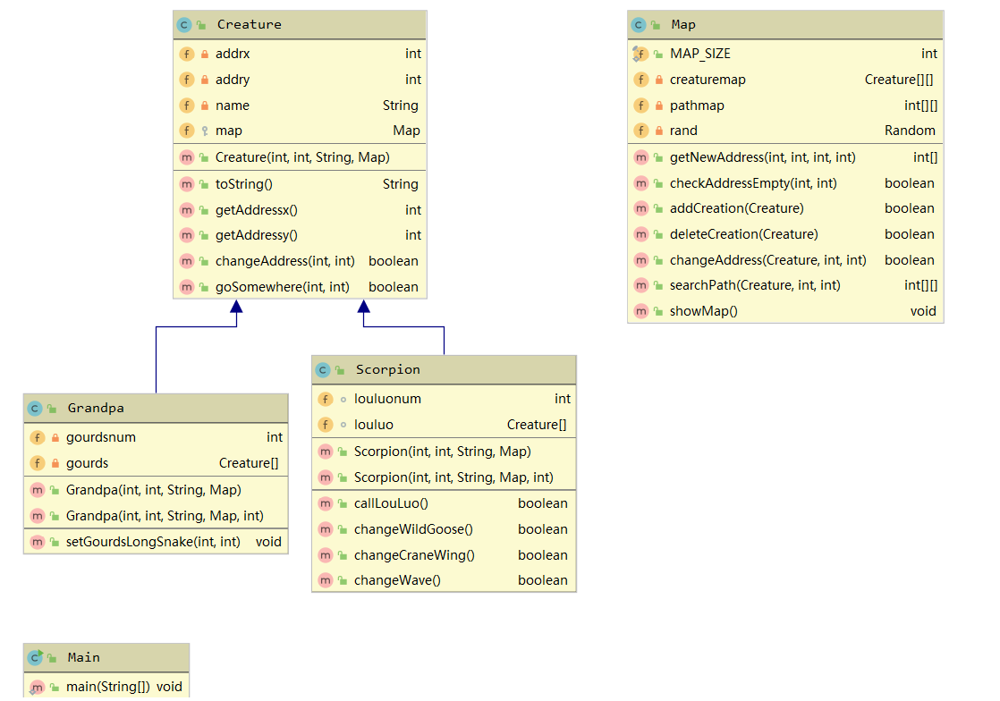

# 一、设计思路  
## （一）需求分析  
### 静态需求：  
（1）存在一个N*N大小的空间，且每个坐标点上可以存在一个生物。  
（2）空间中包括葫芦娃、老爷爷、蛇精、蝎子精以及小喽��若干。  
（3）葫芦娃、老爷爷同蛇精、蝎子精、小喽��站队成对峙局面。  
（4）老爷爷、蝎子精、蛇精位置任意，  
（5）葫芦娃按长蛇阵型乱序站队。  
（6）小喽��按长蛇阵之外的阵型站队。  
### 动作需求：  
（1）需要打印地图上的对峙局面。  
（2）小喽��能够在蝎子精的指挥下变换队形。  
## （二）模块划分与关系  
  主要包含**Main**、**Creature（生物）**、**Map（地图）**、**Grandpa（老爷爷）**、**Scorpion（蝎子精）**五个类，而对于**葫芦娃**、**蛇精**和**小喽��**，由于在本次作业的需求中没有特定的、依赖于其身份的动作，所以统一使用**Creature类**来表示。  
  **Map**中包含有**Creature**的引用数组，用于存储地图上的生物对象；同时生物存在于地图之上，所以生物能够看见整张地图，同时也能使用地图带来的一些操作，因此**Creature**中同样包含**Map**的引用；**Map**与**Creature**之间具有相互组合、相互包含关系。  
  老爷爷和蝎子精都是生物，都具有生物的属性，所以**Grandpa**和**Scorpion**继承了**Creature**，同时他们又有各自的属性和方法用于完成本次作业的需求。  
# 二、模块描述  
## （一）Creature生物类  
### 属性  
（1）int addrx, addry  
  记录生物自身的位置所在。  
（2）String name  
  记录生物的名称（老爷爷、蝎子精、蛇精等）  
（3）Map map  
  即整张地图的引用。  
### 方法  
（1）getAddressx() getAddressy() toString()  
  依次获得生物的位置坐标、名称的属性。  
（2）changeAddress(int x, int y)  
  直接修改生物的位置属性，同时也会同步修改Map中存放生物的引用的位置。  
（3）goSomewhere(int targetx, int targety)  
  尝试修改生物的位置，生物会在地图上试图找到一条到达目的地的路径，路径上不能出现任何生物进行阻挡，如果成功找到这样的路径，生物会进行位置的修改，同时打印经过的路径。  
## （二）Map地图类  
### 属性  
（1）public static final int MAP_SIZE  
  地图的大小，因为地图的大小在一开始就是确定的、不会改变的，同时在程序中会被多次使用，所以被设置为static final的常量。  
（2）Creature[][] creaturemap  
  用于存放并记录生物对象的引用数组。  
（3）int[][] pathmap  
  与楼上的creaturemap具有相对应的存储的内容，主要用于在地图上进行路径的寻找。  
### 方法  
（1）getNewAddress(int left, int righ, int up, int down)  
  获取一个范围，在检查给定范围中是否还有空闲的空间，如果有则在其中随机选取一个空闲位置作为结果返回。（不会修改地图的属性）  
（2）checkAddressEmpty(int x, int y)  
  检查给定位置的空间是否是空闲的。  
（3）addCreation( Creature creature)  
  向地图中添加一个生物，即修改creaturemap和pathmap两个地图。（地图中的一切方法都不会有对生物对象的修改）  
（4）deleteCreation(Creature creature)  
  从地图中删除一个生物，修改creaturemap和pathmap两个地图。  
（5）changeAddress(Creature creature, int x, int y )  
  修改地图上记录生物的引用的位置。  
（6）searchPath(Creature creature, int targetx, int targety)  
  在地图上寻找一条路径（使用广度优先遍历），如果成功找到路径，则会记录路径上经过的每一步的顶点（每步只修改x或y轴坐标之一，且数据值只修改1）。  
（7）showMap()  
  打印地图上所有生物的布局。  
## 三、Grandpa老爷爷类  
### 属性  
Creature[] gourds  
  老爷爷需要能管理葫芦娃，所以老爷爷类中会有一个记录葫芦娃的引用数组。  
### 方法  
setGourdsLongSnake(int x, int y)  
  在地图上的某个位置按长蛇阵型布置葫芦娃。  
## 四、Scorpion蝎子精类  
### 属性  
（1）int louluonum  
  记录小喽��的数量。  
（2）Creature[] louluo  
  同样蝎子精需要能指挥所有的小喽��，所以需要一个记录喽��的引用数组。  
### 方法   
（1）callLouLuo()  
  在场地上没有小喽��的情况下，蝎子精会召唤并生成若干小喽��，小喽��的位置随机。  
（2）changeWildGoose() changeCraneWing() changeWave()  
  依次指挥场地中的小喽��们排成雁行、鹤翼、�n轭三种阵型。  

