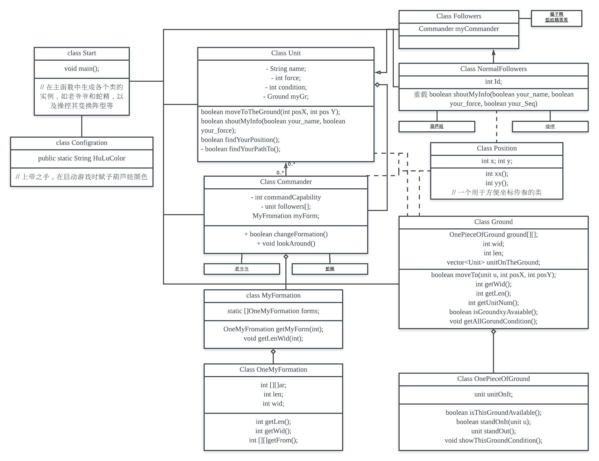

# 第三次作业思路简析 #

## 关于二维空间 ##

这次作业区别于前两次的一个明显变化就是，其特别要求了在二维空间上实现单位的移动。

因此，必须要一个能够承载单位的容器——我暂且把它命名为
> OnePieceOfGround

之后，通过把多个OnePieceOfGround聚合成一个可选大小的二维数组，并添加相应的属性和方法构成一个新类
> Ground

虽然地面没有自己挪动上面物体的能力，但是其客观上可以承载单位的移动，而实际上地面单位在地面移动时，与地面之间的力量交互是必须的——在这样的作业中模拟物理引擎显然并不现实，物体移动时传递给Ground类一个摩擦力反作用力信息也有些过于复杂——如果以后有需要可以模拟此过程，但是本次作业中暂且简化为单位与地面交互后将自己在地面上的位置改变。

## 关于人物 ##

此次作业的另外一个特殊之处就是人物的数量和种类增加了许多，且在第二次作业中负责排序的老爷爷，在这一次作业中也脱离了完全的“旁观者”身份，开始具有了位置和移动力等属性。

不难看出，此次所要求的人物具有的必然需要实现的共同属性包括 位置、身份，其他不一定需要实现的共有属性有生命力、移动力、性别等等。

而另外，对于指挥权限上，老爷爷和蛇精设定为唯一两个能够向本势力单位发送移动指令的单位

再有，明显的派系阵营的不同，同样是一个需要特别注意的属性——暂时可以直接在人物基础属性中进行实现。

因此，做出如下人物类的继承关系安排（详见图片中Unit、Follower、UnitCommander、NormalFollowers等类之间的关系）
从Unit单位类派生出单位命令者这一可以发送指令，且具有指挥能力值的派生类，而同时，Followers和NormalFollowers依次继承，模拟了葫芦娃和喽啰这种具有编号的小角色的可编号性质。

## 单位类和地面类之间的关系 ##

Unit和地面类可以交互，地面理论上能且仅能完成单位移动一格的操作，单位可以访问地面，从而得知自身位置和地面上的障碍物状况，并自己寻找到如何一步一步走到对应位置的方法，而Unit可以通过巡视地面，从而显示出地面上的单位情况——无论我们的终端是地面被动刷新显示的结果还是单位主动观察地面显示的结果，其实都是说得通的，因此作业中没有把这两个方式分得太清楚。

单位只能从地面的边缘踏上和走下地面，这个功能虽未做要求，但是我认为是必须要实现的，在作业实际呈现的效果中，这一点已经实现了，但是其实在代码中完成得尚有瑕疵，不是说功能没有实现，而是这个走上走下的过程有一部分把是否行走的决定权限给了地面，但其实是不符合实际的——这一部分容我以后想得比较清楚时再修改吧……

另外，代码中还有一些小的设计存在问题，例如单位的寻路和走路功能被集成到了一个方法中实现，于是在极端情况下可能会出现找不到路却仍在走动这样的bug。还有一些例如把寻找走上地面的位置的功能有一部分居然给到了main函数，但是由于时间关系，一旦彻底修改牵扯比较大，难以调试，只能下次一起修改了。

希望老师给分手下留情鸭 QAQ
