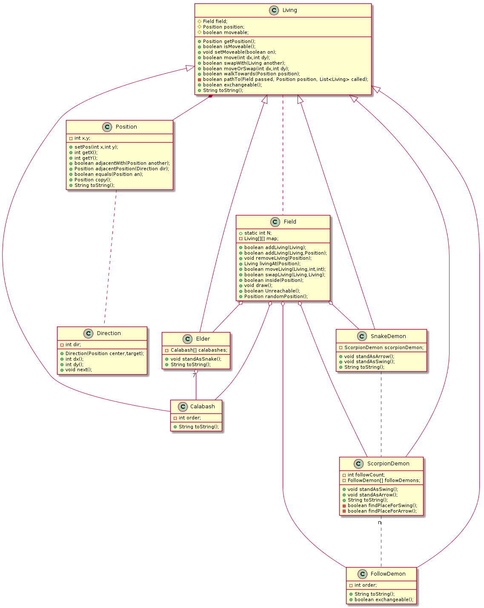

# 第3次作业
171870660, 马兴越

本次作业弃用了上次实现的部分，重新实现所有内容。

## 类结构概述
### 生物部分
生物体部分构成`items`包，包含以下类。
* `items.Living`类。生物体类，所有生物体的基类。以下的生物体类，全都派生自本类。
* `items.Calabash`类。葫芦娃类。
* `items.Elder`类。老人家类。老人家负责指挥葫芦娃排队，维护葫芦娃的引用。
* `items.FollowDemon`类。妖精的喽啰类。各个对象有一个序号，但编程中认为各个对象是全同（i.e.可交换）的。
* `items.ScorpionDemon`类。蝎子精。负责指挥喽啰布阵，并站在阵首，维护喽啰的引用。
* `items.SnakeDemon`类。蛇精。理论上负责指挥蝎子精和喽啰，维护有蝎子精的引用。
### 场地部分
所有与场地和位置有关的类构成`field`包，包含以下类。
* `field.Field`类。场地类。是所有生物体活动的场地，有`N*N`的正方形场地，每个位置由坐标`(x,y)`确定。
* `field.Position`类。位置坐标类。在`items.Living`类中记录当前生物体所处的位置，在`field.Field`中作为参数，用于访问指定的位置。
* `field.Position.Direction`类。邻域方向类。指定以某点为中心的八个方向（东，东北，北，西北，西，西南，南，东南）之一，并计算该方向相对中心位置的偏移量`dx` `dy`。

### 阵型部分

阵型部分构成`formations`包，此部分于2019年10月6日重构完成。根据目前的要求，有以下类。

* `formations.Formation`类。抽象的阵型基类。
* `formations.SwingFormation`类。“鹤翼”阵型类。
* `formations.ArrowFormation`类。“锋矢”阵型类。


## 设定
本系统下，我们设定生物体在场地中的移动，每次只能在**八邻域**意义下相邻的格点间完成。我们设定，相邻位置的两个生物体可以交换位置，且此动作一步完成，不需要多余的空间和步骤。

## `items`包
### `items.Living`类
实现了所有生物体共有的数据成员`field.Position`，即记载当前的位置。
#### 活动方法
实现所有生物体共有活动方法。各方法返回值类型皆为`boolean`，标识是否成功。`move`方法是向邻域移动一步，`swapWith`方法是与邻域的一个生物体交换位置，而`moveOrSwap`是向邻域中指定的位置移动，如果该位置已经有生物，则与之交换位置。

我们设定，生物体是**主动**移动的，从而移动的过程需要向生物体发送消息，而`items.Living`类调用引用中的`field.Field`的有关方法来实现移动。

#### 重写的公共接口
实现了所有生物体共有的接口`isMoveable` `exchangeable`和`toString`，这些方法在派生类中可能重写。

`exchangeable`方法指出该类的对象是否是全同的。本实现中，只有`items.FollowDemon`的对象被认为是全同的。如果此方法返回`true`，则当不可移动的**同类**生物挡住移动时，可以让该对象和当前对象的任务交换。

`isMoveable`方法指出该生物体是否可以移动。一般的，在布阵时，已经就位的生物体设置为不可移动，当它们挡住后来的生物时，后者只能绕路，以防止打乱已经排好的阵型；特别的，当`exchangeable`为`true`时，我们认为该类的所有对象全同，可以交换两者任务。

`toString`方法返回该生物体在输出地图上的标记。

#### 移动到指定位置的的实现
实际的生物体不仅可以移动一步，而且可以自主“寻路”找到指定的位置。在`items.Living`中，使用`walkTowards`方法完成这件事，使用递归算法`pathTo`来具体实现。其中，要求每一步的移动都符合基本的移动规则设定。

`pathTo`的实现采用的是类似于`DFS`的方法。首先调用`field.Direction`计算出目标位置关于当前位置的方向，如果该方向*可到达*（`reachable`），则移动到该位置，递归；如果不可到达，则在变换方向，找到可移动的一个邻域，移动过去，递归。如果递归返回`false`，即该方向没有通路，则退回原来位置，继续寻找下一方向。如果一圈都找完了还没有通路，则判定不存在通路，返回`false`。

前已述及，一般情况下，将布阵中已经就位的生物体的`moveable`设为`false`。在实际操作中，尤其是对妖精的布阵中，经常出现已经布阵的部分妖精和葫芦娃连成一条线，从而把地图分成两部分，会造成比较大概率的移动失败。为此，引入前述的`exchangeable`接口，当遇到可交换的同类对象阻挡时，如果它不在`called`列表中（i.e.不是直接或间接调用本对象的对象，防止死递归），则将移动到指定位置的任务交给它，而自己直接到它原来的位置即可。

在遍历过程中，使用`field.Field`类的实例`passed`用于记录已经到达过的地方。对于每个到达过的地方，加入一个`items.Living`实例，如此，地址`p`没有到过是当且仅当`passed.livingAt(p)==null`。

### `items.Elder`类
老人家类是`items.Living`的一个子类，其`toString`方法返回`LRJ`，即“老人家”，标识在地图上。

我们设定葫芦娃布阵由老人家负责指挥，葫芦娃对象由老人家负责构造。由于葫芦娃是最先布阵的，所以只要大娃所处的位置以下有足够的位置，就一定可以布阵成功。首先将大娃调整到指定的位置。然后依次计算出各个葫芦娃的位置，向葫芦娃对象发消息，由葫芦娃对象自己寻找路径移动到该位置。

### `items.ScorpionDemon`类
蝎子精类也是`items.Living`的子类。与老人家类似，蝎子精需要指挥喽啰（`items.FollowDemon`）布阵。布阵的实现过程与前者类似，但由于阵型比较复杂，很多位置实际排不出阵型，因此在实施布阵前有一系列的检查和移动操作。以下以“鹤翼”(`Swing`)阵型为例说明，实现的另一个阵型“锋矢”（`Arrow`）是完全类似的。

以下内容是布阵的逻辑，自2019年10月6日重构后，这部分逻辑已经迁移到`formations.Formation`类中。

>  利用`readyForSwing`方法检查当前空间是否能够排布Swing阵型。原理是依次检查阵型所需要到达的各个位置是否是可到达的。
>
> 利用`findPlaceForSwing`方法，以递归算法寻找一个可以布阵的首领位置。如果当前位置不能布阵（`readyForSwing()==false`），则遍历周围的八个方向，寻找一个可以到达的位置，递归，如果成功找到则返回`true`，如果找不到则退回来找下一个；如果八个方向遍历完毕还是没找到，则返回`false`。

## `Field`包

### `field.Field`类

`field.Field`类维护场地信息。用`public static final int N`记载场地的尺寸。

利用`items.Living`实例的多态性，用`items.Living[][] map`二维数组记录每个位置的生物体，如果该位置没有生物体，则为`null`。为了输出位置方便，`map`的安排中是先行后列的，但一般习惯的`(x,y)`坐标中，`x`表示横坐标，为此在内部表示和调用中存在一个转置。为了适合一般习惯，实现了`livingAt`方法：
```java
public items.Living livingAt(field.Position pos){
    return map[pos.getY()][pos.getX()];
}
```
为了保证数据统一性，程序过程中应当始终满足：
```java
field.livingAt(p)==null || field.livingAt(p).getPosition()==p
```

### `field.Position`类
> 2019.10.04重构添加本节内容

使用`Position`类记录每个生物体的位置，作为`Living`的成员。

本次重构中，把`Direction`作为了`Position`的内部类（inner class）。由于程序中`Direction`实例的创建总是存在一个中心，利用内部类的closure引用，可以在`Direction`的方法调用中直接完成对`Position`的操作。

新增了`Direction.adjacentPosition()`和`Direction.aStep()`方法，前者返回按当前对象所示方向移动一步后的位置（而当前的`Position`对象不变），后者将当前的`Position`对象按`Direction`所示方向移动一步。同时取消`Position.adjacentPosition()`方法定义。


## `formations`包

> 2019.10.06重构添加本包，将`ScorpionDemon`类中关于阵型的方法有效内容抽离出来形成主要逻辑，同时添加本部分内容。

###  `Formation`类

`Formation`类是所有阵型的抽象基类。维护`field` `leader`（首领） `followers`（从者）引用，由`scorpionDemon`实例化。

本类接口方法为：

`embattle()`布阵。先调用`findPlace()`方法寻找可以布阵的首领（`leader`）位置，或返回无法找到；然后将`followers`依次放到`form()`指定的位置。

本类有一个抽象方法`form()`，由派生的具体阵型类来实现。返回一个指定所有`followers`位置的`Position`类型数组，其大小和`followers`大小一致。

`findPlace`方法使用递归算法寻找`leader`的位置，使得当前类的阵型能够铺开。能够铺开的条件是，`form()`指定的位置上没有不可移动对象，此过程由`ready()`方法判断。

`findPlace()`方法首先检查当前`leader()`所在位置是否可以布阵，若是则直接返回，否则遍历周围的8个邻域方向，进入可到达的位置然后递归；如果递归返回找到了位置，则返回；否则退回原来位置，进入下一方向。此过程类似`DFS`算法。

## `UML`类图

使用`PlantUML`给出类图。在类图中，使用没有附加符号的虚线来表达`关联`关系，即有互发消息的类。即使一个类中存在另一个类的引用，但若它们之间不存在`组合` `聚合` 关系，仍然认为是`关联`关系。例如`items.SnakeDemon`和`items.ScorpionDemon`。

