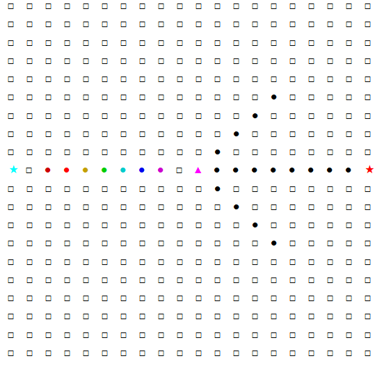
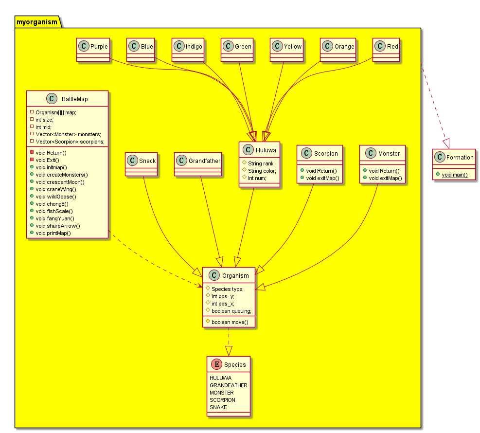

# 葫芦娃变阵型
#### 171860033 黄诗涵

## 继承
 
&emsp;&emsp;地图上的每个个体都是生物体，都有相同的属性：坐标，物种，会做相同的动作：移动，交换位置等。
则将这些共同的属性写在一个基类里（Organism类），葫芦娃，爷爷，蝎子精，蛇精继承自这个基类（葫芦娃还可以分为大娃，二娃等7个不同的葫芦娃），再在派生类中扩展各自特有属性。  
**好处**：   
1.简化了对各种角色的描述,能清晰地体现层次结构关系。  
2.精简代码，减少重复代码。

## 枚举

在地图中，使用了基类的二维数组，则需要一个标识来区别不同的生物体，于是定义了一个枚举类，其中包括了各个物种的名称。  
**好处** ：  
如果不用枚举，就必须在类中定义常量（public static final），而这个常量只在本类中可见，就要在其他类中也定义才能通用。精简了类的成员变量，枚举类在整个包内都可访问。只需一处定义，则可维护性强，利于扩展。

## 异常处理
在创建地图时，太小的地图容不下最低限度的阵型变换，所以当自定义的地图size小于18，会抛出异常终止程序。  
输出：  
Size of map is too small.  
Exception in thread "main" java.lang.NullPointerException

## package

将类的实现都放在一个文件夹里，使他们同属于一个包。
**好处**：  
1.限定了访问权限。对外隐藏了private，protected的变量和方法，有利于封装。
2.同一个包内的类可以互相访问，方便了内部的实现。
3.功能相似的类组织在一起，方便查找调用。
4.可以避免命名冲突

# 阵型的实现

## 自由的地图大小和敌军数量
  1.只要长宽不小于18,任意大小都能完成阵型变换。
  2.每个阵型是依据当前小喽啰数量和地图大小进行调整的。地图越大，可容纳的敌军越多。
  3.可指定小喽啰数量，地图容纳不下的小喽啰是存放在一个Vector里，将来的实现可以是当地图上敌军死亡，再从Vector取出补充到地图上。
  
## 转换阵型  
为了方便，切换阵型时，将场上所有需要调整的对象放入Vector里，但保存下坐标。再依次根据阵型进行move操作（生物体基类中定义的方法）  
可以打印出怪物移动方向比如((0,0)->(1,1))

<u>可能有更流畅的移动方式，但按人数和地图大小会调整队形，不太好实现，待优化</u>

## 地图
>
>地图类实际上是的给生物体(葫芦娃、蝎子精等)指挥的角色，所以地图类与生物体基类Organism有依赖关系，在地图类中定义了N*N的二维数组（Organism[][]）。
>
>但考虑到每一格地砖也可能有自己的属性（比如地板会喷火，有坑），后期可能重新构造这个类。

  

 >如图，左侧蓝色★表示爷爷，接着7色的圆点表示葫芦娃，紫色三角是蝎子精，黑色圆点是小喽啰，最右侧的★是蛇精。

##关键方法

### BattleMap.init()
功能：初始化地图，让爷爷，蛇精站在两边加油助威，让葫芦娃按顺序站成长蛇阵。

### createMonsters(int)
功能：选择小喽啰数量

### 其他
        map.crescentMoon();//偃月
        map.printMap();//打印地图
        map.craneWing();//鹤翼
        map.wildGoose();//雁行   
        map.chongE();//冲轭
        map.fishScale();//鱼鳞 
        map.HouEn();//方円
        map.sharpArrow();//锋矢

