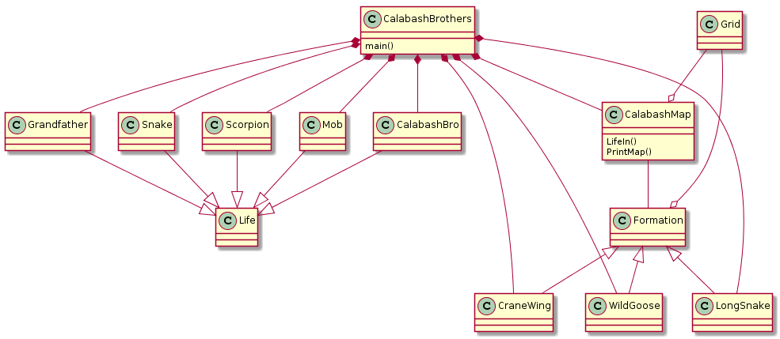

## 作业3实验报告

#### 齐家乐 171850589

### 类简介

代码文件为CalabashBrothers.java，共实现13个类，简介如下：

CalabashBrothers类中只有main方法，作业要求的全部内容相关操作均在此方法中完成。

Life类指**生物体**，是以下五个类的父类：

​	CalabashBro**葫芦娃**

​	Grandfather**老爷爷**

​	Snake**蛇精**

​	Scorpion**蝎子精**

​	Mob**小喽啰**

CalabashMap**地图**类，较重要，主要实现了将生物体放置于空间中的方法和打印地图状态的方法

Formation**阵型**类，是以下3个类的父类：

​	CraneWing**鹤翼阵**

​	WildGoose**雁行阵**

​	LongSnake**长蛇阵**

Grid**格子**类，生物体放置于格子中,格子类聚合成了地图类和阵型类的主体

地图类通过复制阵型类中的阵型排布使生物体布于地图上

### UML类图

