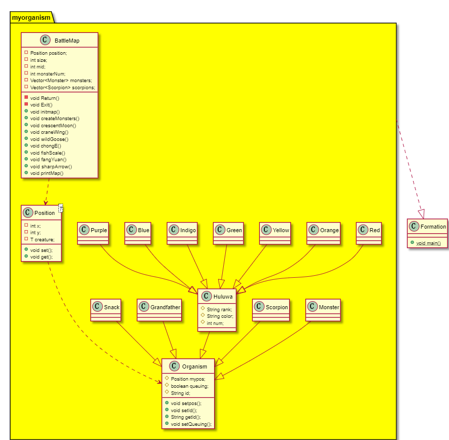
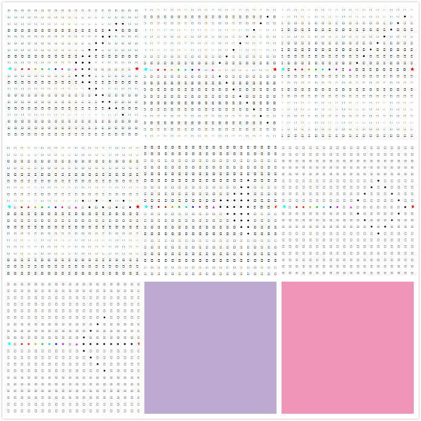

# 小喽啰变阵型_v2
#### 171860033 黄诗涵

## 改进
1. 添加了Position类来表示地图上的离散点，看作“一块地板”，在这个地板上可站立生物体。上一个版本中没有具体表示地板，而是默认一个坐标一个生物，用基类的二维向量表示地图。

2. 在第三次作业中，为了在运行时刻区分对象的类型，我添加了一个枚举型变量来表示对象所属的类。  
JAVA反射机制是在运行状态中，对于任意一个类，都能够知道这个类的所有属性和方法；对于任意一个对象，都能够调用它的任意方法和属性
利用Class.isInstance方法可以在运行时获得对象所属类。

## 泛型与反射
一块地砖上能站立多种生物体，定义为泛型类，则不需要在编译时期知道地砖上得生物属于哪个类。  
```
  public class Position<T extends Organism> {
    private T creature;
    ...
}
```
当需要知道对象得类型时,比如打印地图信息，调用Class.isInstance  

反射机制还可以使程序能够调用任意类的private,public成员变量或修改某一字段。  
当生物体移动时，需要修改生物体的坐标（调用setpos方法）
重新排列队形时修改生物体状态，都要用到反射机制  
例如：  
```
 try {
        Class c=creature.getClass();
        Method m=c.getMethod("setpos", Position.class);
        m.invoke(creature,this);
    }
    catch (NoSuchMethodException e) {}
    catch (IllegalAccessException e){}
    catch (InvocationTargetException e){}
```
Class.getDeclaredMethod能获得类中定义的方法，不包括从基类继承的方法  
用到Class.getMethod函数时必须要有异常处理

修改成员变量使，尝试使用Field.getField方法，但它不能获得从基类中继承的声明为private或protectde的成员。 于是仍然用public方法。


