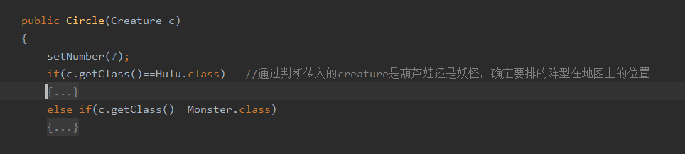
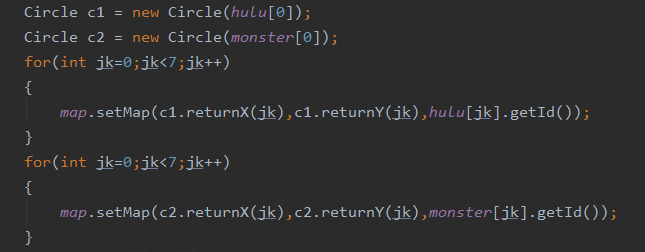

本次的要求为用泛型和反射改写葫芦娃程序。

由于数据结构发生改动，故重新说明：

Creature：包含了生物类的各种属性以及操作。各种生物如葫芦娃、爷爷、蛇精等都继承自Creature类

Formation：包含了布阵的信息，目前包含长蛇阵、方圆阵、锋矢阵。其中保存数组，实例化后只需根据数组对应站上map的对应位置即可。

Map：封装有15*15的棋盘，另有各种与地图有关的操作，如更改地图上所站的生物、根据生物id查找位置等。

关于改写要求：泛型实在是无法添加上，但java反射机制是必须的。如下图：

在阵型的构造时，根据传入的Creature是哪个阵营的（葫芦娃阵营还是蛇精阵营）来决定所站的位置。

在进行初始化时也用到反射机制