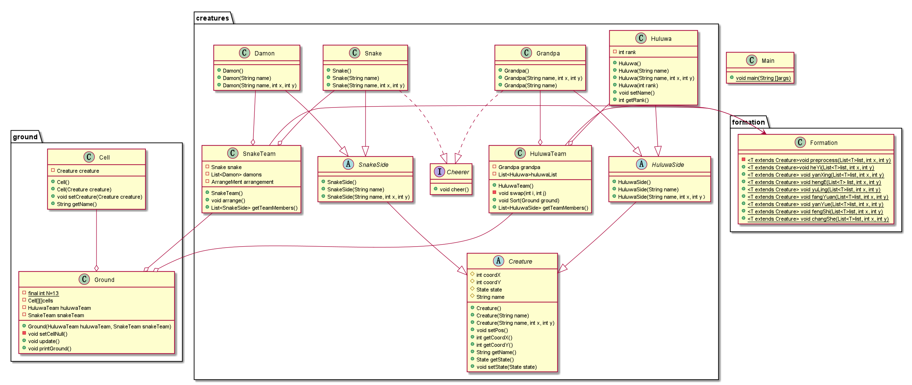
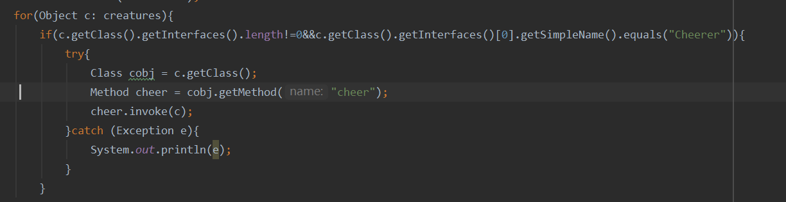
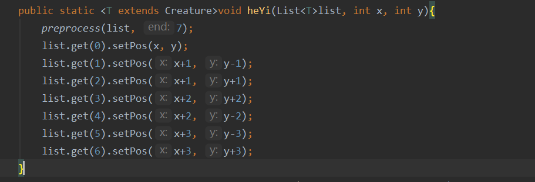

# homework 4

## 需求分析

1. 假设存在一个`NxN`的二维空间（`N>10`)，该空间中的任意一个位置坐标上可站立一个生物体（葫芦娃、老爷爷、蛇精、蝎子精、小喽啰均属于生物体）；
2. 请让初始乱序的七个兄弟按下图所示阵型中的长蛇形依序（老大至老七）站队；
3. 请在图中选择一个阵型（长蛇除外）让蝎子精领若干小喽啰站队；
4. 将葫芦兄弟的长蛇阵营和蝎子精小喽啰阵营放置于二位空间中，形成对峙局面；
5. 请选择合适位置将老爷爷和蛇精放置于空间中，为各自一方加油助威；
6. 将上述对峙局面打印输出；
7. 请让蝎子精小喽啰阵营变换一个阵法（长蛇除外），重复4-6步；
8. 在设计和编码过程中加入反射和泛型机制。

## 假设和依赖

​	1.蛇精阵营的妖精变化阵型时，妖精数目会改变，具体数目参照作业说明中的图；

​	2.若后期某个妖精死亡，不会因该位置的缺失而移动其他妖精以保持阵型；

​	3.由于阵型变化时妖精的数目会改变，故不模拟阵型变化过程中每个妖精的移动过程，只表现阵型变化后的结果。

## 设计介绍

### Creature（抽象类）

生物类，游戏中所有生物的子类，具有的成员变量是自己在地上的坐标、姓名、状态（活/死）。成员函数为：设置自身坐标、获得当前坐标、设置、获得对象状态。

### HuluwaSide(抽象类)

葫芦娃阵营的类，继承Creature。

### SnakeSide(抽象类)

蛇精阵营的类，继承Creature。

### Cheerer(interface)

啦啦队员接口，含有cheer犯法，为自己队员加油。

### Huluwa

继承HuluwaSide，增加了rank，增加了getRank()函数。

### Grandpa/Snake

分别继承自HuluwaSide和SnakeSide, 都implements Cheerer，为自己阵营的队友加油。

### Damon

继承自SnakeSide, 表示蝎子精及小喽啰。

### HuluwaTeam

由葫芦娃兄弟和爷爷组成，可以完成作业要求中的排序操作。

### SnakeTeam

由蛇精、蝎子精、小喽啰组成，可以完成阵列的变换操作。

### Formation

阵列类，针对每个阵列，都有对应的static函数，输入需要排成一个阵列的对象的List, 函数执行的结果是将输入List中的对象排列为对应的阵列。

### Cell

将大地划分为一个个小方块，每个方块上有其上站立的生物体的引用。

### Ground

成员变量是葫芦娃阵营和蛇精阵营生物体的引用，以及13$\times$13的Cell，具有update(),printGround()成员函数，用于更新当前状态以及打印输出。

## UML类图

## 面向对象理念

### 封装

将每个实体封装为一个类，类与类之间互不干扰，通过接口函数传递消息。

### 继承

Creature抽象了所有生物体的特征，作为游戏角色的子类。

HuluwaSide和SnakeSide继承自Creature，将游戏角色划分为葫芦娃阵营和蛇精阵营。

Huluwa, Grandpa继承自HuluwaSide，表示葫芦娃和爷爷。

Snake，Damon继承自SnakeSide, 表示蛇精和其它妖怪。

### 多态

针对爷爷和蛇精加油的行为，爷爷输出：“葫芦娃加油！”， 蛇精输出“妖怪加油！”， 该函数调用时通过Cheerer接口调用， 对于cheer函数使用了多态的机制。

## 反射

每一轮阵列变化后，需要每一队的啦啦队员进行加油，通过getInterfaces判断是否为Cheerer接口，再通过invoke函数调用cheer方法，实现加油的功能，从中可以看出，还使用了**异常处理**的机制。

## 泛型

在Formation，即阵列类中，包含所有阵列的static方法，每个方法含有一个T extends Creature的类型参数，通过接收List\<T\>list作为参数，重排list中的生物阵列。

以鹤翼阵列为例：

同时，HuluwaTeam和SnakeTeam中的生物也是通过List来存放，也使用了泛型的机制。
