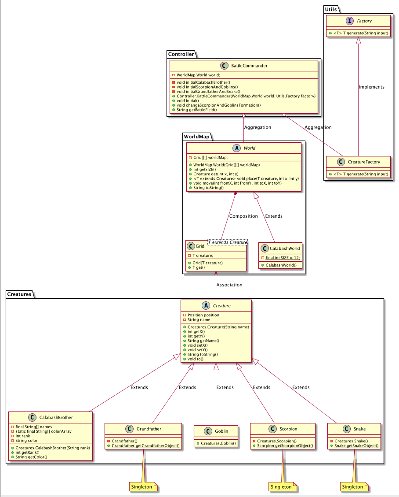
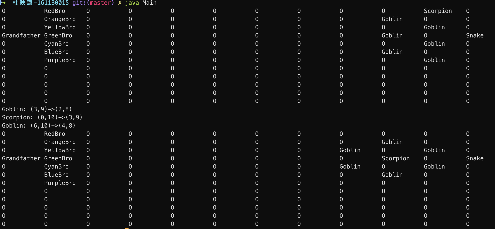

# 第四次作业：面向葫芦娃编程（四）

## UML 图



## 优化思路

本次实验主要根据近几次课上所讲内容对前面的实验进行了部分设计上的优化，下面阐述主要的几点

### 增加 Position 类

在 Creature 中增加了一个 Position 类，用于表示 Creature 所处的位置，这样的实现相较于之前直接将 x 和 y 坐标的值作为 Creature 的成员变量，提高了代码的可读性

### ISP 原则

在原先的设计中，Creature 中的 getName 方法违反了 ISP 原则。原因在于该方法一直都没有被使用，造成了对所有子类的接口污染，因此将其删除掉

### DIP 原则

在原先的设计中，Creature 是一个具体类，而高层模块 World 持有一个对具体类 Creature 的引用，因此违反了 DIP 原则，于是在本次实验中，我将 Creature 变为了一个抽象类  
在原先的设计中， World 为具体类，而 BattleCommander 中持有这一个具体类的引用，这属于高层模块依赖于低层模块，抽象依赖于实现，因此将其变为抽象类，表示抽象意义上的世界，同时增加一个 CalabashWorld 表示葫芦娃的世界

### 泛型的使用

本次实验在两个地方引入了泛型：  
第一是在 World 类中，使用了 Grid 组成的二维数组来表示世界地图，相较于之前使用 Creature 数组来表示的实现方法，新的实现方法更加符合实际情况，即地图上的位置是固有存在的，而 Creature 只是站在上面而已

```java
public abstract class World {
    private Grid[][] worldMap
}
```

这里的 Grid 为新定义的泛型类，其定义如下：

```java
public class Grid<T extends Creature> {
    private T creature;

    public Grid(T creature) {
        this.creature = creature;
    }

    public T get() {
        return creature;
    }
}
```

第二是在实现通过类名直接创建对象的部分使用到了泛型，这一部分将在后面讲反射时阐述

### 反射的使用

其实就当前实验的需求来说，使用泛型和反射的必要性都不足，但考虑到后续大实验的设计，我还是使用反射为程序添加了一个通过输入类的全路径名称（例如 Creatures.Creature）来创建对象的功能，并将其封装在一个工厂类中，供上层模块直接调用，这样子就不需要直接操作下层实现模块，，同时统一初始化方法，使用起来更加方便。具体来说，我先定义了一个名为 Factory 的接口：

```java
public interface Factory {
    <T> T generate(String input);
}
```

可以看到，这里也使用了泛型方法，这样即可以自动根据输入的类名返回对应类型的对象  
接着，新建 CreatureFactory 类实现这一接口：

```java
public class CreatureFactory implements Factory {
    /* Factory for class Creature and all its subclasses */
    @Override
    public <T> T generate(String input) {
        /* For CalabashBrother, the input string has the from of: Creatures.CalabashBrother#3
         *  For others, the input string has the form of: Creatures.Goblin
         * */
        ....
    }
}
```

在上层的 BattleCommander 类中，我们初始化时会一并传入该工厂接口的具体实现，供其实现初始化：

```java
public class BattleCommander {
    private World world;
    private Factory factory;

    public BattleCommander(World world, Factory factory) {
        this.world = world;
        this.factory = factory;
    }

    private void initialCalabashBrother() {
        /* We will place calabash brother on the second column */
        int numCalabashBrother = 7;
        int columnIndex = 1;
        for (int i = 0; i < numCalabashBrother; i++) {
            world.place(factory.generate("Creatures.CalabashBrother#"+ i), i, columnIndex);
        }
    }
```

### 使用包（package）的文件组织

本次实验我将源代码按照其逻辑功能分别放到了不同的几个包内，使得项目目录更加易读，更易调试和维护

## 编译运行方法

```shell
javac -d ./src *.java
java Main
```

## 运行截图


