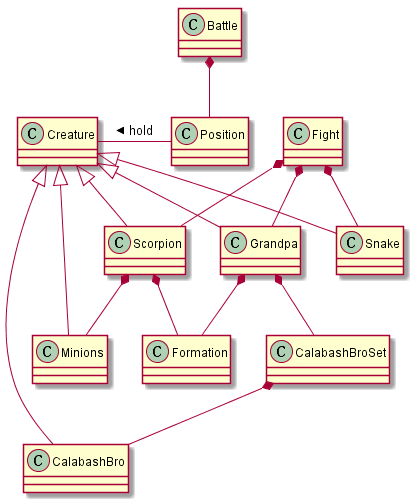
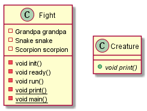
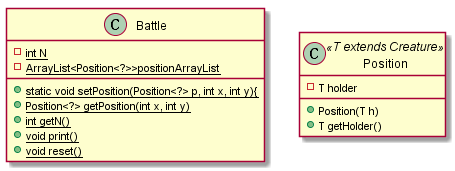
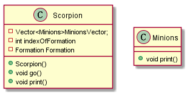
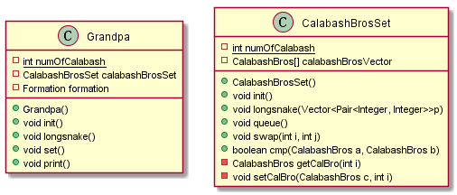
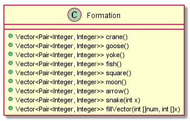

# README

## 设计框架


### 第一层
#### Fight类和Creature类


+ `Fight.init()`:初始化站位(葫芦娃乱序)
+ `Fight.ready()`:葫芦娃按长蛇形排列站在左边，爷爷站在葫芦娃后面，蛇精站在右边
+ `Fight.run()`:蝎子精带领小喽啰变换阵型
+ `Creature.print()`:通过动态绑定打印出符号

#### Battle类和Position类
  
Battle类描述了一个N*N的二维空间，Position类使用了**泛型**，是二维空间里的单元，包装了一个生物体。  

+ `Battle.setPosition`:返回空间中指定坐标的信息
+ `Battle.getN`:返回N值
+ `Battle.print`:打印二维空间
+ `Battle.reset`:重置二维空间中小喽啰和蝎子精的位置信息(变换阵型前)
+ `Position.getHolder`:返回Position中引用的Creature对象

### 第二层
#### Scorpion类和Grandpa类
  
Scorpion类表示了蝎子精带领了小喽啰，`Formation`表示阵型，`indexOfFormation`表示第几个阵型。  
+ `Scorpion.go`:变换阵型，设置站位

#### Grandpa类和CalabashBrosSet类
  
Grandpa类表示老爷爷和葫芦娃。CalabashBrosSet类表示葫芦兄弟。  
+ `Grandpa.init`:设置了爷爷的站位(调用`set()`)，其中调用了`CalabashBrosSet.init`，初始化乱序葫芦娃。
+ `Grandpa.longSnake`:表示葫芦娃按长蛇型站位
+ `Grandpa.set`:设置站位
+ `CalabashBrosSet.queue`:给葫芦娃排队
+ `CalabashBrosSet.swap`:交换葫芦娃次序
+ `CalabashBrosSet.cmp`:按辈分比较两个葫芦娃

### 第三层
#### Formation类
Formation类描述了阵型，**通过反射调用Formation的方法**。  
  
通过反射调用，返回阵型坐标。使用反射的好处可以增加代码的复用性。若增加新阵型，只要修改Formation类和`enum formationType`， 不需要修改调用处的代码。
``` java
formationType f = formationType.values()[(indexOfFormation++ % 7)];
Class<?>mclass = formation.getClass();
try {
    Method[] methods = mclass.getMethods();
    for (Method m : methods){
        if (m.getName().equals(f.toString())){
            position = (Vector<Pair<Integer, Integer>>)m.invoke(formation, (Object[]) null);
            break;
        }
    }
```

#### Creature类
Creature类是一个抽象类，描述生物体的共同特征，只有一个`public abstract void print();`方法。  
