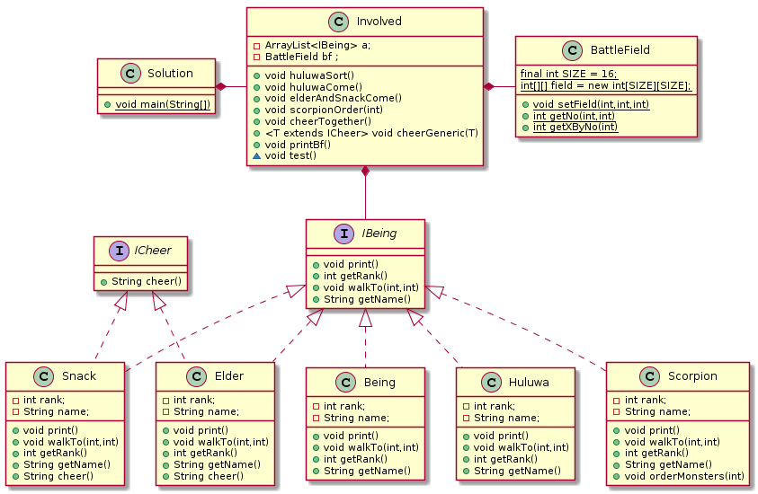

在学习了更多的面向对象程序设计的理念之后，我重新设计了程序架构，最显著的变化，在于**Involved**类与**Snack**,**Elder**,**Being**,**Huluwa**,**Scorpion**这些类之间添加了一个接口**IBeing**以解耦，以尝试使其符合**DIP**法则。这时，**Involved**类实际上使用的是抽象的接口，而非具体类。

设计基本满足单一职责原则，主要的类都只有一种方法会导致其内部数据变化。

系统中存在一个所有变量与方法均为静态的类**BattleField**,实际上这相当于一个全局变量。

系统部分满足开放封闭原则。

完全符合**LSP**，他是实现抽象化的关键，没有任何类继承自非抽象类。

满足**ISP**规则，有效的提高了内聚度。

满足**Coad**法则。

考虑了**LoD**,各个类中的对象均为**private**级别。

实际上我当前设计中没有泛型设计的余地，但我仍然尝试加入这样一个函数：
```java
    public <T extends ICheer> void cheerGeneric(T t) {
        System.out.println(t.cheer());
    }
```

而我在使用这个函数时，我会判断这个**IBeing**的派生类是否满足接口**ICheer**，即：
```java
    public void cheerTogether() {
        for (IBeing i : a) {
            /*if (i.getClass() == Elder.class) {
                if (i instanceof ICheer) {
                    Elder ii = (Elder) i;
                    cheerGeneric(ii);
                }
            } else if (i.getClass() == Snack.class) {
                if (i instanceof ICheer) {
                    Snack ii = (Snack) i;
                    cheerGeneric(ii);
                }
            }*///这个写法也是可以的，但没有体现我的想法。
            if(i instanceof ICheer){
                if(i.getClass()==Elder.class){
                    Elder ii = (Elder) i;
                    cheerGeneric(ii);
                }else if (i.getClass() == Snack.class) {
                    Snack ii = (Snack) i;
                    cheerGeneric(ii);
                }
            }
        }
    }
```

为了使用反射机制，我少设计了一个接口**IOrder**,本来这个接口是为了像**ICheer**接口一样帮助我使用**Scorpion**类中的指挥函数，但在此，我使用了反射机制调用这一函数，对于**Involved**类而言，由于其内部容器为**IBeing**，所以**Scorpion**类中的指挥函数对其实际上是不可见的。这时，我们可以如此使用这一机制：
```java
    public void scorpionOrder(int mode) {
        for (IBeing i : a) {
            if (i.getClass() == Scorpion.class) {
                try {
                    i.getClass().getMethod("orderMonsters", int.class).invoke(i, mode);
                    printBf();
                } catch (Exception e) {
                    System.out.println(e);
                }
                break;
            }
        }
    }
```
这样使用这一机制其实是最浅显的用法，更好地用法是通过反射机制创建变量，这样创建变量的数据就与业务类分离形成配置文件从而实现功能模块间的解耦。