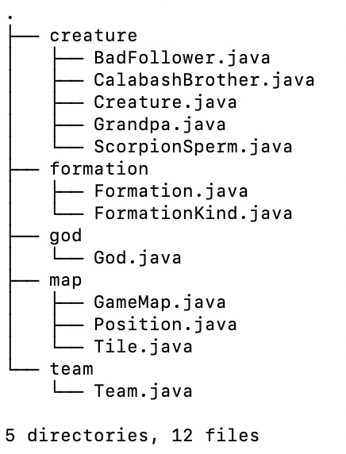

# 作业：面向葫芦娃编程

## 4-Types

本次作业是对第三次作业的更新，主要体现在以下方面：

* 引入反射机制
* 引入泛型
* 引入package
* 代码细节优化

以下分别对这四部分进行说明：

### 反射机制

反射机制的实际作用在于：

1. **在运行时判断任意一个对象所属的类**
2. 在运行时构造任意一个类的对象
3. 在运行时判断任意一个类所具有的成员变量以及方法
4. 在运行时调用任意一个对象的方法

本次实验中引入的反射机制只用到上述反射作用的第1条，重写之前生物体进行报数的`solute`函数，不再使用的动态绑定的方式输出不同生物体的名字，而是**在运行时使用`instanceof`关键字判断对象所属的类**，如下所示：

```java
//生命体报出自己的名字
public void solute(){
    if(this instanceof CalabashBrother)
        System.out.print("葫芦娃");
    else if(this instanceof Grandpa)
        System.out.print("爷爷");
    else if(this instanceof ScorpionSperm)
        System.out.print("蝎子精");
    else if(this instanceof BadFollower)
        System.out.print("小喽啰");
    else
        System.out.print("未知生物");
}
```

### 泛型

之前的代码中将葫芦娃`CalabashBrother`类作为爷爷类`Grandpa`中的成员对象，但是<u>葫芦娃并不是爷爷的一部分</u>，因此思考单独创建一个`Team`类，其中有成员对象`leader`以及其小弟们`followers`，`leader`可以是蝎子精或者爷爷，`followers`可以是葫芦娃或者小喽啰，因此在此处引入泛型就显得很重要了：

```java
//队伍类
public class Team<T1 extends Creature,T2 extends Creature> {
    public T1 leader;
    private T2[] followers;
    public Team(T1 leader,T2[] followers){...}
    public void changeFormation(FormationKind formation) {...}
}
```

在初始化时创建两支队伍`goodTeam,badTeam`，创建方式如下：

```java
//创造两支队伍
 Team<Grandpa,CalabashBrother> goodTeam=new Team<>(grandpa,calabashBrothers);
 Team<ScorpionSperm,BadFollower> badTeam=new Team<>(scorpionSperm,badFollowers);
```

### 引入package

为了方便对代码进行管理以及明确各java文件的作用，将其分为`creature`, `formation`, `god`, `map`, `team`五个package，如下图所示：



### 代码细节优化

1. **加入异常处理机制**

   为了正确处理程序运行中可能出现的异常，在代码中可能产生异常的地方加入异常处理机制。

   ```java
   try {
       setGrandpaAndScorpionSperm();
   }catch (Exception e){
       e.printStackTrace();
       System.exit(-1);
   }
   ```

   ```java
   try {
       swap(creatures[i].curTile.position, dst);
   }catch (NullPointerException nex){
   		System.out.println("空指针错误");
   		System.exit(-1);
   }
   ```

2. **面向对象编程优化**

   * 去除`Creature`类中的`x,y`成员变量，因为生物体不会知道自己在地图中位置，只知道自己当前处于哪块地砖`Tile`上，所以将`Creature`类中的`x,y`成员变量改变为对其所在的`Tile`类对象的引用

   * 将`Tile`中表示位置的`x,y`成员变量封装为`Position`类的对象`position`，简化表示，以及可以使用`Position`类重载的`equals`方法进行坐标比较

   * 生物体在<u>判断地图中的某个位置是否存在其他生物体</u>以及<u>判断坐标是否越界</u>时，不应该自己进行比较，因为生物体不具有地图`GameMap`类中的全局信息，所以将以上两个判断过程抽象为`GameMap`类中的静态成员函数`outOfRange`以及`hasCreature`，如下所示：

     ```java
     //判断目标位置是否越界
     public static boolean outOfRange(Position dst){
         return dst.x < 0 || dst.x >= GameMap.N || dst.y < 0 || dst.y >= GameMap.N;
     }
     //判断目标位置是否有生命体存在
     public static boolean hasCreature(Position dst){
        	return battleField[dst.x][dst.y].creature!=null;
     }
     ```

     

   
