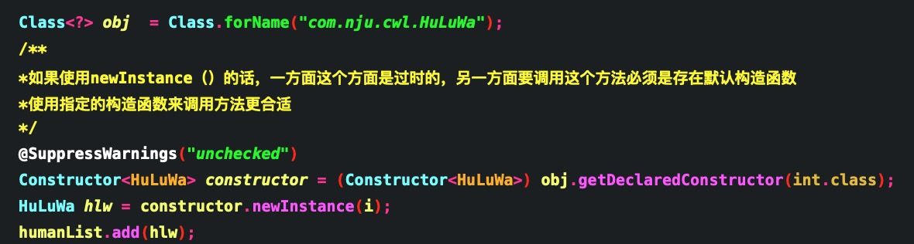
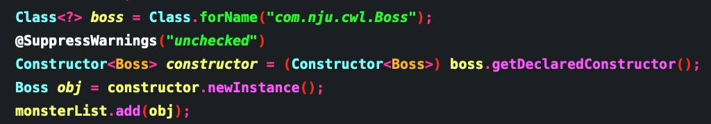
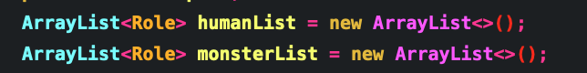
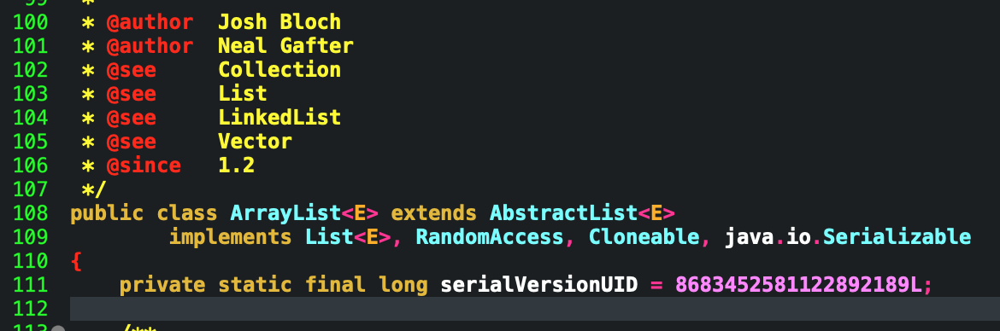

# 葫芦娃小游戏

## 思路分析
- 游戏运行界面展示：

### Role类
- 抽取所有实体的共性作为超类，葫芦娃，爷爷，妖精等都是生物个体，可以提取出很多的共性，比如每个个体都应该具备的属性：名字，血量，MP值，攻击力，移动速度，技能消耗所需的MP等等属性。我们抽取出来做成“角色类” Role

### HuLuWa类 --> Human.java
- 就是Role的子类，拥有“葫芦娃属性类”成员变量。通过葫芦娃的序号进行初始化。实现葫芦娃属性和对象的分离便于管理和修改。在该项目中七个葫芦娃都属于攻击型的角色。

### HuLuWaCharacter类  --> Human.java
- 拥有7个葫芦娃所需要的所有属性的类，实质上是一个辅助类，用来对HuLuWa类实例化的时候提供数据支持。实际是就是剥离7个葫芦娃的属性制作成的用来管理葫芦娃信息的辅助类。

### Grandpa类  --> Human.java
- 是Role的子类,是人类这边的爷爷，是七个葫芦娃的爷爷，在该游戏中充当辅助角色，就是说该
任务属性在本游戏设计中是一个辅助。

### Butterfly类 --> Human.java
- 是Role的子类，是人类这边的小蝴蝶，是葫芦娃的好朋友，在该游戏中也是充当的辅助角色。

### Formations类 --> Formation.java
- 是界面中的阵型类，用来管理妖怪的阵型。
阵型类的UML图如下：

### YanYue类 --> Formation.java
- 七大阵型之一

### YanXin类 --> Formation.java
- 七大阵型之一

### YuLin类 --> Formation.java
- 七大阵型之一

### FangYuan类 --> Formation.java
- 七大阵型之一

### FengShi类 --> Formation.java
- 七大阵型之一

### ChongE类 --> Formation.java
- 七大阵型之一

### SanJiao类 --> Formation.java
- 七大阵型之一

### Boss类  --> Monster.java
- Role类的子类，妖怪阵营的大王，拥有众多的小喽啰，攻击力高，血量足

### Sanke类 --> Monster.java
- Role类的子类，妖怪阵营中的蛇精，负责辅助。

### Frog类 --> Monster.java
- Role类的子类，妖怪阵营中的小喽啰,攻击低，血量低，但是数量多，多大15只。

人类和妖怪阵营的UML图如下：

### 使用javafx实现UI界面设计 
### main类

- Main类继承于javafx的Application类
- 这次使用了一个战斗场景，因此就简单地把UI的控制和画面都写进了Main，方便控制，但是后期要实现多个战斗场景的时候肯定是会实现VC分离的，就是把View 和Controler的分离。
这次职位为了方便偷个懒，但是分离也是非常快的，只需要抽取出代码就行。
Mian类的UML图如下：

- 可以实现人物的移动，血条和法蓝的实时显示

- 可以实现妖怪的阵型变换。

- 可以随便换场景

### 用到的设计理念和思想

### MVC设计模式
- 其中MVC是指M（module） V（view） C（controller) 在这个项目中就是把任务，UI和控制实现了分离管理，分别放进了不同的java文件便于管理。好处就是逻辑感和层次感突出明显，后期debug或者增添功能的时候能够实现快速定位。
### SRP 单一职责原则
- 有点类似MVC的思想，就是一个类负责它该有的功能就好，比如人物就管任务属性，控制就管控制，阵型就负责阵型，分工明确。

###其中运用到的反射机制和泛型机制
##反射机制的运用
在该项目中利用反射动态创建实例对象，该项目中生产葫芦七兄弟和妖精的时候使用了反射机制。
+ **葫芦七兄弟**的诞生

+ **妖精大王**的诞生

1. 通过Class.forName(类的完全限定名)来动态获取class对象。
2. 对于获得到的class对象调用getDeclaredConstructor(Object...class)从而获取构造器对象。
3. 再通过构造器对象newInstance（参数）方法来实现动态创建类的对象。

## 泛型机制的运用
在该项目中涉及到的泛型机制主要是利用jre库里面自带的容器来盛放生成的任务对象。

+ 其中ArrayList在jre库中的原型定义为：

+ 其中我们设定的尖括号<>里面的类型就是这个容器存放的对象的类型，定义中的E即是Element，代表泛型，用来定义ArrayList存放的元素对象的类型。