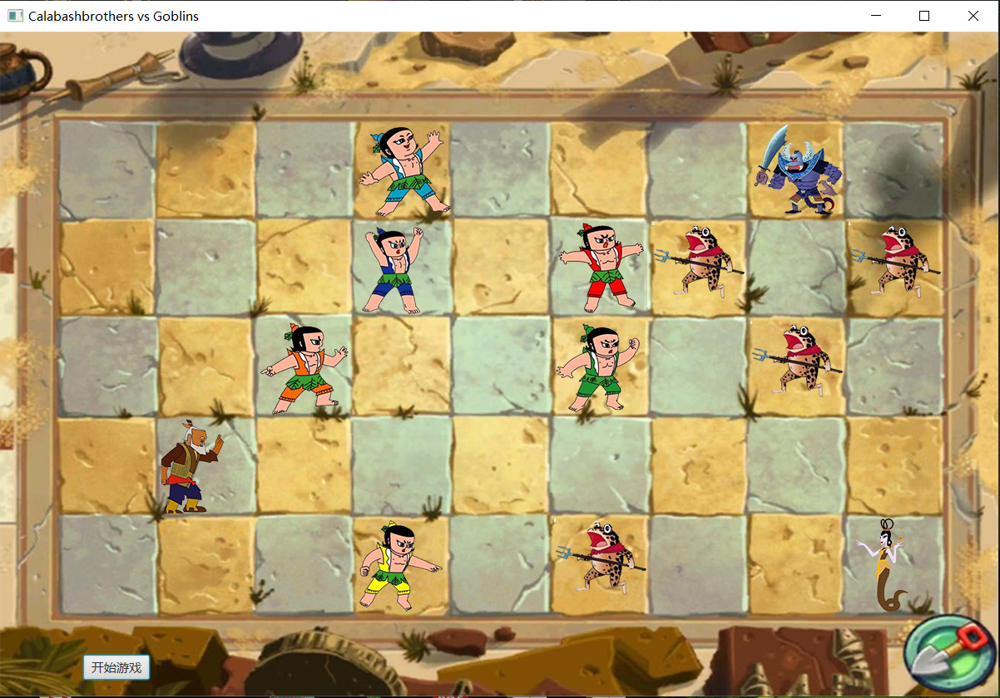
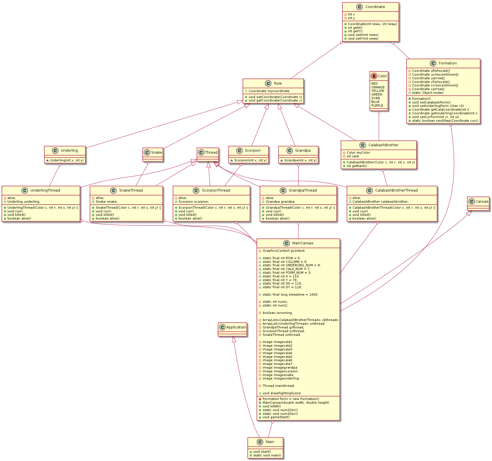

# 面向葫芦娃编程

## 使用说明

点击“开始游戏”按钮，葫芦娃和妖精出现并开始战斗。葫芦娃和妖精均有三种阵型，游戏开始时双方各自随机选取一个阵型（由于画面限制，仅采用鱼鳞、偃月、锋矢三种阵型）。



## 类的设计

### （一）程序入口

**Main类：**包含main函数。

### （二）界面绘制

**MainCanvas类：**完成游戏界面的绘制。

### （三）Enum类型

**Color类：**存放葫芦娃的七种颜色。

### （四）游戏状态相关

**（1）Coordinate类：**存放坐标，可进行对坐标的操作。

**（2）Formation类：**存放全部阵型，可获取当前阵型信息。

**（3）Role类及其派生类：**

**1)基类**

**Role类：**所有角色的公共特性，如坐标。

**2)派生类**

**CalabashBrother类：**葫芦娃的相关信息。

**Grandpa类：**爷爷的相关信息。

**Scorpion类：**蝎子精的相关信息。

**Snake类：**蛇精的相关信息。

**Underling类：**小喽啰的相关信息。

### （五）线程相关

**CalabashBrotherThread类：**葫芦娃线程。

**GrandpaThread类：**爷爷线程。

**ScorpionThread类：**蝎子精线程。

**SnakeThread类：**蛇精线程。

**UnderlingThread类：**小喽啰线程。

方法：初始化游戏状态、指挥葫芦娃或小喽啰更换阵型等。

***类图：***


## 线程间通信

每个生物体线程：与敌人战斗或寻找下一步的位置，完成后调用wait()，等待主线程唤醒。    	

```java
@Override
public void run() {
    while (alive) {
        alive = Formation.nextStep(calabashbrother.mycoordinate);    	
		synchronized(Lock.lock) {
    		try {
    			Lock.lock.wait();
    		}
    		catch(InterruptedException e) {
    			e.printStackTrace();
    		}
    	}
    }
    ...
}
```
主线程：根据当前状态绘制UI。绘制完成后唤醒其它线程，直至一方生物体全部死亡。

```java
while (isrunning) {
	synchronized (Formation.class) {
		...
		Platform.runLater(new Runnable() {
					 
			@Override
			public void run() {
				drawFightingScene();
			}
		});
	}
	
    synchronized(Lock.lock) {
		Lock.lock.notifyAll();
	}
	
    try {
		Thread.sleep(sleeptime);
		} catch (InterruptedException e) {
			e.printStackTrace();
		}
	}
}
```
在生物体与敌人战斗或寻找下一步的位置，以及绘制UI界面时，通过同步机制防止多个线程同时修改阵型类中的数据。

```java
synchronized(Formation.class) {
	...
}
```

## 异常处理机制

使用try-catch语句块捕获可能发生的异常，例如：

```java
try {
	Thread.sleep(sleeptime);
	} catch (InterruptedException e) {
    	e.printStackTrace();
	}
}
```

## 设计模式

UI组件采用了装饰器模式。