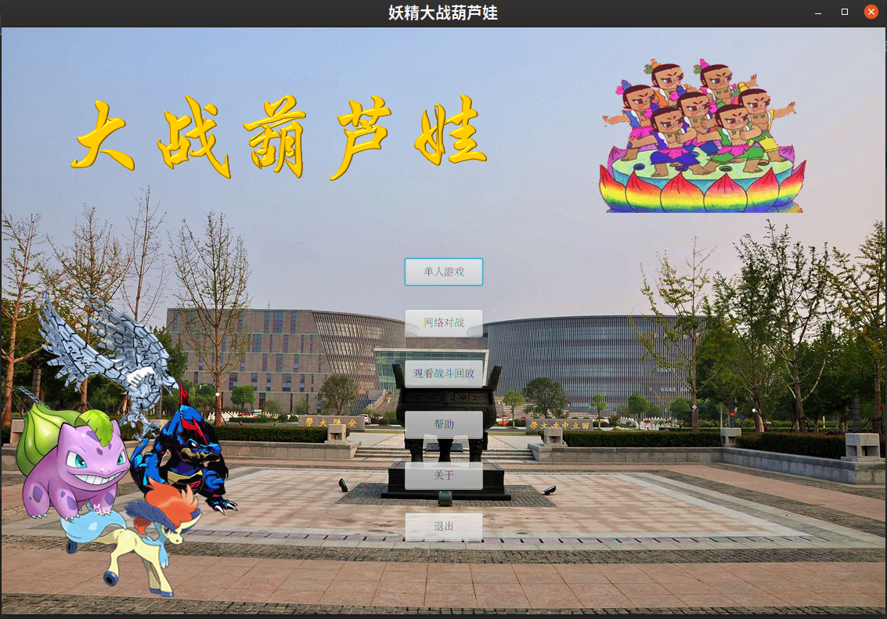
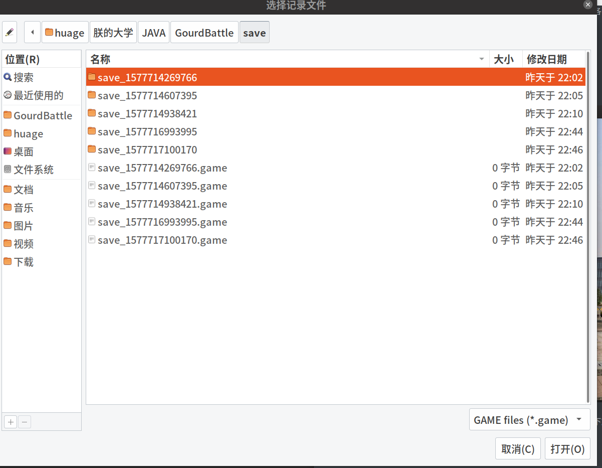
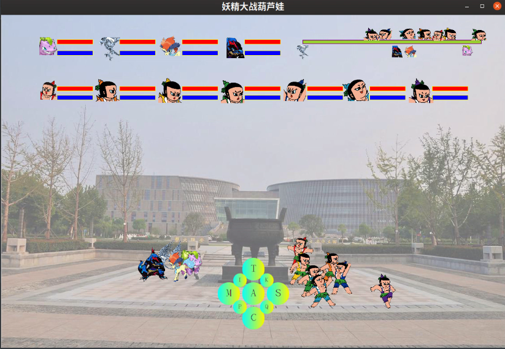
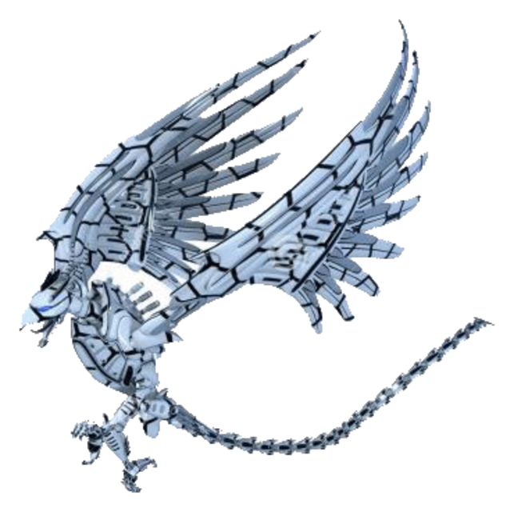
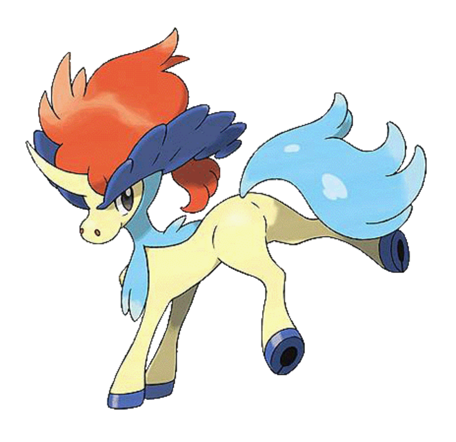
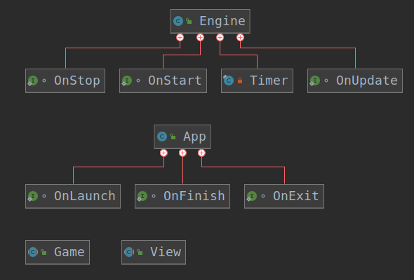
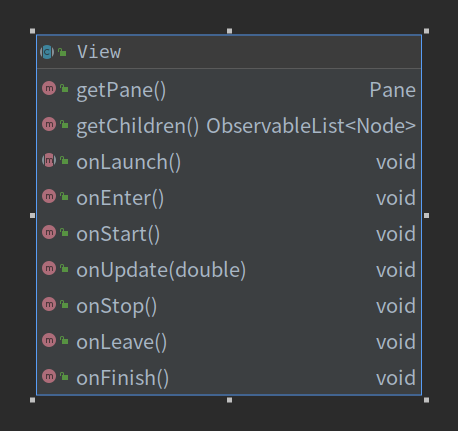
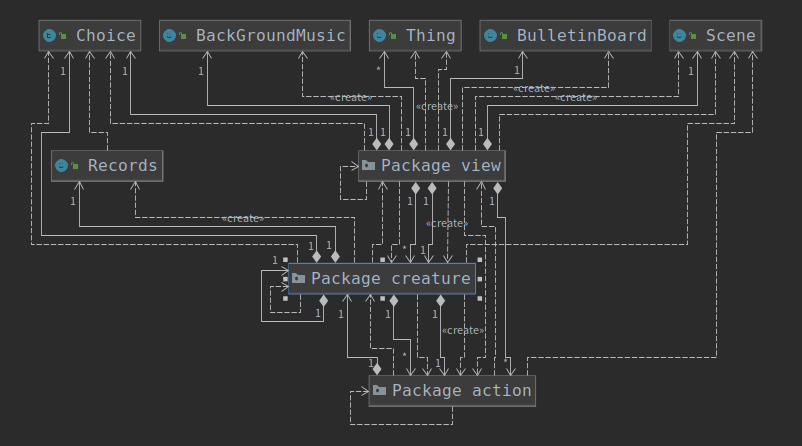

# 妖精大战葫芦娃 游戏设计

> 姓名：刘松桦
>
> 学号：171860621
>
> 邮箱：171860621@smail.nju.edu.cn

## 前言

* 本文档为2019秋季学期南京大学Java程序设计课程大作业实验报告，由以下两大模块组成：
  1. 游戏说明：包含游戏逻辑、操作方式、各个组件含义等
  2. 设计说明：包含游戏设计模式、实现方案、用到的Java语言机制、各个模块之间关系等

## 游戏说明

### 概述

* 游戏以南京大学仙林校区杜厦图书馆为战斗背景，玩家操控妖精一方，在2.5D的游戏场景下与葫芦娃展开激烈的战斗

* 该游戏属于半即时制游戏，玩家操控的角色在走完行动条后可以进行该回合的行动
* 玩家操控的妖精一方共有4个角色，敌方葫芦娃共有7个角色，妖精全部阵亡则玩家失败，葫芦娃全部阵亡则玩家胜利
* 主要实现了人机对战、战斗回放功能，双人网络对战功能敬请期待

### 主界面

* 用户启动游戏后，即可显示出如下主界面

* 单击单人游戏按钮，可以进入单击游戏模式，开启游戏，游戏介绍参见下文

* 单击观看战斗回放按钮，弹出游戏存档文件选择对话框，如下图所示。其中，用户需要选择后缀名为.game的游戏存档文件。每一个.game存档都对应一个同名的目录，该目录中存放游戏的具体数据，每一个.game与该同名目录相互关联，不可修改，否则会造成游戏回放错误。关于回放具体的描述参见下文。游戏记录默认保存在游戏的save目录下

  

* 网络对战模块由于时间关系敬请期待

* 帮助按钮可以查看帮助信息

* 关于按钮可以查看与本游戏开发相关信息

* 按退出按钮退出程序

### 游戏界面

* 进入游戏后，妖精一方在场景左侧列阵，葫芦娃一方在场景右侧列阵，敌我双方角色行动条以各自的速度开始行进，在右上角会显示进度条以及各角色的当前进度条状态

* 我方角色进度条满时，进入选择行动状态，界面中会出现操作盘，如图所示

  

  敌方角色行动条满将根据当前真气值与对方阵型自动选择技能或普通攻击

* 如果有我方角色在选择行动的状态下行动条满，则该角色进入等待选择行动状态，即等到之前排队等候选择行动的角色都选择完毕后，才轮到该角色。因此为了保证游戏的胜利，需要**手速尽可能快**，这样才会浪费最少的时间

### 操作盘

* 操作盘上共有9个按钮，其含义与行为如下：

  1. 按钮A：执行普通攻击，点选后进入选择目标状态，玩家可以选择任意一个格子进行进攻，选择目标时会有椭圆高亮指示，确定目标后按下鼠标左键即可发动进攻

  2. 按钮M：选择法术攻击，点选后进入法术菜单，有若干按钮列出人物拥有的不同法术，每个法术消耗不同的真气值，如果当前真气不足，点击相应的法术按钮将会无相应，否则在扣除相应的真气值之后人物将执行该法术

  3. 按钮T：选择使用物品，点选后进入物品菜单，出现若干物品供玩家选择，点击相应按钮后人物将使用该物品

  4. 按钮C：更换位置，点选后进入选择目标状态（同普通攻击的选择目标状态一致），玩家可以任选一个格子进行位置切换，但注意如果发生两个人共用一个位置的情况，系统将视为角色发生了碰撞，防御力较低的角色将**立即死亡**，因此使用前请三思！
  5. 按钮S：跳过当前回合，什么也不操作
  6. 按钮I：将该角色切换为AI控制，如果玩家对于自己的手速没有自信可以使用该选项，但注意，被切换为AI控制的角色在当前游戏局将无法切换回手动操控
  7. 按钮K：该角色执行**自杀**操作，**慎点**
  8. 按钮P：游戏暂停
  9. 按钮Q：退出游戏

### 角色介绍

#### 妖精1：猫精

特点：能力均衡

技能：幻影三杀（召唤自身幻影，攻击敌方阵营某一行3次，威力中，耗蓝30点）

#### 妖精2：鹰兽

特点：速度快，伤害低

技能：剑来（召唤尚方宝剑，攻击地方阵营某一行1次，威力弱，耗蓝30点）

#### 妖精3：小马

特点：伤害高，防御低

技能：飞剑踏雪泥（万剑当空，攻击地方阵营全体3次，威力高，耗蓝60点）

#### 妖精4：公鸡（？）

特点：伤害高，带回血，速度慢，防御低

技能：

1. 春风又绿江南岸（我方全体回血40点，共执行2次，耗蓝50点）
2. 羊驼踏岳（召唤羊驼冲向敌方阵营5次，攻击敌方阵营一行，每一次威力低，耗蓝50点）

#### 大娃

特点：能力均衡

技能：葫芦压顶（召唤巨大的葫芦给对方压力，攻击敌方阵营一列，执行1次，威力中，耗蓝30点）

#### 二娃

特点：能力均衡

技能：天外飞仙（召唤魔化老爷爷的幻影，攻击敌方阵营一行，执行2次，威力中，耗蓝40点）

#### 三娃

特点：专职奶妈

技能：回魂仙梦（我方一行回血20点，执行1次，耗蓝30点）

#### 四娃

特点：法术高强

技能：三昧真火（召唤天火攻击敌方全体1次，耗蓝50点，威力高）

#### 五娃

特点：喜欢划水（x）

技能：水啊（x）（召唤瀑布，攻击敌方一列3次，耗蓝50点，威力低）

#### 六娃

特点：专职奶妈

技能：奶啊（x）（召唤纯牛奶，恢复我方阵营一列血量15点，执行2次，耗蓝30点）

#### 七娃

特点：防御高，速度慢

技能：紫电青霜（召唤闪电，攻击敌方阵营全体2次，威力高，耗蓝50点）

### 物品介绍

1. 可口可乐：恢复真气15点
2. 红牛：提升普通攻击伤害10点
3. 仙葫芦：提升法术攻击伤害10点
4. 羽绒服：提升物理防御10点
5. 魔女斗篷：提升法术防御10点

### 其他事项

* 所有攻击操作与加血操作都可能因为目标棋盘格没有生物而导致**Miss**
* 为了区分受到攻击的角色以及发动攻击的角色，受到攻击的角色会向后振动，表示挨打；发动攻击的角色在发招之前先发出特殊音效
* 一方生物全部死光游戏结束，如果玩家操控的妖精一方死光，屏幕上将会显示下图所示的失败提示；否则会出现下图所示的胜利提示。同时，该局游戏的记录将被写入文件，以便回放

## 设计说明

### 游戏框架

* 游戏采取在自定义游戏引擎框架基础上开发，在frame包下，提供了游戏各场景分离与切换、场景进入、帧刷新、场景退出、鼠标与键盘消息、音乐播放器等底层接口

* 其中，引擎类提供了游戏引擎启动、停止、与帧更新的接口
* 本次实验主要用到的类是视图类，在框架包中是一个抽象类，提供该视图的启动、进入、离开、结束与帧更新的抽象方法

### 游戏主逻辑

#### 主要模块

1. 游戏场景模块：
   * 维护了游戏所用的二维逻辑棋盘每个位置保存生物的引用：可以访问棋盘中任意一个位置的生物
   * 维护了游戏二维场景坐标到棋盘逻辑坐标双向映射：由于游戏在2.5D的视角下运行，并且采用内置的棋盘存储各个生物，因此需要维护这样一个映射以知晓某个棋盘位置在哪个二维像素位置，以及某个二维像素位置匹配哪一个棋盘位置，提供双向查询方法
   * 提供了游戏场景所需的基本图元：背景图片、进度条、操控板等
2. 游戏视图模块：
   * 维护了当前所有生物的列表，以控制每一个生物在视图中的显示
   * 维护当前视图的状态，分为：各角色都在行进进度条的行进状态、用户在为某个角色选择操作的选择状态、一方生物死光的游戏结束状态、游戏暂停状态等，每一种状态下，帧更新函数都有着不同的行为
   * 帧更新函数位于JavaFX主线程，需要从生物列表中读取每一个生物的状态、进度值、血量、真气值等与显示有关的信息，并以相应的形式显示在屏幕上。注意：该模块只负责读取信息与显示，与通知生物线程用户选择的操作，不负责其他修改功能
3. 游戏角色模块：
   * 生物类：
     * 所有具体的游戏角色（每个妖精、葫芦娃）都继承自抽象的生物类，该类维护角色通用的属性与行为，例如血量、真气值、速度、攻击力与防御力等属性，更新进度条、执行攻击操作等行为
     * 每一个具体类维护各自不一样的行为，例如每个生物都有不一样的属性值，不一样的技能等
     * 每一个生物类都实现Runnable接口，有各自的运行线程，该线程以帧为单位进行循环，每一帧将会根据该生物当前所处的状态有着不同的行为。**注意**：该处帧更新为单独生物线程的帧更新，不与游戏视图的帧更新同步。当角色血量低于0时角色死亡，该线程被杀死。
   * 生物工厂：负责在游戏开始的时候生产出4各妖精与7各葫芦娃。在游戏的设计阶段，有过妖精通过工厂召唤小萝莉的设想，但因时间有限，该部分敬请期待
   * 生物状态：枚举类型，表示某一个生物所处的状态，有进度条行进状态、等待用户选择操作状态、用户正在选择操作状态、技能执行状态、角色死亡状态
4. 游戏技能模块：
   * 技能抽象类提供了技能通用的属性与方法，例如起始与终止目标、技能图元、技能重复次数、技能耗蓝、攻击力、攻击范围、技能动画关键帧位置等属性，技能发动等抽象方法
   * 具体的技能类：分为攻击一行的技能、攻击一列的技能、全体攻击、普通攻击的技能，每一种技能有不同的动画关键帧生成方法
5. 物品模块：
   * 该模块较简单，主要维护物品的名称、提供物品使用之后生效的方法
6. 通告板模块：
   * 在某个技能发动或落空、某个生物受到攻击或死亡、因为移动位置发生的碰撞等事件触发时，系统会将相应的信息打印在通告板上，通告板是单独一个线程，内部使用队列实现，最多显示5条通告，后来的通告将会淹没之前的通告，一条通告最多存在3秒
7. 记录模块：
   * 该模块较简单，负责序列化游戏记录。具体地，每一回合该模块将会记录各个生物在该回合选择操作所耗的时间以及执行的操作，以便之后回放
8. 背景音乐模块
   * 该模块较简单，是独立性极高的一个线程，只负责循环播放背景音乐

#### 主要设计模式的应用

1. 状态模式：是驱动本游戏设计最主要的模式，符合半即时制的特点，允许生物与场景在不同状态下有不同的行为
2. 工厂模式：所有游戏角色都诞生于角色工厂
3. 观察者模式：游戏通告板采取观察者模式实现，当接到有新通告的消息时，自身会更新状态
4. 中介者模式：在设计碰撞逻辑时，并没有让两个生物直接进行交互，而是通过棋盘这一媒介，如果一个生物落在棋盘的某个位置，另外的生物也想争取这个位置，此时视作发生碰撞
5. 责任链模式：在实现技能的发动时，生物类会将当前生物的控制权转交给具体的技能类，以便在发动技能时同步更新生物状态

### 其他实现细节

* “每一时刻用户最多为一个角色选择操作”，该功能通过信号量机制实现，将“用户的手”视作信号量，初始值和最大值都是1，每当一个用户进度条满时将会申请该信号量，申请不到则进入排队，中途发生死亡的情况则退出排队；当前拥有信号量的角色在选择完毕或者死亡时会释放信号量
* 普通攻击为了避免场景中多个技能与角色混杂的混乱，因此在技能类中，为普通攻击采取另外的动作路径——使用抛物线计算每一帧的位置
* 游戏回放时将不会显示操控盘，在回放状态下，各个生物将从序列化的文件中读取这一回合的延迟与操作
* AI操控一个角色时，将会优先发动威力最强的技能，蓝量不够时将会发动普通攻击，随机选择对方阵营的目标
  * **Tip**：由于生物可以自由移动位置，某个生物也可以移动到敌方阵营中去，这时敌方的法术由于是AI控制，将无法打到该生物，但要注意此时可能会被己方技能误伤

### 遇到的困难及解决方案

* 本次实验除了工程量大，并未遇到很多困难；在开发初期时，曾遇到线程的空指针异常，查阅资料后发现图元的显示必须要放在JavaFX的主线程中，否则将会出问题，因此将属性更新与图元显示分离开来
* 其他的困难体现在Maven这个工具上，并没我想象的那么好用，动不动就是包错误、版本错误等其他莫名其妙的错误，最后换了镜像源才成功下载了需要的包