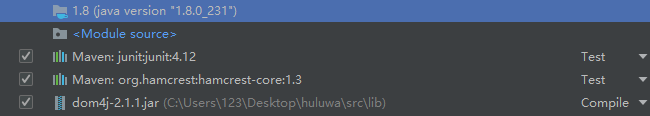
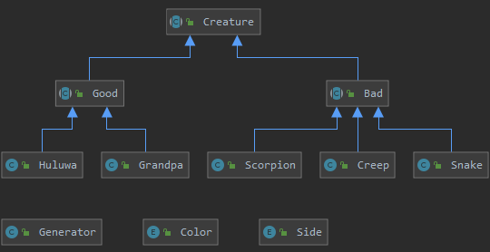
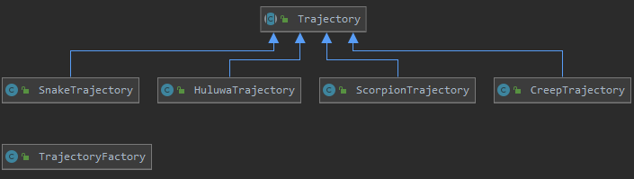
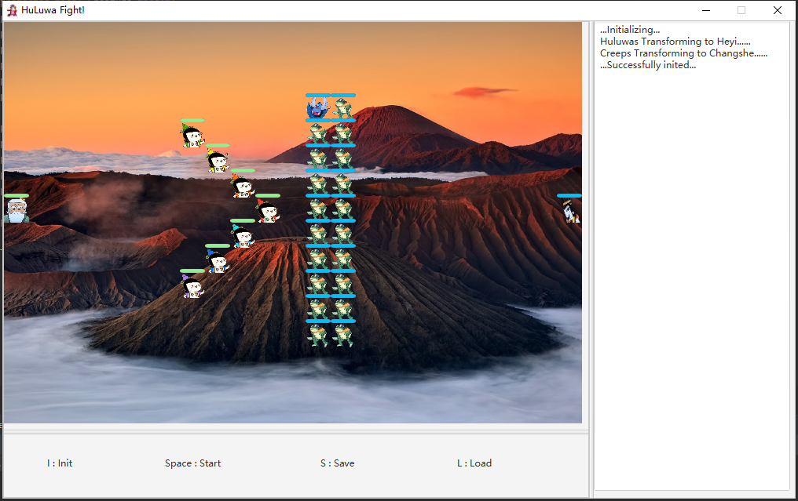
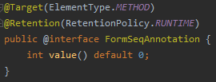
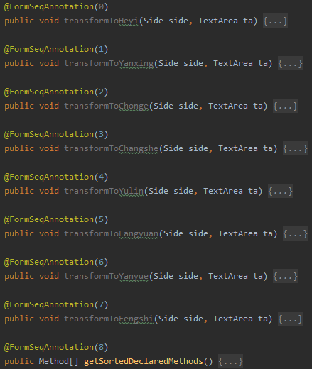
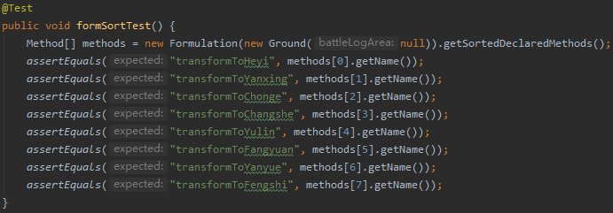
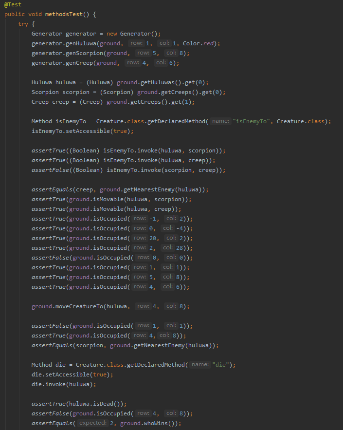

# Huluwa Battle
## 〇、序：配置说明
Project SDK: 1.8(java version "1.8.0_231")  
Project Language Level: >= 8  
Dependencies:   

## 一、游戏介绍
### 1. 界面
游戏界面分为3个版块。主版块显示游戏画面。下方版块显示操作说明。右侧版块显示游戏运行动态和战斗日志。

### 2. 单位
游戏中的单位有生物(Creature)和弹道(Trajectory)两大类。Creature衍生出Good和Bad两个类，即两大阵营，再由这两个类衍生出各个具体角色。每个Creature都是一个线程，由Generator产生。Trajectory类代表了生物的攻击行为，由TrajectoryFactory产生，除爷爷(Grandpa)之外每个生物内部都有一个TrajectoryFactory，因为根据设定爷爷没有攻击行为。
两大类的类图如下图所示：  
  

下表列出了各个生物体的属性及默认值。每个生物体的类在static块中用SAXReader读取attributes.xml中设定的值，然后在创建对象时setAttributes。可在attributes.xml文件中对属性值进行修改，Max health不能超过1000。

Creature | Parent class | Maximum health | Damage | Converging Bonus | Trajectory | Remarks
-|-|-|-|-|-|-
Huluwa | Good | 100 | 48 | 0.20 | HuluwaTrajectory | Melee. Fight against Scorpion and Creep.
Grandpa | Good | 100 | 10 | 0.10 | - | Can't attack. Provide 10% damage bonus for Huluwa if alive. Try to dodge Snake's attack.
Scorpion | Bad | 150 | 40 | 0.15 | ScorpionTrajectory | Melee. Tanky. Fight against Huluwa.
Creep | Bad | 100 | 21 | 0.10 | CreepTrajectory | Melee. Fight against Huluwa.
Snake | Bad | 100 | 50 | 0.10 | SnakeTrajectory | Long-range. Especially hunt Grandpa.

### 3. 伤害计算
1) 蛇精对爷爷的攻击造成等于蛇精Damage的纯粹伤害。
2) 葫芦娃和蝎子精小喽啰之间的交锋造成的伤害按如下方式计算：  
  假设攻击方为A，被攻击方为B。  
  a) 任意一方每失去3%的生命值，减少1%的Damage。  
  b) 对A而言，若B邻接的格子（最多8格）有A的友军，A将获得以该友军Converging Bonus为系数的对Damage的加成（夹击加成）。若有多个友军，则按叠乘加成。若友军与B只有顶点相邻，则该友军带来的加成效果减半。例：小喽啰B周围有葫芦娃A的3个友军，其中2个边相邻，1个只有顶点相邻，则加成后  
  **A.realDamage = A.Damage * (1 + 0.20) * (1 + 0.20) * (1 + 0.20 * 0.5)**  
  c) 若A是葫芦娃，当爷爷活着时，他将获得10%的Damage加成。  
  d) 经上述3步得到A.realDamage和B.realDamage，分别记为a和b。设最终伤害为D。设随机值P，范围为\[0, 1)。  
  当a>=b时，有如下公式：  
  \*(\frac{(\frac{a}{b}+3)^4}{512}+0.5))  
  当a<b时，有如下公式：  
  /(\frac{(\frac{b}{a}+3)^4}{512}+0.5))

### 4. 操作  
1) I. 初始化战斗。将所有生物以满血状态布置到战斗场地上。战场左侧为Good阵营，右侧为Bad阵营。葫芦娃们和蝎子精带领着的小喽啰们分别以8种阵型中的随机一种列阵，朝向相对。爷爷和蛇精分别在各自阵营的大后方。正在战斗和正在回放时无法初始化。
2) Space. 开始战斗。当且仅当战斗已经初始化之后才能开始。战斗期间无法进行其他操作。任意一方获胜时战斗自动结束。
3) S. 保存战斗。当且仅当战斗结束之后才能保存。默认保存至save目录下的.hlwb(Huluwa Battle file)文件。
4) L. 加载战斗。只要不在进行战斗且不在进行回放就可以加载。读取.hlwb文件，然后自动开始回放。
5) ↑和↓. 调节bgm音量。初始音量为14，单次调节间隔为2，最大100，最小0。

### 5. 规则
战斗场地(Ground)由16x23的格子(Position)组成，一个格子仅能容纳一个活体生物，可以容纳多个生物尸体。即活体生物有碰撞体积，尸体没有碰撞体积。葫芦娃、蝎子精和小喽啰可以在整个场地内移动，爷爷和蛇精只能在他们初始的列里上下移动，相恨相杀。葫芦娃、蝎子精和小喽啰是战斗的主体；爷爷是光环怪，给葫芦娃攻击力加成（类似于复仇之魂的被动），没有攻击能力，被蛇精追杀，全程都在躲避蛇精的攻击；蛇精对爷爷发动密集的追踪攻击，在默认设置下需要且仅需2次攻击即可击杀爷爷。当葫芦娃全部阵亡时，Bad阵营获胜；当蝎子精和小喽啰全部阵亡时，Good阵营获胜。（在代码中已经避免了同归于尽的情况）

### 6. 效果展示

## 二、实现
### 1. GUI和Controller
该应用通过javafx.application.Application实现。主类继承Application，重载其void start(Stage primaryStage)方法，通过Stage和Scene进行界面布置。  
使用Javafx Builder绘制应用的界面，得到GUI.fxml，在主类的start中用FXMLLoader加载该文件，布置到应用中。  
对GUI.fxml的控制通过BattleController类实现，BattleController是用户界面和后台代码的交接处。它拥有displayCanvas，即展示游戏运行动画的“画布”，通过以@FXML注释的initialize()方法进行初始化：播放bgm、构造战斗场地Ground、添加键盘事件监听和处理、获取displayCanvas上的GraphicsContext（类似于“画笔”）以及绘制游戏背景。它有5个主要的方法分别对应前述5种操作：init() start() save() load() setMusicVolume(char)。它还有一个内部类KeyEventHandler，执行EventHandler<KeyEvent>接口，作用顾名思义。此外，它还有logWriter和logReader，用于战斗日志的存取。
在start()中，利用Timeline辅助绘制动画，在Timeline添加关键帧KeyFrame，每个刷新周期（设置为10ms）移动一次所有的Trajectory并刷新一次动画。与此同时开启一个线程，每个刷新周期判断一次是否有一方获胜，若有胜者则放出胜利画面并停止动画。  
在右侧版块中，用TextArea显示战斗日志。

### 2. Formulation和FormSeqAnnotation
Formulation类用于生成生物体并将其列阵。Formulation中的方法均用自定义的@FormSeqAnnotation(int)注释，为其标记序号，在init时用于随机布阵。  
  

### 3. Ground, Position及战斗细节
每个Position相当于一个格子，Ground中有一个16x23的Position数组。每个Position可以容纳一个活体生物和多个死亡生物，活体生物有碰撞体积，死亡生物没有碰撞体积。当一个Position上同时有活体生物和死亡生物时，优先显示活体生物；没有活体生物但有多个死亡生物时，优先显示最新死亡的生物的死亡图片。  
战场中的生物数量设定为：葫芦娃7个、蝎子精1个、小喽啰19个、爷爷和蛇精各1个。
GroundInit中，用反射机制随机调用Formulation中的“阵法”，生成各个生物并列阵。  
GroundStart中，用Excutors.newCachedThreadPool()新建线程池，执行所有的生物体线程。  
GroundClear中，停止所有线程，移除所有生物和弹道，清空场地，重置状态符。  
由于爷爷和蛇精的战斗逻辑较为简单，所以下面阐述其他生物的战斗逻辑。战斗开始后，所有生物每隔500ms进行一次动作循环（爷爷和蛇精为200ms），只要它活着且战斗尚未结束，就会根据自定义的寻路原则向最近的敌人移动，实现为moveForward(Creature)。寻路原则中也包括不需要移动的情况，例如和敌人相邻时。此时保持不动。moveForward执行之后，若生物canAttack==true，则产生攻击行为。设置canAttack是为了避免同归于尽的情况，初始为true，当敌人的攻击足以致自己死时置为false。在攻击行为中，首先判断边相邻的4格中有没有敌人，若无敌人结束攻击行为，若有敌人，选择他们中生命值最低的，对其产生攻击弹道，发动攻击。当弹道到达敌人身上时，将由前述公式计算出的伤害施加到敌人身上。敌人受到伤害时，判断自己是否死亡，若死亡则调用die方法，将isDead置为true，并进入其所在position的墓地中。  
Ground中的display和displayTrajectory方法分别用于绘制生物和弹道。

### 4. LogWriter和LogReader
LogWriter用于存档，和BattleController中的save()结合使用。LogWriter中有logs用于记录战斗日志。战斗初始化时，将刷新周期写入logs。在战斗中，每次刷新画面时，将当前时刻各个生物的位置和血量百分比以及各个弹道的位置写入日志中，该行为伴随在display和displayTrajectory中。各单位状态记录完成后，写入“stop”，作为当前帧结束的标志。最后战斗结束时，写入胜利方。战斗结束时，战斗日志都记录在了LogWriter中，用户此时可以按S键进行保存，将日志写入.hlwb文件；也可以不保存。  
LogReader用于加载，和BattleController中的load()结合使用。LogReader中有logs用于存储读入的战斗日志。当用户按L键并选择好存档后，调用readIn(File)，在该方法中用BufferedReader读入日志，并将isReplaying置为true。随后自动开始回放。读入刷新周期，创建Timeline，每隔一个刷新周期传入一幅关键帧，该帧用refreshReplay(String[])解析并绘制。load()同时还创建一个线程每个刷新周期判断一次回放是否结束。

### 5. Background Music
用Media解析mp3资源文件，然后用MediaPlayer播放。

## 三、测试
测试工具为Junit。
### 1. Formulation测试
测试Formulation中的使用借助注释实现的排序方法是否能将“阵法”正确排序。  
测试通过。  

### 2. Ground和Creature部分方法的测试
用葫芦娃、蝎子精和小喽啰各一个进行测试。首先测试Creature的isEnemyTo方法。然后测试Ground的getNearestEnemy, isMovable和isOccupied。接下来移动葫芦娃，再测试移动后isOccupied和getNearestEnemy是否正确。最后杀死葫芦娃，测试死亡状态是否正确，以及判断胜者的whoWins是否正确。  
测试通过。  

