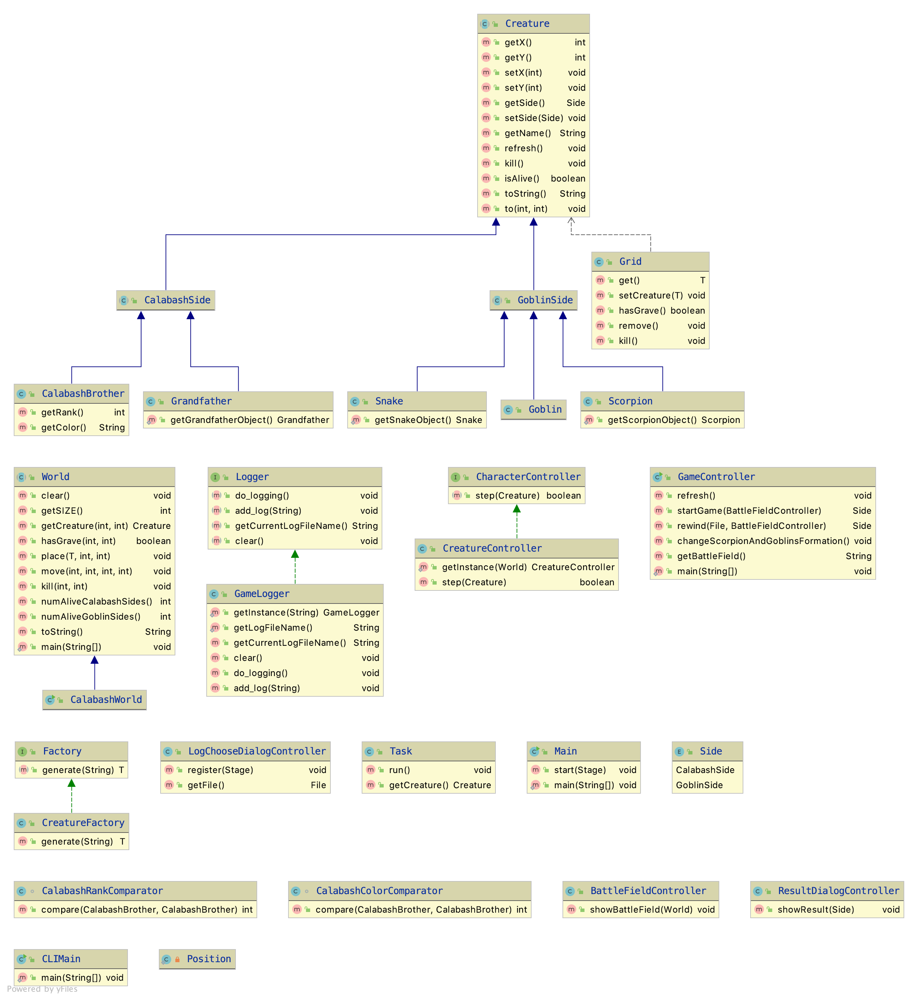

# 大作业：葫芦娃大战妖精

## 编译运行方法

```shell
mvn clean
mvn package
java -jar target/Java-Final-1.0.jar
```

## 程序使用方法

执行上面的`java -jar target/Java-Final-1.0.jar`命令后，会弹出程序的开始界面：


可以看到，葫芦娃阵营和妖精阵营已经分别在两边列阵完毕，接下来，按下空格键开始战斗：


当一方阵营全部阵亡后（除了蛇精和老爷爷，因为他们不参与战斗），战斗结束，同时会有对话框弹出显示获胜阵营和日志文件的名称


按下`l`键会弹出对话框，用于选取日志文件进行回放：


日志文件默认保存在运行`Jar`包的目录下的`Log`文件夹内，当然也可以放在任何位置，只需要选择想要回放的日志文件（后缀为`cglog`）即可：


打开该日志文件后将进行回放，回放完成后同样会有获胜阵营的提示：


## 设计思路

本次作业沿用了之前四次作业的代码，同时根据新的需求添加了新的模块并对现有的部分代码进行了重构。由于大作业要求以 GUI 的形式呈现，为了使程序拥有较好的模块性，我采用了 MVC 的设计思路，下面将分别从前端和后端两方面来进行阐述。

### 前端（View 和 Controller）

大作业要求使用 `JavaFX` 作为图形化框架，在前端进行图形化界面的设计时，我主要利用了 `JavaFX` 的 `fxml` 文件进行布局的设计。由于需求为实现一个葫芦娃大战妖精的程序，因此考虑将程序设计为 2D 上帝视角的表现方式，在战斗进行时，机位处于战场的正上方。

为了实现所有的需求，我们一共需要四个不同的界面，分别为根界面、战斗或回放界面、战斗或回放结果展示界面以及日志文件选取界面。因此，我一共使用了四个 `fxml` 文件，其在`src/main/resources/FXML`目录下，其对应的 `Controller` 类在 `fxview` 这个包中。

#### 根界面（RootLayout.fxml）

根界面使用 `BorderPane` 进行布局，并在上方加入 `MenuBar` 菜单栏。后续的所有界面都会被放置在根界面之上。根界面没有什么操作逻辑，因此没有编写对应的 `Controller` 类。

#### 战斗或回放界面（BattleField.fxml 和 BattleFieldController）

战斗和回放界面的设计较为复杂，在设计战场布局时我借鉴了经典游戏“植物大战僵尸”，将界面分为了 10 乘 10 共 100 个方格，每个格子上在同一时刻仅可站立最多一名角色。如果两名处于对立阵营的角色同时走到一个方格上时，便进行战斗。根据需求，我们还需要在有角色死亡的地方生成一个墓碑的标志。综合以上的想法，我首先使用 `AnchorPane` 进行布局，同时叠放三个 10 乘 10 的 `GridPane`，分别用于显示背景、人物和墓碑。

完成了该界面的布局设计后，我在对应的 `Controller` 类中创建了三个 `GridPane` 的成员变量用于和 `fxml` 文件中的控件进行关联，同时创建了三个类型为 `ImageView` 的数组，其用于在 `GridPane` 的每个 `Node` 上显示图片：

```java
@FXML
private GridPane backgroundGridPane;
@FXML
private GridPane characterGridPane;
@FXML
private GridPane graveGridPane;

private ImageView[][] backgroundImageViews;
private ImageView[][] characterImageViews;
private ImageView[][] graveImageViews;
```

同时我还编写了名为`showBattleField`的方法，用于根据当前战场的情况刷新 UI 的显示：

```java
public void showBattleField(World world) {
    for (int i = 0; i < MAPSIZE; i++) {
        for (int j = 0; j < MAPSIZE; j++) {
            Creature creature = world.getCreature(i, j);
            if (creature == null) {
                setCharacterImageView(IMAGEPATH + "Grass.jpeg", i, j);
            } else {
                setCharacterImageView(IMAGEPATH + creature.getName() + ".jpeg", i, j);
            }
            setGraveImageView(world.hasGrave(i, j), i, j);
        }
    }
}
```

#### 战斗或回放结果展示界面（ResoutDialog.fxml 和 ResoutDialogController）

在战斗或回放完成之后，需要对结果进行展示，我选择采用弹出 `Dialog` 的形式向用户展示结果。`Dialog` 也采用 `AnchorPane` 进行布局，同时在居中的位置添加 `Label` 控件，用于显示战斗结果。

在对应的 `Controller` 文件中，首先创建 `Label` 类型的成员变量与 `fxml` 的控件相关联，同时编写函数用于根据后端传入的战斗结果设计 `Label` 的显示信息：

```java
@FXML
Label result;

public void showResult(Creature.Side winningSide) {
    Logger logger = GameLogger.getInstance(null);
    String logInfo;
    if (logger != null) {
        logInfo = "Result saved in " + logger.getCurrentLogFileName();
    } else {
        logInfo = "Rewind end";
    }
    switch (winningSide) {
        case CalabashSide: result.setText("Calabash side win!\n" + logInfo); break;
        case GoblinSide: result.setText("Goblin side win!\n" + logInfo); break;
    }
}
```

#### 日志文件选取界面（LogChooseDialog.fxml 和 LogChooseDialogController）

与结果展示界面相同，选取界面也采用当用户在主界面按下 `L` 键之后弹出 `Dialog` 的方式实现。该界面同样采用 `AnchorPane` 进行布局，同时在上面放置一个 `Button` 控件，点击之后弹出文件选择器（`FileChooser`）用于选择已有的日志文件

在对应的 `Controller` 类中，我创建了 `Button` 类型的成员变量用于与对应的控件相关联，同时编写了事件注册函数，使得在按下 `Button` 会弹出文件选择器：

```java
@FXML
Button button;
File file = null;

public void register(Stage stage) {
    FileChooser.ExtensionFilter filter = new FileChooser.ExtensionFilter("Calabash v.s Goblin log file (*.cglog)"
            , "*.cglog");
    final FileChooser fileChooser = new FileChooser();
    fileChooser.getExtensionFilters().add(filter);

    button.setOnAction(event -> {
        file = fileChooser.showOpenDialog(stage);
        stage.close();
    });
}
```

### 后端（Model）

本次实验的大部分代码沿用自前四次实验，因此与前四次实验有关的代码设计思路在此处就不提了，具体阐述一下新添加和重构的部分。

#### CalabashSide 和 GoblinSide

在本次实验中，我新添加了两个虚类，分别用以表示葫芦娃一方和妖精一方的所有生物，其都继承自 `Creature` 这一虚类，而葫芦娃和妖精阵营的所有生物都改为继承这两个虚类，同时在基类 `Creature` 中，新添加了枚举类型的变量 `Side`，用以指明该生物体属于哪一阵营。

作出以上的重构原因，主要在于本次实验需要区分不同生物所属阵营，重构后的 `Creature` 类提供了`getSide`方法，供上层应用直接获取所处阵营信息

#### CharacterController 和 CreatureController

为了实现在战斗进行时对每个生物体的控制，定义了`CharacterController`接口和其具体实现`CreatureController`，接口的定义如下：

```java
public interface CharacterController {
    boolean step(Creature creature); /* Make a single step move, return true if success, false if fail */
}
```

在后面使用线程对生物体进行控制时，只需要调用`step`即可执行一步的操作。在`CreatureController`中，对`step`的具体实现如下：

```java
@Override
public boolean step(Creature creature) {
    if (!creature.isAlive()) {
        return false;
    }
    if (creature.getSide() == Creature.Side.CalabashSide && world.numAliveGoblinSides() <= 0) {
        return false;
    }
    if (creature.getSide() == Creature.Side.GoblinSide && world.numAliveCalabashSides() <= 0) {
        return false;
    }
    int[] nextPos = nextMove(creature);
    if (nextPos[0] == -1 && nextPos[1] == -1) {
        return false;
    }
    makeMove(creature, nextPos[0], nextPos[1]);
    return true;
}
```

即对于每个生物体，我们会首先判断其是否还存活，如果仍然存活再判断战斗是否已经结束，如果还未结束便根据当前战斗的情况生成下一步的位置，然后移动到下一步位置。在`nextMove`方法中我们会控制生物体朝离他最近的敌方单位移动，而在`makeMove`中，我们还会在与敌方单位相遇时进行战斗。

#### Task

Task 类实现了 Runnable 接口，实际即为控制每个生物的线程，在重载的`run`方法中，通过调用上面提到的`step`方法控制生物移动：

```java
public class Task implements Runnable {
    Creature creature;
    World world;
    CharacterController controller;

    public Task(Creature creature, World world) {
        this.creature = creature;
        this.world = world;
        controller = CreatureController.getInstance(world);
    }

    @Override
    public void run() {
        controller.step(creature);
    }
}
```

#### GameController

`GameController`复用自上次实验的`BattleFieldController`，进行了部分重构，添加了新的成员变量同时进行了重命名。该类负责控制整个程序的初始化、开始战斗和回放功能，在最顶层的`Main`类中就是通过这一类来实现对整个程序的控制。

在该类中，我们在初始化时会为除了爷爷和蛇精的所有生物体创建线程（爷爷和妖精不参与战斗），在开始战斗后，通过这些创建的线程接续运行控制整个战斗的进行，在某一方获得胜利后退出，同时返回胜利一方所属的阵营`Side`：

```java
public Creature.Side startGame(BattleFieldController controller) {
    int calabashSideAlive = NUMCALABASHBROTHER;
    int goblinSideAlive = NUMGOBLINS + 1;
    controller.showBattleField(world);
    while (true) {
        try {
            Collections.shuffle(tasks);
            Iterator<Runnable> taskIter = tasks.iterator();
            while (taskIter.hasNext()) {
                Task task = (Task) taskIter.next();
                Thread thread = new Thread(task);
                thread.start();
                thread.join();

                if (!(task.getCreature().isAlive())) {
                    if (task.getCreature().getSide() == Creature.Side.CalabashSide) {
                        calabashSideAlive--;
                    } else {
                        goblinSideAlive--;
                    }
                    taskIter.remove();
                }
                System.out.println(world);
                controller.showBattleField(world);
                Thread.sleep(100);
            }
            if (goblinSideAlive == 0) {
                return Creature.Side.CalabashSide;
            } else if (calabashSideAlive == 0) {
                return Creature.Side.GoblinSide;
            }
        } catch (Exception e) {
            e.printStackTrace();
        }
    }
}
```

在进行回放时，读取传入的日志文件，并根据日志文件的相关内容控制各个生物体的移动，同样，在完成后也会返回获胜一方所属阵营的信息：

```java
public Creature.Side rewind(File file, BattleFieldController controller) {
    try {
        if (file == null) {
            throw new IllegalArgumentException();
        }
        BufferedReader bufferedReader = new BufferedReader(new FileReader(file));
        String move;
        int calabashSideAlive = NUMCALABASHBROTHER;
        int goblinSideAlive = NUMGOBLINS + 1;
        while ((move = bufferedReader.readLine()) != null) {
            System.out.println(move);
            String[] tokens = move.split("_");
            if (tokens[1].compareTo("KILLED") == 0) {
                if (tokens[0].compareTo("Goblin") == 0 || tokens[0].compareTo("Scorpion") == 0) {
                    goblinSideAlive--;
                } else {
                    calabashSideAlive--;
                }
                int x = Integer.parseInt(tokens[2]);
                int y = Integer.parseInt(tokens[3]);
                world.kill(x, y);
            } else {
                int oldX = Integer.parseInt(tokens[2]);
                int oldY = Integer.parseInt(tokens[3]);
                int newX = Integer.parseInt(tokens[5]);
                int newY = Integer.parseInt(tokens[6]);
                world.move(oldX, oldY, newX, newY);
            }
            controller.showBattleField(world);
            Thread.sleep(100);
        }

        if (calabashSideAlive == 0) {
            return Creature.Side.GoblinSide;
        } else if (goblinSideAlive == 0) {
            return Creature.Side.CalabashSide;
        } else {
            assert (false);
            return null;
        }
    } catch (Exception e) {
        e.printStackTrace();
        return null;
    }
}
```

#### Logger 和 GameLogger

为了将战斗过程以日志的形式记录下来，我的代码中设计了 `Logger` 接口和其具体实现 `GameLogger`，接口的定义为：

```java
public interface Logger {
    void do_logging();
    void add_log(String log);
    String getCurrentLogFileName();
    void clear();
}
```

上述四个方法分别用于将日志以文件的形式保存下来、添加新的日志信息进缓冲区、获取当前日志的名称和清除 `Logger`。日志的格式分为两种：对于生物体的正常移动，如果需要表示生物体 `A` 从`(a, b)`移动到`(c, d)`，则为`A_FROM_a_b_TO_c_d`，对于生物体 `A` 在`(a, b)`处被杀死，则为`A_KILLED_a_b`。在进行战斗回放时，通过逐行读取日志文件，便可以完美地重现战斗经过了。

### 前后端的互动

在后端的线程控制生物体进行移动之后，前端的 GUI 线程需要及时进行刷新。在 JavaFX 中，我们不能在非 GUI 线程中更新 GUI 的内容显示，通过查阅资料，我选择采用了 JavaFX 中的 Task 这一泛型类来实现根据后端运行的线程刷新 GUI。程序的入口`Main`类继承自`Application`类，在重载的`start`方法中，首先完成初始化工作（包括根界面的初始化、战斗或回放界面的初始化、葫芦娃世界的初始化和`GameController`的初始化），接下来为根界面所在的`Scene`注册键盘响应事件（按下空格后进行战斗，按下`L`进行回放）。具体的战斗和回放由匿名的`Task`类完成：

```java
scene.setOnKeyPressed((final KeyEvent keyEvent) -> {
    if (keyEvent.getCode() == KeyCode.SPACE) {
        Task<Creature.Side> task = new Task<Creature.Side>() {
            @Override
            protected Creature.Side call() {
                /* Initialize logger */
                String logFileName = GameLogger.getLogFileName();
                GameLogger.getInstance("./Log/" + logFileName);

                gameController.refresh();
                controller.showBattleField(calabashWorld);
                Creature.Side winningSide = gameController.startGame(controller);
                System.out.println(winningSide);
                Logger logger = GameLogger.getInstance(null);
                logger.do_logging();
                return winningSide;
            }
        };

        task.setOnSucceeded(event -> {
                showResultDialog(task);
                clearLogger();
        });
        task.setOnFailed(event -> clearLogger());
        Thread gameLogic = new Thread(task);
        gameLogic.setDaemon(true);
        gameLogic.start();
    }
    ...
}
```

GUI 的更新由上面提到的`BattleFieldController`的`showBattleField`方法完成，在这里利用到了 JavaFX 的 Observable 机制。由于`ImageView`是一个 Observable 对象，因此当我们更改了某个`ImageView`对象的内容时，GUI 会自动进行刷新。

## 设计原则

本次大作业对课上所提到的几个设计原则都没有违反，特别的，对于 DIP 原则，我的代码遵守的很好。在我的程序结构中，所有高层的模块都没有依赖于低层的具体实现，而都是依赖于抽象类或者接口。例如`GameController`中，依赖于接口`CharacterController`和抽象类`World`，以及`World`依赖于抽象类`Creature`而非具体的`Goblin`或`CalabashBrother`

## 设计模式

本次大作业中，我应用到以下几种设计模式

### 工厂模式

由于本次实验中生物体的数量、种类都很多，且初始化复杂，因此考虑使用工厂模式来进行对象的创建和初始化。在包`Utils`，定义了`Factory`接口和`CreatureFactory`作为具体实现，同时，在具体实现中，我还是采用的反射的方式进行对象的创建，更一步简化了代码同时增加了可扩展性：

```java
public interface Factory {
    <T> T generate(String input);
}
```

### 单例模式

本次大作业中广泛使用到了单例模式，首先是对于爷爷、蛇精和蝎子精三个对象采用了单例模式，因为按照逻辑其应该只存在一个实体，这一部分在之前的实验报告中已经介绍过了，因此不再赘述。

在本次新加入的内容中，由于需要在生物体移动时将移动的路径或生物体在被杀死时将死亡的位置记录到日志上，如果采用传参或成员变量的方式传递负责日志记录的`Logger`，对原有的代码结构会造成较大的破坏同时也不符合类与类逻辑上的关系，因此考虑利用单例模式生成`Logger`，这样就可以确保所有需要用到`Logger`的地方访问到的是同一个对象，同时也避免了对代码结构的破坏：

```java
public class GameLogger implements Logger {
    private File logFile;
    private List<String> logs;
    private static GameLogger logger = null;

    private GameLogger(String logFileName) {
        logFile = new File(logFileName);
        logs = new ArrayList<>();
    }

    public static GameLogger getInstance(String logFileName) {
        if (logFileName != null) {
            logger = new GameLogger(logFileName);
        }
        return logger;
    }
}
```

## 其它使用到的机制

### 异常处理机制

在大作业的代码中，我广泛使用了异常处理机制，特别是在地图类`World`中，由于经常涉及对数组和数组成员的操作，因此在许多方法中我都会先对传入参数的合法性进行检查，如果不符合逻辑则抛出`IllegalArgumentException`，如下面的`move`方法：

```java
public synchronized void move(int fromX, int fromY, int toX, int toY) {
    if (worldMap[fromX][fromY].get() == null || worldMap[toX][toY].get() != null) {
        throw new IllegalArgumentException();
    } else {
        Creature creature = worldMap[fromX][fromY].get();
        worldMap[fromX][fromY].remove();
        creature.to(toX, toY);
        worldMap[toX][toY].setCreature(creature);
    }
}
```

该方法的目的是将`(fromX, fromY)`位置上的生物体移动到`(toX, toY)`位置上，因此需要在原位置上存在生物体，且目标位置上不存在生物体。

### 集合类型

在大作业中，我广泛使用了各种集合类型，例如在`World`类中，使用`List<CalabashSide>`和`List<GoblinSide>`两个集合类型用于分别表示两方阵营内的生物体，在`GameController`中，则使用了`List<Runnable>`和`List<Creature>`，用于表示控制生物体移动的线程和所有的生物体。

### 泛型

大作业中有关泛型的使用已在上次作业的报告中介绍了，主要是使用了`Grid`这个泛型类来表示地图中的每一个方格，以及在`Factory`接口中使用了泛型方法，使其可以利用反射直接返回对应类型的对象。

### 注解

本次大作业使用`JavaFX`作为图形化框架，同时由于我采用了`fxml`的设计方式，因此为了将`fxml`文件中定义的控件与`Java`代码中的变量联系起来，使用了框架提供的`@FXML`注解，使用该注解修饰的方法和变量就可以被框架以反射的形式获取了：

```java
public class BattleFieldController {
    @FXML
    private GridPane backgroundGridPane;
    @FXML
    private GridPane characterGridPane;
    @FXML
    private GridPane graveGridPane;

    ...

    @FXML
    private void initialize() {
        initialDisplay();
    }
```

### 输入和输出

在实现战斗回放功能时，需要将战斗过程输出到文件永久保存，用到了输出机制。在根据日志进行回放时，又需要读取文件，又使用到了输入机制。

### 多线程编程

由于本次实验对每个生物体使用一个单独的线程来控制其的移动和战斗，因此线程的同步和互斥十分重要。为了使得程序在运行时不会出现不一致的问题，在线程访问临界区资源（主要是与 World 这个类进行交互）时，我使用了`synchronized`关键字来修饰相关的方法，同时也使用了线程的`join`方法来控制线程的同步运行

### 单元测试

在本次大作业中，比较复杂的就是控制生物体进行移动的相关方法和类，因此我使用`JUnit`框架为这些方法编写了对应的单元测试：

```java
public class CreatureControllerTest {
    private static CreatureController creatureController = null;
    private static Creature calabashSideCreature = null;
    private static Creature goblinSideCreature = null;
    private static World world = null;

    @BeforeClass
    public static void initial() {
        world = new CalabashWorld();
        calabashSideCreature = new CalabashBrother("1");
        goblinSideCreature = new Goblin();
        creatureController = CreatureController.getInstance(world);
    }

    @Before
    public void setUp() {
        world.clear();
    }

    @After
    public void tearDown() {
        world.clear();
    }

    @Test
    public void testRowEnemyMove() throws Exception {
        Method rowEnemyMove = creatureController.getClass().getDeclaredMethod("rowEnemyMove", Creature.class,
                int.class, int.class);
        rowEnemyMove.setAccessible(true);

        /* Test for case when there is no enemy */
        world.place(calabashSideCreature, 0, 1);
        int res = (int) rowEnemyMove.invoke(creatureController, calabashSideCreature, 0, 1);
        Assert.assertEquals(0, res);

        /* Test for case when there is one enemy */
        world.place(goblinSideCreature, 0, 3);
        res = (int) rowEnemyMove.invoke(creatureController, calabashSideCreature, 0, 1);
        Assert.assertEquals(1, res);

        world.clear();
        world.place(calabashSideCreature, 0, 3);
        world.place(goblinSideCreature, 0, 1);
        res = (int) rowEnemyMove.invoke(creatureController, calabashSideCreature, 0, 3);
        Assert.assertEquals(-1, res);
    }
    ...
}
```

可以看到，在单元测试中也使用到了注解、反射等相关机制

## UML 图



## 可能出现的 BUG

在 macOS 的系统上，如果使用某些版本的 openJDK 8 运行程序，当在程序弹出对话框（Dialog）时，如果点击了其它位置（focus loss），程序会直接崩溃。具体可以参见官方 GitHub 上的这个[issue](https://github.com/javafxports/openjdk-jfx/issues/480)。如果出现了这个问题，可以尝试升级到最新版本。如果还不能解决，请联系我。(duconnor@outlook.com)
