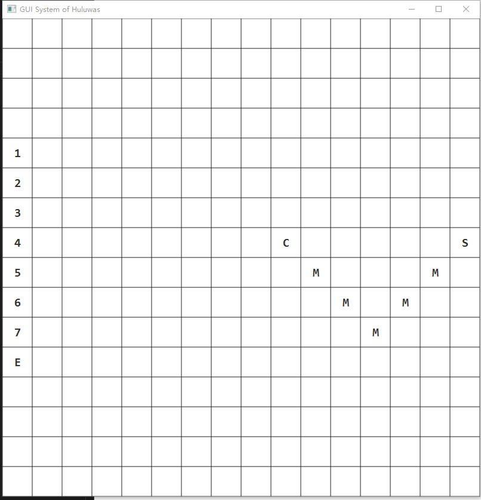
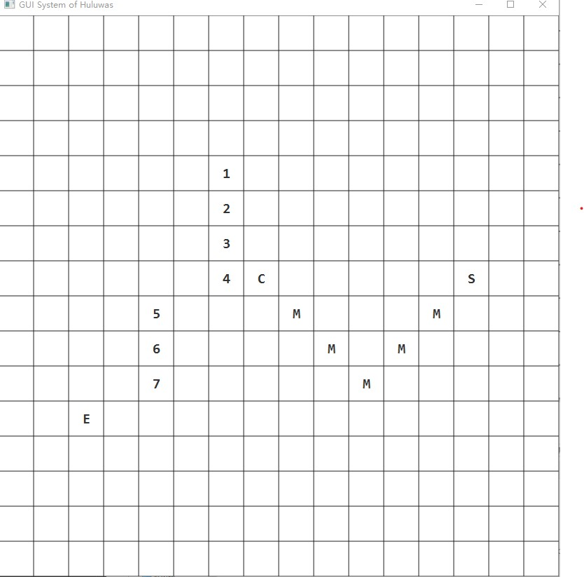
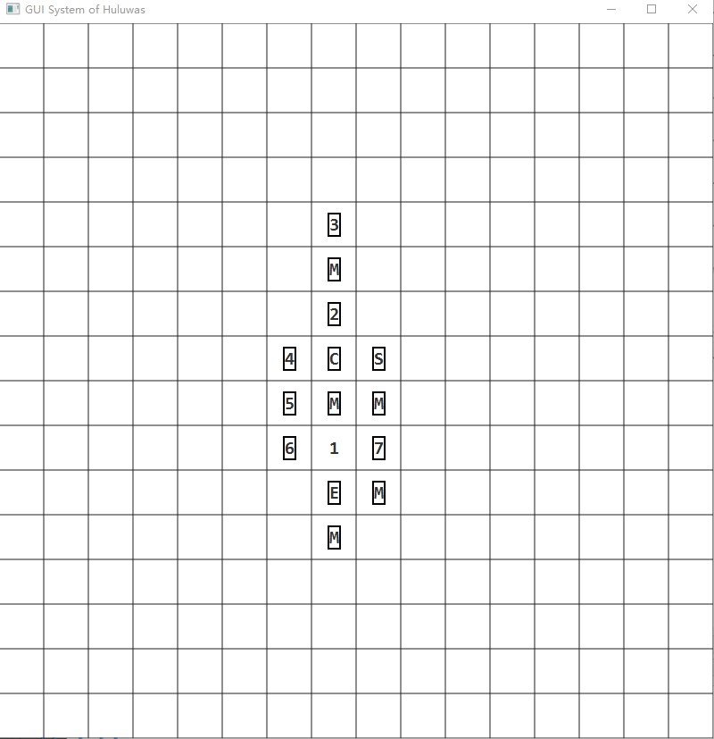
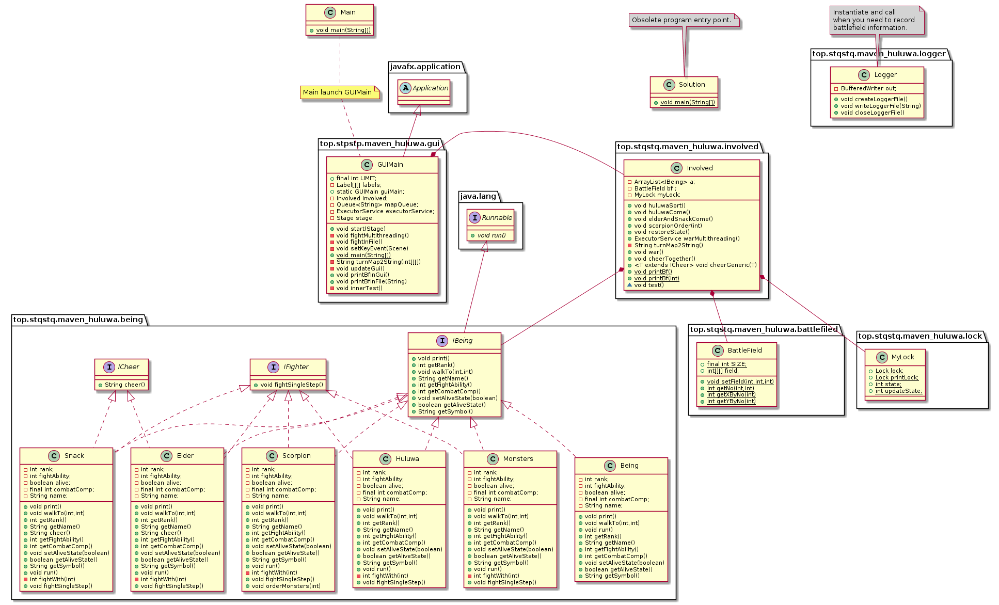
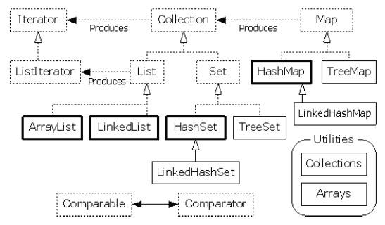

# 大作业实验报告
171860522 沈天琪
## 程序操作简要指南
打开程序后将出现以下界面：


当按下`L`键时 程序将自动启动一个用于打开文件的窗口：


假如选择了文件，那么其将自动进行重放，并在重放完成后3s切换回来。否则就不进行操作。

当按下`1` `2` `3` `4` `5` `6` `7`时，敌人将不断切换7个要求的阵型。另外，切换的同时还会重置战场。

当按下`SPACE`时，将启动所有生物体线程，程序开始运行。




在图中，若字符为边框所包围，则说明他已经死去。

战斗结束后棋盘不会自动重置，且其会将战斗过程存入`.log`文件。

## 程序设计说明
### UML类图

### 面向对象基本特性
这主要是指封装、继承和多态这三个面向对象基本特性。

我程序中的类都很好的体现封装的特性，一个类就是一个封装了数据以及操作这些数据的代码的逻辑实体。

继承是指这样一种能力：它可以使用现有类的所有功能，并在无需重新编写原来的类的情况下对这些功能进行扩展。显然在关系图中我们可以看到大量这类关系存在的痕迹。继承概念的实现方式有二类：实现继承与接口继承。实现继承是指直接使用基类的属性和方法而无需额外编码的能力；接口继承是指仅使用属性和方法的名称、但是子类必须提供实现的能力。在我的程序中主要出现的是接口继承。

多态是同一个行为具有多个不同表现形式或形态的能力。多态就是同一个接口，使用不同的实例而执行不同操作。在我的程序中，这一点的体现是很明显的。在`class Involved`中的`ArrayList<IBeing> a`其中的对象实际上都是实现了`interface IBeing`的各个类。对于这其中的成员，调用`interface IBeing`中定义的各个函数，其将各自产生不同的行为。

### 设计原则
为什么要有设计原则？

那是由于软件开发过程中的复杂性随着软件规模变大而增长的幅度超出了一般人所能处理的上限，这意味着我们不得不对软件功能、结构进行分解、层次化、抽象，从而对高层隐藏细节，对低层降低其与高层的耦合度。
#### 单一职责原则
单一功能原则规定应该有且仅有一个原因引起类的变更。在我的程序中，除了一个工具类，其他类的变化都有且只有一个函数接口导致。
#### 开放封闭原则
开放封闭原则就是软件实体应该对扩展开放，而对修改封闭。实现开放封闭的核心思想就是对抽象编程，而不对具体编程，因为抽象相对稳定。让类依赖于固定的抽象，所以对修改就是封闭的；而通过面向对象的继承和多态机制，可以实现对抽象体的继承，通过覆写其方法来改变固有行为，实现新的扩展方法，所以对于扩展就是开放的。可以注意到：我的程序主要在`package top.stqstq.maven_huluwa.involved`和`package top.stqstq.maven_huluwa.being`这两个实现软件后台逻辑的部分中运用了这个原则。
#### Liskov替换法则
这是指：若对类型S的每一个对象O1,都存在一个类型T的对象O2，使得在所有针对T编写的程序P中，用O1替换O2后，程序P的行为功能不变，则S是T的子类型。换言之：派生类必须能通过基类的接口而被使用，且使用者无须了解两者之间的差异。这一法则的主要目的在于控制派生类所产生的程序复杂度。在我的程序中，派生类与基类的输入输入类型都是相同的。显然满足这一点。
#### 接口隔离原则
这是指：客户端不应该依赖它不需要的接口；一个类对另一个类的依赖应该建立在最小的接口上。接口是设计时对外部设定的“契约”，通过分散定义多个接口，可以预防外来变更的扩散，提高系统的灵活性和可维护性。在我的程序中，`interface ICheer`和`interface IFighter`就是这一原则的体现。
#### 依赖倒置原则
高层模块不应该依赖低层模块，两者都应该依赖其抽象；抽象不应该依赖细节，细节应该依赖抽象。它的目的就是降低层与层之间的耦合，使得设计更加灵活。对比我在作业3中的设计，就可以看到这个原则对我设计的影响。
### 程序使用的机制
#### 异常处理
异常是指程序运行中出现的一些错误，这类错误有时可以在处理后使程序在原有状态下继续运行，这就要依赖于Java提供的异常处理机制。在Java中，程序出现异常后通常会抛出异常类`class Exception`，他是`class Throwable`的子类，`class Throwable`还有一个子类`class Error`，`class Error`一般是JVM发生错误时抛出的，例如JVM内存溢出。通常而言，程序仅会捕获`class Exception`并尝试处理，遇到`class Error`时程序一般不会尝试从这之中恢复。

一般而言，要尝试捕获异常会使用`try` `catch` `finally`关键词，语法如下：
```java
try{
    ;//some code
}catch(Exception e){
    ;//some code
}finally{
    ;//some code
}
```
在我的程序中，异常处理是一个被使用的重要机制，主要用于辅助debug，程序发生异常时我可以借助这个机制定位问题。
#### 集合类型
在编程中，常常需要集中存放多个数据。通常而言，数组是一个选择，但是若我们无法确定数据量，通常而言我们就得准备一个大小超过最大可能数量的数组，在某些情境下，这是不可能做到的。这时我们更应选择的是集合类。

以下就是集合类型的大致框架。


在我的程序中大概有两个重要的集合类型的实例，他们分别是：
```java
private Queue<String> mapQueue;//in class GUIMain
public static ArrayList<IBeing> a//in class Involved
```

在这两者之中，后者使用方式基本上就是数组的形式。而前者`Queue`使用`LinkedList<String>()`作为实例化，`LinkedList`实现了接口`Dueue`，而`Dueue`继承了`Queue`。这样`Queue`是可以使用`LinkedList`实例化的。
#### 泛型
泛型的本质是参数化类型，也就是说所操作的数据类型被指定为一个参数。Java中的泛型特性一般是指泛型方法与泛型类。一个泛型方法，该方法在调用时可以接收不同类型的参数。根据传递给泛型方法的参数类型，编译器适当地处理每一个方法调用。可以使用`extends` `implements`等关键词限制类型参数的边界。本质上讲，泛型特性就是为了尝试解决相似代码过多的情况，但从软件设计的角度上讲，这其实不是一种唯一解。有时我们可以使用多态的方式解决类似的问题。在我的程序最初的设计中，是尝试使用多态解决问题的。而在现在的实际程序中，多态主要出现在两处：其一是几个集合类型的使用中，因为这些集合类型实际上就是泛型类。其二就是一处方法：`class Involved`中的`public <T extends ICheer> void cheerGeneric(T t)`，这一方法的泛型主要还是为泛型而泛型。
#### 注解
注解是在JDK5时引入的新特性。它为我们在代码中添加信息提供了一种形式化的方法，以使我们可以在稍后某个时刻方便的使用这些数据。注解在使用时通常比较简单，就是在你需要他出现的地方添加注解即可；注解在定义时也相对简单，声明此注解为什么所使用（方法或类），信息保存至何时（源代码或运行时等），注解内部有何数据及其默认值；然而要使用注解中的信息就没有那么简单，完成一个注解处理器需要使用Java所提供的反射特性，借此从对应的`Class`对象中获取信息，从而根据注解的信息改变程序的行为。

注解在经过编译后实际上我们发现它也是一个特殊的接口，一个继承了`Annotation`接口的接口。而注释若不经过解析，实际上他是几乎无作用的，但是编译器所能提供的注解解析不能覆盖自定义的注解，对于这部分注释，编译器仅能通过查看它定义时信息，决定是否将这部分信息放入编译完成后的字节码。即必须让我们的代码命令由译器或虚拟机来“主动”解析它，它才能发挥自己的作用。

在我的程序中，我主要在单元测试框架JUnit中使用注解。这些注解是测试正常运行的前提条件。这里使用的注解主要是`@Before` `@After` `@Test`，借由`@Test`注解，可以轻松的配置测试的相应配置，例如方法运行的的最大时间，应抛出的异常。
#### 输入输出
Java所有的I/O机制都是基于数据流进行输入输出，这些数据流表示了字符或者字节数据的流动序列。Java的I/O流提供了读写数据的标准方法。任何Java中表示数据源的对象都会提供以数据流的方式读写它的数据的方法。

在我的程序中，除了控制台输出外，最主要的输入输出应用在两处：其一是`class Logger`中将战斗过程保存，这里主要使用了`BufferedWriter`；另外一部分则是在`class GUIMain`中的`private void fightInFile()`方法，这里主要使用了`BufferedReader`。
### 多线程
在我的程序中，主要有两处运用了多线程：首先是每个生物体都是一个线程，在战斗中并发运行；其次是在GUI框架中运用了多线程，主要就是将刷新界面的任务提交给`Platform.runLater(Runnable runnable)`让框架中的相关事务处理线程在合适的时间调用这一个刷新任务（在我的应用中由于业务逻辑相对简单，需要管理的事务较少，提交的事务间又有延时，通常而言这就意味着立刻）。

对于在战斗中并发的生物体线程，为了防止出现多线程意外bug，例如多个生物同时站上一个格子，多个生物互相杀死，这意味着我们需要一个有效的线程同步机制以解决这个问题。
也正因此，我设计了一个`class MyLock`，具体代码如下：
```java
public class MyLock {
    public static Lock lock;
    public static Lock printLock;
    public static int state;
    public static int updateState;

    static {
        lock = new ReentrantLock(true);
        printLock = new ReentrantLock(true);
        //lock.unlock();
        state = 1;
        updateState = 1;
    }

    public MyLock() {
    }
}
```

这个类的所有成员都是静态的，它唯一的任务就是在线程间提供同步机制，它在使用中大概是这样：

```java
    public void run() {
        while (true) {
            MyLock.lock.lock();
            try {
                if (MyLock.state == 0)
                    return;
                int count1 = 0, count2 = 0;
                for (int i = 0; i < BattleField.SIZE; i++)
                    for (int j = 0; j < BattleField.SIZE; j++) {
                        if (Involved.a.get(BattleField.getNo(i, j)).getCombatComp() == 1 && Involved.a.get(BattleField.getNo(i, j)).getAliveState())
                            count1++;
                        else if (Involved.a.get(BattleField.getNo(i, j)).getCombatComp() == 2 && Involved.a.get(BattleField.getNo(i, j)).getAliveState())
                            count2++;
                    }
                if (count1 == 0 || count2 == 0) {
                    MyLock.state = 0;
                    return;
                }

                while (true) {//具体而言 这个循环就是为了等待外部线程有效输出棋盘后在执行棋盘操作
                    MyLock.printLock.lock();//这个锁是为了保证缓冲区的访问不出现问题
                    try {
                        if (MyLock.updateState == 0)//当前棋盘状态已被更新才进行操作
                        {
                            fightSingleStep();
                            MyLock.updateState = 1;
                            break;
                        } else
                            Thread.sleep(2);
                    } finally {
                        MyLock.printLock.unlock();
                    }
                }
                //fightSingleStep();
                // Thread.sleep(1);
            } catch (InterruptedException e) {
                e.printStackTrace();
            } finally {
                MyLock.lock.unlock();
            }
        }
    }

```

简单来讲：

`MyLock.lock`是为了保证同时只有一个生物体线程访问缓冲区

`MyLock.printLock`是为了保证同时只有一个生物体线程之一修改棋盘或显示线程读取棋盘

`MyLock.state`是为了指出生物体线程组运行状态，为0时即需无条件推出

`MyLock.updateState`是为了指出当前棋盘状态。

在这样的机制保护下，对棋盘的访问逻辑上就是线性的，如下：
```
生物体1
显示线程
生物体2
显示线程
生物体3
显示线程
……
生物体n
显示线程
生物体1
显示线程
……
```
### 测试与构建管理
我的程序对基础逻辑类不涉及多线程的地方都设计了简单的单元测试，这些测试的源文件在`/src/test/`下。每次代码修改都要求可以通过这些测试。

我的程序按照要求使用`Maven 3.6.2`进行构建管理，在我的配置中使用了`java 12.0.2`作为基础运行环境，`junit 4.12`以管理单元测试 `javafx-maven-plugin 0.0.3`作为maven管理插件 `javafx-controls 12.0.2`作为GUI框架 `maven-assembly-plugin 3.0.0`将程序所依赖的运行环境打包为一个，方便运行。
### 战斗机制简要介绍
在战斗时，生与死由3个因素决定：1.我方战斗力：MFA，2.敌方战斗力：EFA，3.随机修正因素X。

战斗力表如下：
|人物|战斗力|GUI符号|
|---|---|---|
|老大|8|1|
|老二|7|2|
|老三|6|3|
|老四|6|4|
|老五|5|5|
|老六|4|6|
|老七|3|7|
|爷爷|0|E|
|小喽啰|1|M|
|蛇精|2|S|
|蝎精|10|C|

随机修正因子X范围：0~9

战斗时即计算 `MFA + X - EFA` 的大小，若 `<= 4` 即我方失败，否则我方胜利。

这种战斗方式主要借鉴了 **群星（Stellaris）** 中的考古机制。