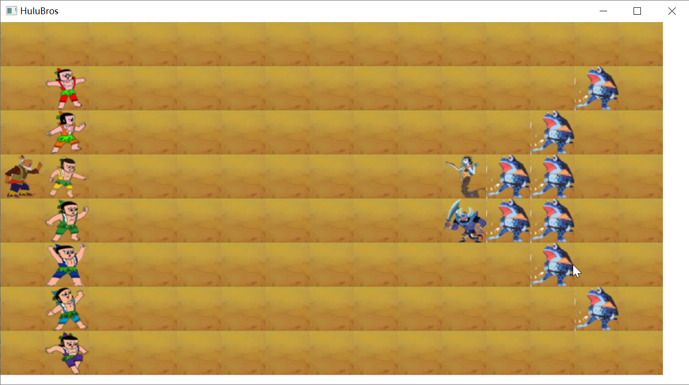
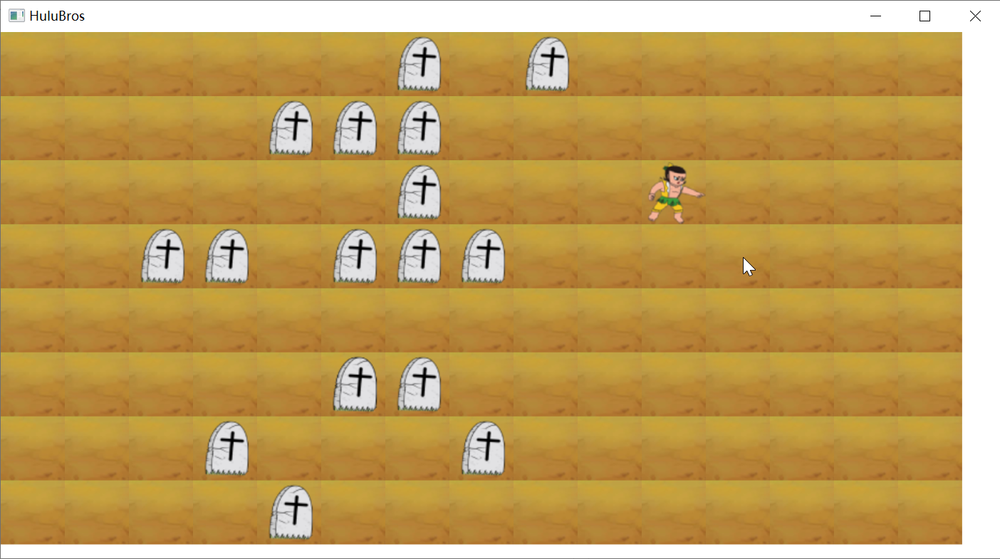
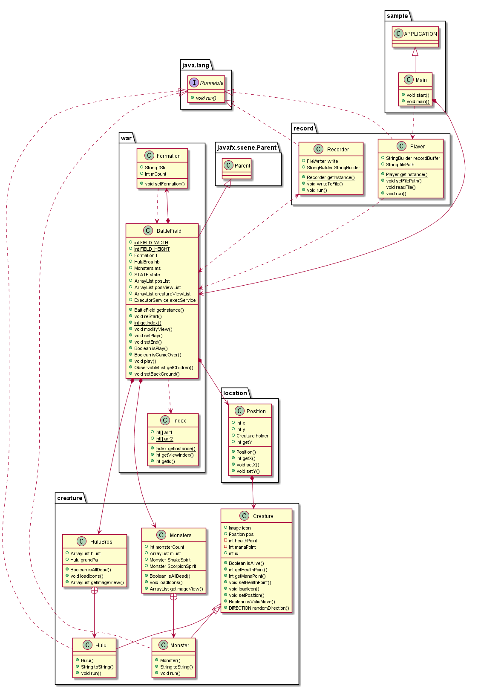
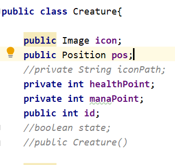
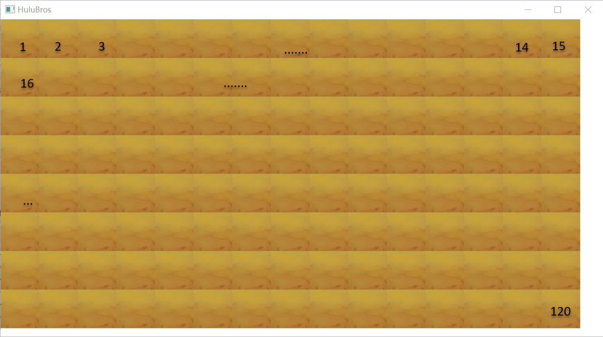
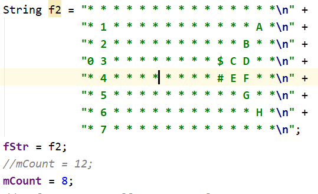
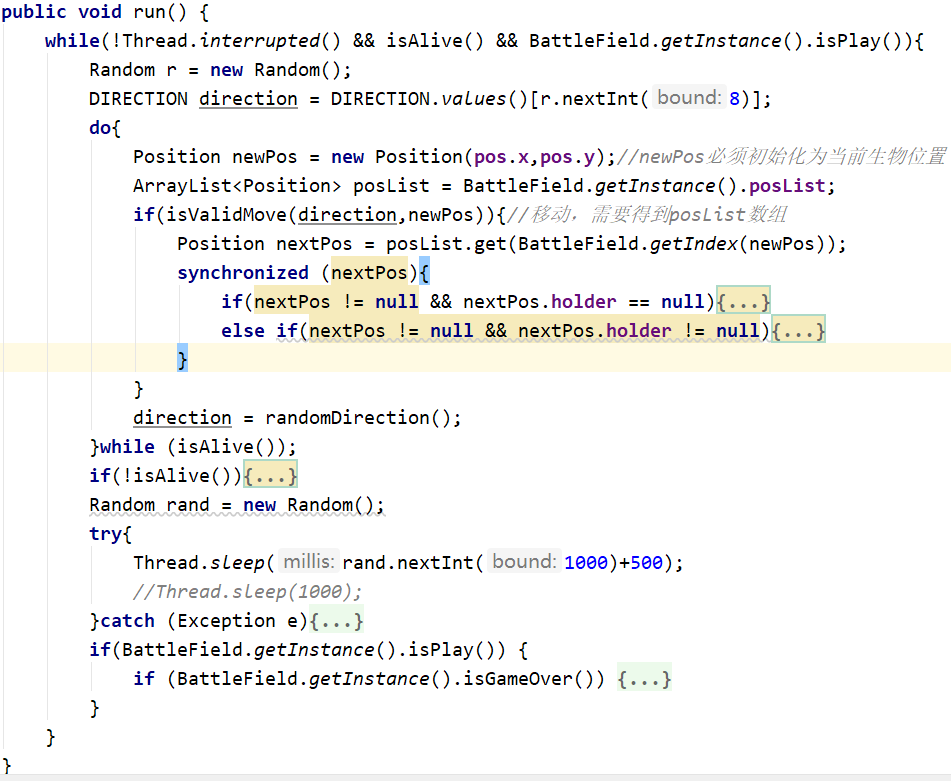
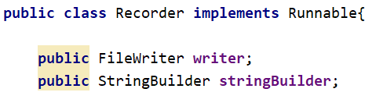
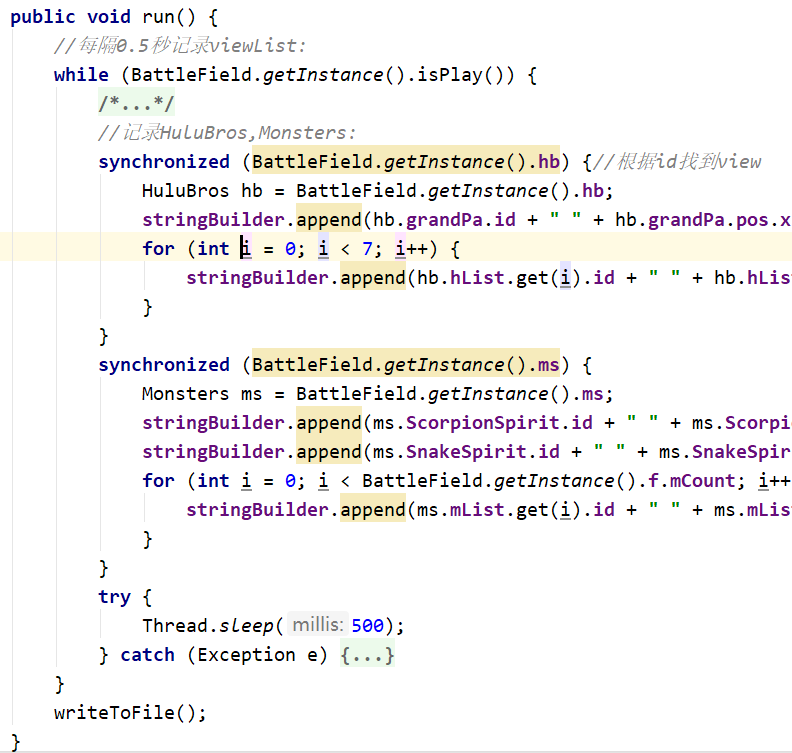
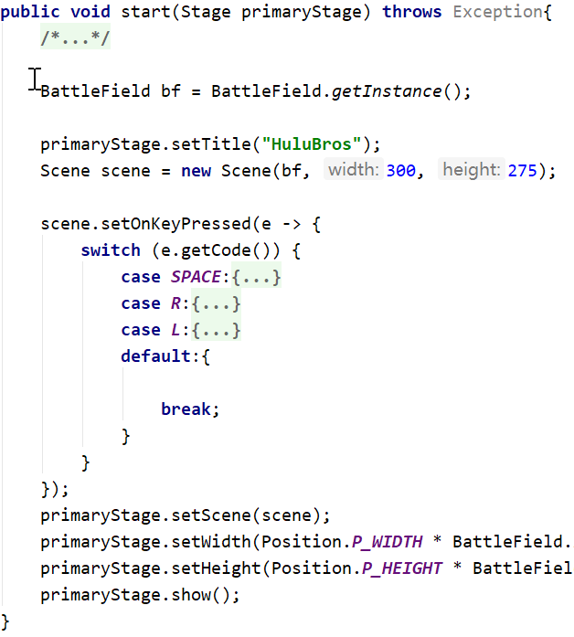

# java大作业

## 程序说明

### 编译环境

Intellij IDEA 2019

jdk1.8.0_221

maven: junit4.12, hamcrest-core-1.3.jar

### 程序运行：

运行程序进入主界面：葫芦兄弟采用长蛇阵，妖精使用鹤翼

按下"SPACE"开始战斗，按下"L"键弹出文件选择对话框选择并加载记录文件，按下"R"重新开始:

当葫芦兄弟或者妖精任意一方全部死亡时游戏结束：

## 类的介绍

| 类名 | 定义 |
| --- | :---: |
| Creature | 生物类，作为Hulu和Monster类的父类 |  
| Hulu| 葫芦的定义，继承自Creature，实现了Runnable接口 |   
| Monster| 妖精的类定义，继承Creature，实现了Runnable接口 |  
| HuluBros | 葫芦兄弟类, 将葫芦兄弟以及爷爷作为一个集体定义的一个类, Hulu类作为静态内部类 |  
| Monsters | 将妖精集体定义为一个类，Monster是其静态内部类 |  
| Position | 位置类，表示二维地图的位置，左上角为(0,0) |  
| Player | 实现回放功能，继承了Runnable接口 |  
| Recorder | 实现记录功能，继承Runnable接口 |  
| Formation | 阵型类，根据阵型字符串将HuluBros和Monsters排列阵型 |  
| Index | 用于生物id和其ImageView的下标索引类，使用单例模式 |  
| BattleField | 战场模拟类，使用单例模式|  
| Main | main函数定义，程序入口，处理键盘事件 |  

UML类图：

**Creature类**

icon表示生物图标；  
healthPoint表示生物血量；  
manaPoint表示生物攻击力；   
id用于指示当前生物表示哪一个生物；   

## 设计思路

### 战场的模拟

战场设置为：15*8的Position块组成：

左上角1的位置为(0,0)，2的位置为(0,1)，以此类推，最后第120块所表示的位置为(7,14)
故使用ArrayList\<Position\> posList来表示二维的战场；
每一块Postion所表示位置的宽和高分别为60像素；整个战场的宽就为15\*60=900，高为8\*60=480；

战场类继承javafx.scene.Parent，在战场类中使用ArrayList\<ImageView\> posViewList作为战场背景图，将其加入父类Parent的getChildren()中即可显示在GUI上；posViewList数组中的背景ImageView与posList中的位置所表示地方块一一对应；

葫芦娃妖精等生物的显示同理，使用creatureViewList维护他们对应的ImageView

### 阵型的设计

Formation表示阵型，由String fStr和int mCount两个成员变量，fStr表示阵型字符串，mCount表示小喽啰数量：

使用阵型字符串来表示战场，字符0表示爷爷，字符1-7分别表示七个葫芦娃，字符#表示蝎子精，字符$表示蛇精，26个英文字符A-Z用来表示小喽啰，从A开始计；

Formation中的setFormation()为泛型方法，传入HuluBros或者Monsters对象及BattleField中的posList，将战场生物按阵型字符串排列；

### 生物的运动

生物的运动表现在表示他们的ImageView的显示位置的更改，因此改变生物所对应的ImageView即可实现其移动，生物对应的ImageView在creatureViewList中维护，根据生物修改其在creatureViewList中对应的ImageView坐标即可；

每个生物实现为一个线程，所以Hulu类和Monster类均实现了Runanable接口，并将其移动方法实现在了run()函数中：

如图，当当前生物存活时，随机产生一个方向，使该生物向该方向移动一步，若移动不合法则循环直到产生一个移动合法的方向，若生物要移动的下一个位置有敌人，则生物对其进行攻击，溶蚀也会受到敌人的反击；详细可见代码；
使用sleep()让线程随机休眠0.5-1秒；以实现动画效果；
当有一方全部阵亡时，游戏停止；

### 对战记录保存与回放

**Recorder类**

使用stringBuilder保存对战记录字符串，最后将stringBuilder写到记录文件之中；

对战过程中，将战场看作一个状态机，就是战场状态随时间在不断改变，只需按一定时间间隔记录下对应战场状态即可；而战场状态的改变实际上就只是生物位置以及生物血量的改变，所以归根结底只需按时间间隔记录下生物位置及其血量即可；

所以Recorder作为一个单独的线程记录对战状态：

当游戏是在进行中时，每隔0.5s记录以及所有生物的位置和血量；

**播放**

使用Player类实现播放，读取文件根据文件数据每隔一定时间设置生物状态以及血量，并更新viewList即可；也实现为一个线程，大体与Recorder相似；

### 游戏入口

javaFx应用入口将调用start()：

在start()中监听键盘事件并调用相应函数；

### 游戏流程说明

运行游戏后，由于BattleField采用单例模式，所以BattleField将会自动初始化：初始化阵型，葫芦兄弟，妖精，并设置阵型，设置ImageViewList，初始化过程具体见代码BattleField类的构造方法代码。
按下按键"SPACE"，BattleField进入"PLAY"状态，调用BattleField中的play()，开始所有线程，游戏开始执行；当有一方全部死亡后，BattleField状态置为"END"，Recorder将记录的数据写入文件，所有线程停止；等待键盘事件响应。

## 设计模式与设计原则

### 单例模式

BattleField作为战场类，会在Formation中用到，也会在生物相关类中使用到，且生物类多个线程会对同一个BattleField修改，所以将其作为一个基础服务类，使用单例模式实现，减少资源消耗。
Recorder与Player也使用了单例模式，避免创建多余对象；

但是单例模式会与单一职责原则冲突；

### 依赖倒置原则

依赖抽象而不是依赖实现。抽象不应该依赖细节，细节应该依赖抽象。高层模块不能依赖低层模块，二者都应该依赖抽象。

### 里氏替换原则

所有引用基类的地方必须能透明地使用其子类的对象，也就是说子类对象可以替换其父类对象，而程序执行效果不变。

## 相关技术

**内部类**:Hulu和Monster只在Monsters和HuluBros中用到，故设置为内部类；

**泛型，反射**

**继承**

**封装**

**异常**

**文件IO**

**多线程**

**...**

